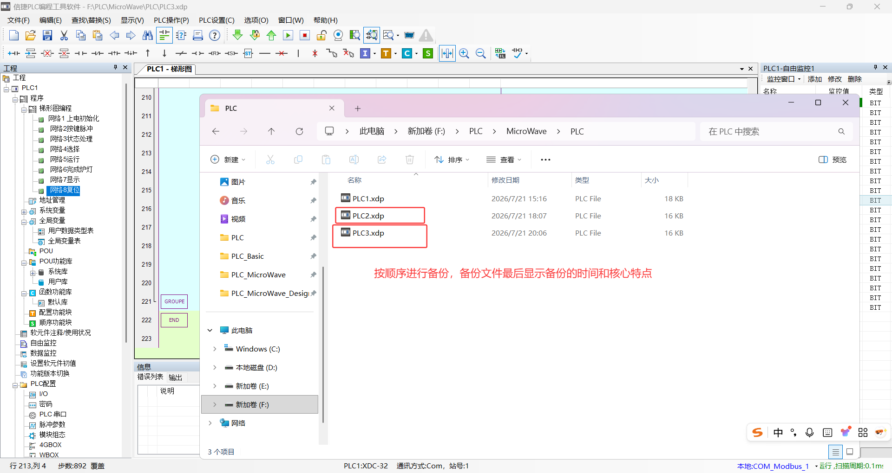

# PLC_Basic 学习笔记

## 一、软件操作

官方提供的软件手册已经很完善了，讲解很细致而且图片很多很容易看懂。[PLC信捷官方手册](../../../../30-资源/PLC-微波炉-工程与手册/1. 软件手册.pdf)

**1. 工程备份**

工程备份就是在修改程序或画面前，先保存一份可回退的工程文件。

主要作用是区分隔离开发和运行版本，避免调试失败后找不到旧逻辑。




注意事项：

- 每次大改前单独保存版本，因为 PLC 下载后不一定能完整恢复注释；
- 上传工程不要直接覆盖本地工程，因为上传内容可能缺少注释或配置；
- 文件名建议带日期和功能点，方便判断哪个版本能运行。


2. **地址分层**

地址分层就是把 HMI 命令位、PLC 内部状态位、显示位和寄存器分开使用，主要作用是防止触摸屏绕过 PLC 判断，直接改掉真实运行状态。

常见做法是 HMI 写命令位，PLC 处理后再输出状态位给 HMI 显示。


注意事项：

- HMI 不要直接写运行状态位，因为这样会绕过门锁、报警和启动条件；
- 显示位可以由 PLC 每个扫描周期刷新，因为它只反映结果；
- 命令位、状态位和输出位混用，会导致画面显示和 PLC 逻辑不一致。


3. **按钮点动**

按钮点动就是按钮按下时写 ON，松开时回 OFF。

主要作用是让 PLC 用上升沿 `PLS` 识别一次按键动作。

点动按钮适合开始、停止、复位、模式选择、时间选择等一次性操作。


注意事项：

- 如果按钮保持 ON，下一次按键可能没有新的上升沿；
- HMI 按钮最好写命令位，再由 PLC 自动复位或边沿处理；
- 需要保持状态的功能，不应靠 HMI 按钮保持，而应由 PLC 锁存。


4. **状态镜像**

状态镜像就是把 PLC 内部真实状态复制到专门给 HMI 读取的软元件。

主要作用是让动画和指示灯只读显示，不参与真实控制。

例如真实状态用一个内部 `M` 保存，动画读取另一个镜像 `M` 或状态码 `D`。


注意事项：

- 动画对象不要带写入动作，因为显示组件写状态会破坏 PLC 逻辑；
- 真实状态必须由 PLC 条件改变，不能由 HMI 直接改；
- 多个动画状态建议用一个状态码寄存器表示，因为比多个灯更直观。


5. **HD 与 D 分工**

HD（Hold Data Register）适合保存参数设定值，D（Data Register）适合保存程序运行值。

主要作用是区分“用户设定”和“当前计算结果”。

常见做法是 HMI 数值输入写 `HD`，PLC 校验范围后复制到 `D` 使用。

注意事项：

- 不要直接递减 HD，因为这会把用户设定值改掉；
- HMI 显示确认后的参数时，建议显示 D，而不是未校验的 HD；
- 数值异常时先检查 16 位/32 位、十进制/BCD、整数/浮点设置。


6. **注释长度**

注释长度就是指指令表或软元件注释中每行说明文字的长度。

主要作用是帮助阅读，但过长注释可能影响导入稳定性。

学习阶段建议注释短、准、固定，例如“上电初始化”“开始条件”“状态显示”。

注意事项：

- 指令表注释建议控制在十几个汉字以内；
- 注释不要夹杂特殊符号，因为复制后可能变成隐藏字符；
- 长说明放到设计文档中，不要塞进指令表。


7. **在线监控顺序**

在线监控顺序就是按 PLC 逻辑路径逐级查条件，而不是只看最终输出。

主要作用是判断“按钮有效但动作不执行”的具体原因。

一般顺序是先看命令脉冲，再看允许条件，再看锁存状态，最后看输出镜像。

注意事项：

- 边沿脉冲只持续一个扫描周期，监控不到不一定代表按钮没写入；
- 先查常闭禁止条件，例如报警、完成、暂停、门开等；
- 不要一开始就强制输出，因为强制输出会掩盖真正的逻辑问题。


## 二、PLC概念

**PLC（可编程逻辑控制器，Programmable Logic Controller）** 是一种专为工业环境设计的数字运算操作电子系统。它采用可编程的存储器，用于在其内部存储执行逻辑运算、顺序控制、定时、计数和算术运算等操作指令，并通过数字式或模拟式的输入/输出接口控制各种机械设备或生产过程。

PLC专门用来**接收传感器信号,如温度、压力、按钮状态等**，按照工程师编写的逻辑程序进行判断和运算，然后**输出指令控制执行器**，从而实现生产线的自动化运行。PLC具有高可靠性、抗干扰能力强、能在高温/粉尘等恶劣环境下24小时不间断工作等特点。

| 部分   | 英文全称                                        | 作用                                       | 当前实现                    |
| ------ | ----------------------------------------------- | ------------------------------------------ | --------------------------- |
| PLC    | Programmable Logic Controller，可编程逻辑控制器 | 执行联锁、状态、定时、计数、温度和复位逻辑 | 信捷 XDC-32T                |
| PSU    | Power Supply Unit，电源单元                     | 为 CPU 和 I/O 电路供电                     | 以实际铭牌为准              |
| DI     | Digital Input，数字量输入                       | 接按钮、限位和开关量传感器                 | M/D 仿真版暂不直接使用 X    |
| DO     | Digital Output，数字量输出                      | 驱动继电器、灯、蜂鸣器等                   | M/D 仿真版用 M 状态代替 Y   |
| HMI    | Human-Machine Interface，人机界面               | 操作按钮、参数输入、状态动画               | TouchWin                    |
| I/O    | Input/Output，输入/输出                         | PLC 与现场设备交换开关量或数值             | 预留 X/Y，当前主要用 M/D    |
| RAM    | Random Access Memory，随机存取存储器            | 保存运行中的普通软元件数据                 | 普通 M、D 等                |
| Flash  | Flash Memory，闪存                              | 保存程序和部分保持参数                     | PLC 内部、HD/FD 类保持区    |
| RTC    | Real-Time Clock，实时时钟                       | 日期和时间功能                             | 本项目未使用                |
| RS-232 | Recommended Standard 232                        | 点对点串行通信                             | 可用于 PLC/HMI 或电脑通信   |
| RS-485 | Recommended Standard 485                        | 差分、多点串行通信                         | 可用于较远距离 HMI/设备通信 |

1. **触点**

**触点**是梯形图中用于判断某个软元件状态的图形符号。

它本身不是一个新的元件，而是读取 `X`、`M`、`T`、`C` 等软元件当前是 ON 还是 OFF。

触点的主要作用是组成判断条件，决定后面的线圈或指令是否执行。

如`M0` 是待机状态时，常开触点 `M0` 导通；`M0` 为 OFF 时，这个触点不导通。

注意事项：

- 触点是读取状态，不是写入状态；
- 同一个软元件可以在多个地方作为触点读取；
- 触点导通不等于物理电流真的流过，它表示逻辑条件成立；
- 触点状态会随扫描周期刷新，所以监控时看到的是当前扫描结果。

2. **常开触点**

常开触点是软元件 ON 时导通、OFF 时断开的触点。

在指令表中，网络起点常用 `LD 软元件` 表示常开判断，串联条件常用 `AND 软元件`。

主要作用是表达“这个状态存在时允许执行”。

如启动条件中使用 `ANI M100`，表示只有 `M100=OFF`、炉门关闭时该条件才成立。

注意事项：

- 常开不是指现场按钮一定是常开接线，而是 PLC 逻辑中按 ON 判断；
- 输入点的 ON/OFF 要结合传感器接线理解；
- 常开触点适合表示允许条件、已选择状态、运行状态等正向条件。

3. **常闭触点**

常闭触点是软元件 OFF 时导通、ON 时断开的触点。

在指令表中，网络起点常用 `LDI 软元件` 表示常闭判断，串联条件常用 `ANI 软元件`。

主要作用是表达“这个禁止状态不存在时允许执行”。

如启动条件中使用 `ANI M6`，表示没有报警时才允许继续执行。

注意事项：

- 常闭触点不是没有接线，而是该软元件为 OFF 时逻辑成立；
- 报警、暂停、完成、保护状态常用常闭条件排除；
- 常闭条件多时要写清楚含义，否则很难判断动作为什么被禁止。

4. **线圈**

线圈是梯形图中用于写入位软元件状态的输出符号。

它可以驱动物理输出 `Y`，也可以驱动内部辅助继电器 `M`。

主要作用是把前面条件的结果保存或输出成一个状态。

如前面条件成立时执行 `OUT M2`，表示把运行条件结果写入 `M2`。

注意事项：

- 线圈是写入状态，触点是读取状态；
- 同一个普通线圈不要多处 `OUT`，因为后面的网络可能覆盖前面的结果；
- 需要保持的状态通常用 `SET/RST`，不要只靠普通 `OUT`；
- 物理输出线圈要先汇总安全条件，再统一输出。

5. **条件**

条件是 PLC 判断某个动作能不能执行的逻辑表达式。

条件通常由多个触点、比较指令和状态组合而成。

主要作用是把工艺要求变成 PLC 能逐步判断的逻辑。

注意事项：

- 条件要从动作目标反推，先问“什么情况下允许动作”；
- 允许条件和禁止条件要分清，避免写成互相冲突；
- 条件越多，越要分层写，否则后期监控很难排查；
- 重要动作不能只在开始瞬间检查，运行中也要持续检查联锁。

6. **指令**

指令是 PLC 能识别和执行的基本命令。

梯形图中的触点、线圈、定时器、计数器、比较和传送，最终都可以对应到指令表中的指令。

主要作用是让 PLC 按固定规则完成读取、判断、写入、计时、计数和运算。

注意事项：

- 指令必须符合 PLC 型号支持范围；
- 指令操作数类型要匹配，例如位指令不能随便写字寄存器；
- 语法正确不代表逻辑正确；
- 学习时要同时看梯形图含义和指令表顺序。

7. **网络**

网络是梯形图中一段相对独立的逻辑单元。

一个网络通常完成一个动作、一个状态、一个判断或一组相关复位。

主要作用是把复杂程序拆成便于阅读和调试的小块。

注意事项：

- 一个网络只做一类事情，后期更容易排查；
- 网络顺序会影响结果，因为 PLC 从上到下扫描；
- 初始化、运行、报警、输出、显示最好分层放置；
- 网络注释要短而明确，说明这一段逻辑的目的。

8. **状态**

状态是 PLC 用软元件保存的当前阶段或结果。

常见状态包括待机、运行、暂停、完成、报警、手动、自动等。

主要作用是让程序知道设备现在处于哪个阶段，从而决定下一步能做什么。

注意事项：

- 状态要互斥时，置位一个状态的同时要复位其他状态；
- 状态位不要让 HMI 直接写，应该由 PLC 判断后改变；
- 状态太少会表达不清，状态太多会难以维护；
- 状态码适合给 HMI 显示文字或动画。


9. **边沿**

边沿是信号从 OFF 到 ON 或从 ON 到 OFF 的变化瞬间。

上升沿表示 OFF 变 ON，下降沿表示 ON 变 OFF。

主要作用是把持续按下的按钮变成一次动作，避免一个按键在多个扫描周期重复执行。

注意事项：

- 边沿脉冲很短，在线监控时可能只闪一下；
- 长按按钮时，边沿只在变化瞬间产生一次；
- 计数、复位、单次选择等动作适合用边沿；
- 连续运行条件不适合只靠边沿，还要有锁存状态。


10.  **锁存**

锁存是条件成立一次后，让状态保持 ON，直到另一个条件复位它。

在指令表中常用 `SET` 和 `RST` 实现。

主要作用是保存运行、报警、完成、选择等需要保持的状态。

注意事项：

- 每个锁存状态都必须设计清楚复位条件；
- 报警适合锁存，因为瞬间故障也需要被操作者看到；
- 启动按钮不应长期保持 ON，运行保持应交给锁存状态；
- 复位条件不能过宽，否则状态会刚置位就被清掉。


11. **寄存器**

寄存器是 PLC 中用于保存数值的数据软元件。

位软元件只表示 ON/OFF，寄存器可以保存时间、温度、计数值、状态码和参数。

主要作用是处理数字量以外的数值信息。

注意事项：

- 寄存器要注意 16 位、32 位、整数、浮点和 BCD 格式；
- 普通运行值和保持设定值要分开；
- HMI 显示随机数时，常见原因是数据类型或地址格式错误；
- 修改寄存器前要知道它参与哪些判断。


### PLC 硬件结构

1. **电源单元 PSU**

PSU（Power Supply Unit）是电源单元，用于给 PLC 的 CPU、输入输出电路和内部总线供电。

主要作用是把外部交流或直流电源转换成 PLC 内部稳定可用的工作电源。

使用方法是先看 PLC 铭牌和接线图，确认输入电压、端子名称和接地要求，再接入 L/N、24V/0V 或保护地。

注意事项：

- AC 和 DC 电源不能接错，因为接错可能直接损坏 PLC；
- PLC 辅助 24V 通常只适合小电流传感器，不能当大功率负载电源；
- 控制电源和动力电源要分清，因为动力侧干扰或短路会影响 PLC 稳定性；
- 接地不是可有可无，因为良好接地能减少干扰和触电风险。


2. **数字量输入 DI**

DI（Digital Input）是数字量输入，也叫开关量输入。

主要作用是把按钮、限位开关、接近开关、光电开关等现场 ON/OFF 信号送入 PLC。

在程序中，数字量输入通常对应 `X` 输入继电器，只能读取现场状态。

使用方法是根据 PLC 输入公共端和传感器类型接线，常见传感器类型有 NPN 和 PNP。

注意事项：

- NPN/PNP 接法必须和 PLC 输入类型匹配，因为接法错了输入可能一直无效；
- 机械按钮可能抖动，所以必要时要用滤波、定时或边沿处理；
- 输入信号不能只看程序，还要看端子指示灯，因为接线错误不会被程序自动发现；
- X/Y 基本点常按八进制风格编号，例如 `X0~X7` 后是 `X10`。


3. **数字量输出 DO**

DO（Digital Output）是数字量输出，也叫开关量输出。

主要作用是把 PLC 运算结果送给指示灯、继电器、接触器、电磁阀、蜂鸣器等执行元件。

在程序中，数字量输出通常对应 `Y` 输出继电器。

常见输出形式有 Relay Output（继电器输出）、Transistor Output（晶体管输出）和 Triac Output（双向可控硅输出）。

注意事项：

- PLC 输出有电压和电流限制，因为它不是万能电源开关；
- 大功率负载要通过中间继电器、接触器或驱动器控制；
- 感性负载要考虑续流二极管、浪涌吸收或 RC 吸收；
- 同一个 `Y` 不要在多处 `OUT`，因为扫描顺序会导致输出被覆盖。

4. **CPU 单元**

CPU（Central Processing Unit）是中央处理单元，是 PLC 的运算和控制核心。

主要作用是读取输入、执行用户程序、刷新输出，并处理通信、诊断和系统任务。

使用方法不是直接接线控制 CPU，而是通过下载程序、设置参数、监控状态来使用它。

注意事项：

- CPU 状态要区分 RUN 和 STOP，因为 STOP 时用户程序不执行；
- 扫描周期不是绝对固定值，程序越复杂、通信越多，扫描时间可能越长；
- 上电初始化只应在首次扫描做，因为每扫描都初始化会覆盖运行数据；
- CPU 故障或电源异常不能只靠程序恢复，要查硬件状态和错误信息。

5. **存储器**

存储器用于保存 PLC 的系统程序、用户程序、软元件状态和参数数据。

常见类型包括 RAM（Random Access Memory）、ROM（Read-Only Memory）和 Flash Memory。

主要作用是区分临时运行数据、系统固件、用户程序和断电保持参数。

使用方法是根据数据性质选择普通寄存器或保持寄存器，例如普通工作值放 `D`，断电保持参数放 `HD`。

注意事项：

- 保持数据不是绝对安全备份，因为误写、初始化或下载设置都可能改变它；
- 不要在每个扫描周期频繁写 Flash 类保持区，因为可能影响寿命；
- 参数上电后要做范围校验，因为保持区可能残留旧值或异常值；
- 普通 D 和保持 HD 要分工明确，避免运行过程破坏设定值。

6. **通信接口**

通信接口用于 PLC 与电脑、HMI、变频器、仪表、其他 PLC 或上位机交换数据。

常见接口包括 RS-232、RS-485、USB 和 Ethernet（以太网）。

主要作用是完成程序下载、在线监控、触摸屏通信、远程数据读写和设备联网。

使用方法是让两端协议、站号、波特率、校验方式、IP 地址或端口号保持一致。

注意事项：

- 通信失败时先查物理线缆，再查协议和参数；
- RS-485 的 A/B 标识不同厂家可能相反，必要时要对调测试；
- 以太网通信要确认电脑和 PLC 在同一网段；
- 通信正常不代表逻辑正确，只说明数据能传输。

7. **扩展模块**

扩展模块是连接在 PLC 本体之外的功能模块。

常见类型包括扩展 DI/DO、模拟量 AI/AO、温度模块、高速计数、通信模块和运动控制模块。

主要作用是增加 PLC 本体没有的点数或功能。

使用方法是先确认模块型号和安装位置，再在软件中做模块组态或地址分配。

注意事项：

- 模块顺序会影响地址分配，因为 PLC 按扩展顺序映射资源；
- 模块电源和本体电源要核对，因为部分模块需要单独供电；
- 模拟量模块要确认电压、电流、热电偶或热电阻类型；
- 模块组态错误时，程序可能能写完，但实际地址读不到正确信号。

8、**HMI 触摸屏**

HMI（Human-Machine Interface）是人机界面，用于操作人员与 PLC 交换信息。

主要作用是把按钮、参数输入、状态显示、报警和动画集中到触摸屏上。

HMI 本身不应代替 PLC 做关键联锁判断，关键逻辑仍应放在 PLC 中。

使用方法是将 HMI 元件绑定到 PLC 的 M、D、HD 等地址，并通过通信读取或写入。

注意事项：

- HMI 按钮不要直接写真实状态位，因为会绕过 PLC 条件判断；
- 动画对象建议只读 PLC 状态码或显示位；
- 数值输入要设置正确数据类型，因为格式错会显示随机数；
- HMI 通信正常后，还要用 PLC 监控确认地址是否真的变化。


## 三、PLC 扫描

PLC 扫描周期的本质是**输入采样、程序执行与输出刷新**三个阶段的循环往复。CPU 并不实时响应外部信号的变化，而是在每个固定的时间片内统一读取输入状态、执行用户程序、更新物理输出。


在进行输入采样时，CPU 将所有 X 端子的物理电平一次性读入输入映像区。在后续的程序执行过程中，即使外部 X 信号发生跳变，映像区内容也不再改变，直至下一个扫描周期重新采样。程序执行阶段从第一条指令开始顺序执行至 END 指令结束，所有运算均以输入映像区、内部继电器 M、定时器及计数器的当前值为依据。该阶段对 Y 输出映像区的中间修改不会立即传送至物理 Y 端子。输出刷新阶段在扫描周期末尾将输出映像区的状态统一传送到物理 Y 端子。若同一 Y 在程序中被多次赋值，仅最后一次赋值在输出刷新阶段生效。

PLS 指令所操作的 M 线圈仅在当前扫描周期内有效。该指令在输入采样后判断外部 X 的上升沿，条件满足时置位对应的 M 线圈，该 M 线圈在下一扫描周期开始时由 CPU 自动复位，无需用户程序干预。因此 PLS 适用于处理按钮或 HMI 按键输入，可避免因按键持续按压而导致程序重复触发。


**注意事项**：

- 倒计时操作并非每个扫描周期都执行。`SUB D1 K1 D1` 指令仅在 M40 为 ON 的扫描周期中执行一次，而 M40 由秒脉冲驱动，每秒置 ON 一个扫描周期。因此 D1 只在秒脉冲到来时递减一次，不会因扫描周期的存在而失控递减。
- 程序末尾对输出点的强制赋值具有高于 HMI 写入的优先级，这可以让用户程序对关键状态具有最终控制权，可屏蔽 HMI 误操作或通信干扰造成的影响。


**梯形图执行顺序**：

从上到下是最基本的执行顺序，但在同一行内还遵循先左后右、先串后并的原则。CPU把每一行当作一个逻辑表达式来求值，从最左侧的母线开始，依次判断各个触点的状态，最终将逻辑结果写入行末的线圈。

对于并联支路，CPU先解析当前行主路径的触点逻辑，再处理分支块，然后合并两者的逻辑结果。对于嵌套电路，CPU按括号的展开顺序逐层解析。但不管结构如何复杂，最终都是按行号递增的顺序处理。

PLS指令的行为比普通线圈特殊。当前扫描周期内检测到前级条件从OFF变为ON时，PLC在当前周期的程序执行阶段将目标M置为ON，但在下一个扫描周期的输入处理或程序执行开始前，CPU会自动将该M复位为OFF。因此PLS产生的脉冲只持续一个扫描周期。


## 四、软元件

| 类型 | 英文名称                    | 数据类型            | 是否物理点 | 是否保持           | 本项目例子               |
| ---- | --------------------------- | ------------------- | ---------- | ------------------ | ------------------------ |
| X    | Input Relay                 | Bit                 | 是         | 通常否             | 实体炉门限位预留 X0      |
| Y    | Output Relay                | Bit                 | 是         | 通常否             | 实体运行输出预留 Y6      |
| M    | Auxiliary Relay             | Bit                 | 否         | 普通 M 通常否      | M2 运行、M114 食物状态   |
| HM   | Holding Auxiliary Relay     | Bit                 | 否         | 是                 | 本项目未使用             |
| SM   | Special Auxiliary Relay     | Bit                 | 系统位     | 由定义决定         | SM0、SM2                 |
| S    | State Relay                 | Bit                 | 否         | 通常否             | 本项目未使用             |
| HS   | Holding State Relay         | Bit                 | 否         | 是                 | 本项目未使用             |
| T    | Timer                       | Bit + Current Value | 否         | 非累计型通常不保持 | T0、T1                   |
| HT   | Holding/Retentive Timer     | Bit + Current Value | 否         | 是                 | 本项目未使用             |
| C    | Counter                     | Bit + Current Value | 否         | 普通 C 通常不保持  | C0                       |
| HC   | Holding Counter             | Bit + Current Value | 否         | 是                 | 本项目未使用             |
| D    | Data Register               | 16-bit Word         | 否         | 普通 D 通常否      | D0、D1、D20、D30         |
| HD   | Holding Data Register       | 16-bit Word         | 否         | 是                 | HD10~HD13                |
| SD   | Special Data Register       | Word                | 系统数据   | 由定义决定         | 可查看扫描周期和错误信息 |
| FD   | Flash Data Register         | Word                | 否         | Flash 保持         | 本项目未使用             |
| SFD  | Special Flash Data Register | Word                | 系统参数   | Flash 保持         | 本项目未使用             |

> 保持范围和地址上限随 PLC 型号、固件和参数设置变化。使用前应查看 XDC-32T 对应软元件表，不要仅凭其他系列经验推断。


### 1. X

X（Input Relay）是输入继电器，用于反映物理输入端子的 ON/OFF 状态。

X 只能作为触点读取，不应由普通程序把实体 X 当作内部线圈写入。

注意事项：

- X/Y 常按八进制风格编号，因为基本点可能从 `X0~X7` 后直接到 `X10`；
- 输入逻辑必须结合传感器常开/常闭和接线方式判断，因为同一个动作可能对应 ON 或 OFF；
- 急停和安全门不能只依赖普通 PLC 输入，因为软件扫描和程序错误不能替代硬件安全链。

### 2. Y

Y（Output Relay）是输出继电器，用于控制物理输出端子。

Y 主要用于 `OUT Y0`、`SET Y0` 等方式驱动，但安全输出通常先汇总内部条件，再统一 `OUT`。

注意事项：

- 避免同一个 Y 多处 `OUT`，因为后面的输出结果可能覆盖前面的结果；
- 确认输出类型和负载电流，因为继电器输出、晶体管输出能带的负载不同；
- 高压、大功率、感性负载必须通过隔离和驱动器件，因为 PLC 输出点不能直接承受冲击电流和反向电压。

### 3. M

M（Auxiliary Relay）是辅助继电器，也就是 PLC 内部使用的位状态。

M 不直接对应物理端子，可以作为触点读取，也可以用 `OUT`、`SET`、`RST` 写入。

注意事项：

- 普通 M 不应默认掉电保持，因为断电后状态可能丢失；
- HMI 命令位和 PLC 状态位要分开，因为 HMI 直接写状态会绕过联锁；
- 不要把 `M8000` 当作信捷运行常 ON 位，因为 XD/XL/XG 常用的是 `SM0/SM000`。

### 4. HM

HM（Holding Auxiliary Relay）是保持辅助继电器，用于保存断电后仍需要保留的位状态。

HM 适合保存维护模式、权限标志、配方选择等状态，但不适合随意保存运行状态。

注意事项：

- 不要用 HM 保持加热运行状态，因为上电自动恢复运行有安全风险；
- 使用 HM 后仍要做上电检查，因为现场门、食物和温度可能已经变化；
- HM 地址范围随型号变化，因为不同 PLC 的保持区容量不同。

### 5. SM

SM（Special Auxiliary Relay）是特殊辅助继电器，用于表示 PLC 系统状态或特殊功能。

SM 应按手册定义使用，不能当作普通 M 随便占用。

注意事项：

- `SM2` 只在首扫描接通，因为初始化只应执行一次；
- `SM0` 每次扫描都接通，所以不能用它反复写默认参数；
- 不要随便写特殊 SM，因为部分特殊位可能清保持区、初始化 PLC 或改变系统状态。

### 6. S 与 HS

S（State Relay）是状态继电器，HS（Holding State Relay）是保持状态继电器，常用于步进顺控。

每个 S 通常代表一个工艺步骤，例如待机、运行、完成、报警。

注意事项：

- 互斥步骤不要同时置位，因为流程会变得不可判断；
- 使用 HS 时要确认现场状态，因为断电保持的步骤可能和实际机械位置不一致；
- 初学项目用 M 表示简单状态更直观，因为网络数量和概念负担更少。

### 7. T

T（Timer）是定时器，用于在条件持续成立一段时间后让定时器触点 ON。计时未完成时触点保持 OFF；到达设定时间后，触点变为 ON 并保持 ON，不是只持续一个扫描周期。只有计时条件断开，或执行 `RST T`，触点才会回到 OFF。

T 同时具有到时触点和当前值；`LD T0` 读取到时触点，`MOV T0 D0` 这类用法读取的是当前值。

注意事项：

- 设定值要和时基一起看，因为 `TMR T0 K10 K100` 表示 10 个 100 ms；
- 同一个 T 不要重复写多处，因为可能造成倒计时变快或状态混乱；
- 非累计定时器断开会清零，因为它不适合直接保存暂停前的累计时间。
- `TMR` 到时触点本身会保持 ON；如果到时后程序马上执行 `RST T0`，监控中看到的才可能只有一个扫描周期，那是程序复位造成的；

### 8. HT

HT（Holding Timer / Retentive Timer）是保持或累计定时器，用于在条件断开后保留已累计时间。

HT 适合需要暂停后继续累计的场景，但恢复动作必须经过安全判断。

注意事项：

- HT 必须有明确复位条件，因为否则旧累计值会影响下一次运行；
- 掉电后继续计时要谨慎，因为设备状态可能已经不满足运行条件；
- 初学项目优先用 D 保存剩余时间，因为监控和解释更直观。

### 9. C

C（Counter）是计数器，用于统计脉冲次数，到达设定值后 C 触点 ON。

C 常配合 `CNT C0 K2` 和 `RST C0` 使用。

注意事项：

- 计数输入应使用脉冲，因为持续 ON 可能导致计数行为不符合预期；
- 重新选择模式或时间后要清 C0，因为旧计数会误触发总复位；
- 炉灯阶段要屏蔽 C0，因为完成后炉灯倒计时不应被复原键提前打断。

### 10. HC

HC（Holding Counter）是保持计数器，用于断电后仍保存计数值。

HC 适合产量、维护次数、累计运行次数等长期统计。

注意事项：

- 不要用 HC 保存临时按键次数，因为掉电保持会让下次上电状态不干净；
- 计数上限和溢出要提前设计，因为长期计数会不断累加；
- 若写入 Flash 保持区，要避免高频写入，因为 Flash 有寿命限制。

### 11. D

D（Data Register）是数据寄存器，用于保存 16 位数值数据。

D 可用于 `MOV`、比较、加减运算和 HMI 数值显示。

注意事项：

- 确认十进制、BCD、浮点和 16/32 位格式，因为 HMI 类型选错会显示随机数；
- 普通 D 不应默认掉电保持，因为掉电后工作值应重新初始化；
- 同一个 D 不要让 HMI 和 PLC 无规则同时写，因为会出现显示和控制互相覆盖。

### 12. HD

HD（Holding Data Register）是保持数据寄存器，用于保存断电后仍要保留的数值参数。

HD 适合作为 HMI 参数输入地址，再由 PLC 校验后复制到普通 D 使用。

注意事项：

- HD 也要做上下限校验，因为保持数据可能来自误输入或旧工程残留；
- HMI 显示建议读 D10~D13，因为这些是 PLC 已接受值；
- 不要直接递减 HD13，因为它是设定值，炉灯剩余时间应使用 `D14`。

### 13. SD

SD（Special Data Register）是特殊数据寄存器，用于保存 PLC 系统数据。

SD 常用于查看扫描周期、时钟、通信状态、错误代码等信息。

注意事项：

- 不同系列 SD 定义可能不同，因为特殊寄存器和固件强相关；
- 不要把未知 SD 当普通 D 写入，因为可能影响系统参数或诊断状态；
- 错误诊断要结合 SM 位和 SD 代码，因为单看一个寄存器容易误判。

### 14. FD 与 SFD

FD（Flash Data Register）是 Flash 数据寄存器，SFD（Special Flash Data Register）是特殊 Flash 参数寄存器。

FD/SFD 用于长期保存数据或系统参数，通常只在参数确认或维护时写入。

注意事项：

- 不要每扫描写 FD/SFD，因为 Flash 有写入寿命；
- SFD 地址必须查对应型号手册，因为错误写入可能改变 PLC 工作方式；
- 部分 Flash 参数需要重新上电才生效，因为它们不是普通运行数据。

### 15. K

K（Decimal Constant）是十进制常数，用于在指令中表示固定数值。类似的还有H表示16进展常数，B表示2进展常数

K 常出现在 `MOV K10 D0`、`TMR T0 K10 K100`、`AND> D1 K0` 这类指令中。

注意事项：

- K 的含义要结合指令看，因为定时器里的 K 同时涉及设定值和时基；
- 常数不要写成中文全角数字或符号，因为导入时可能报操作数错误；
- 阈值类 K 要集中记录，因为后期调试时需要知道为什么选这个数。


## 五、基本指令

| 指令  | 英文含义               | 操作数数量 | 本项目作用                   |
| ----- | ---------------------- | ---------: | ---------------------------- |
| LD    | Load                   |          1 | 从常开条件开始网络           |
| LDI   | Load Inverse           |          1 | 从常闭条件开始网络           |
| LDP   | Load Pulse             |          1 | 以上升沿条件开始网络         |
| AND   | Logical AND            |          1 | 串联常开条件                 |
| ANI   | AND Inverse            |          1 | 串联常闭条件                 |
| OUT   | Output                 |          1 | 每扫描驱动线圈               |
| SET   | Set                    |          1 | 置位并锁存                   |
| RST   | Reset                  |          1 | 复位位、定时器或计数器       |
| PLS   | Pulse                  |          1 | 生成一个扫描周期的上升沿脉冲 |
| PLF   | Pulse Falling          |          1 | 生成一个扫描周期的下降沿脉冲 |
| ALT   | Alternate              |          1 | 每个有效脉冲翻转目标状态     |
| TMR   | Timer                  |          3 | 非累计定时                   |
| CNT   | Counter                |          2 | 计数                         |
| MOV   | Move                   |          2 | 数据传送                     |
| ADD   | Addition               |          3 | 加法                         |
| SUB   | Subtraction            |          3 | 减法                         |
| LD>   | Load Greater Than      |          2 | 以大于比较开始网络           |
| AND>  | AND Greater Than       |          2 | 串联大于比较                 |
| AND<= | AND Less Than or Equal |          2 | 串联小于等于比较             |
| END   | End of Program         |          0 | 主程序结束                   |

指令表注释规则：注释可以写中文，但必须以英文分号 `;` 开头，且每条建议不超过 13 个汉字。XDPPro 3.8.1a 的导入解析器对过长注释不稳定，可能出现 `trans.DLL` 的字符串越界报错。

基本指令逐项笔记

### 1. LD

LD（Load）的效果是以一个常开触点结果开始新的逻辑网络。

一般格式为：`LD 软元件`。

注意事项：

- LD 通常是网络起点；
- 如果上一网络没有正确结束，导入指令表时可能出现结构或操作数错误。


### 2. LDI

LDI（Load Inverse）的效果是以一个常闭触点结果开始新的逻辑网络。

一般格式为：`LDI 软元件`。

注意事项：

- LDI 判断的是程序位 OFF，不是传感器物理常闭；
- 接线常开/常闭要单独分析，否则门开门关容易判断反。


### 3. AND

AND（Logical AND）的效果是把一个常开触点串联到当前逻辑条件后面。

一般格式为：`AND 软元件`。

注意事项：

- 串联条件越多，任意一个 OFF 都会让后面动作不执行；
- 开始无反应时要逐个监控这些条件，因为问题通常出在其中一个许可没有成立。


### 4. ANI

ANI（AND Inverse）的效果是把一个常闭触点串联到当前逻辑条件后面。

一般格式为：`ANI 软元件`。

注意事项：

- ANI 只有一个位操作数；
- 如果软件提示操作数错误，先检查是否有全角空格、隐藏字符或少写了地址；
- ANI 的含义是“该位为 OFF 时成立”，不是“删除这个条件”。

### 5. OUT

OUT（Output）的效果是每个扫描周期按当前逻辑结果驱动目标线圈。

一般格式为：`OUT 软元件`。

注意事项：

- OUT 不锁存，条件 OFF 时输出也会 OFF；
- 同一个线圈不要多处 OUT，因为后面的 OUT 可能覆盖前面的结果；
- HMI 显示位适合 OUT，因为它应该跟随内部状态变化。

### 6. SET

SET（Set）的效果是条件成立时把目标置为 ON，并在条件消失后继续保持。

一般格式为：`SET 软元件`。

注意事项：

- SET 必须有对应 RST 路径；
- 报警和运行状态用 SET 后会保持，因为这样不会因按钮松开而消失；
- 不该保持的瞬时信号不要用 SET，否则后面会一直处于 ON。

### 7. RST

RST（Reset）的效果是把位、定时器或计数器复位。

一般格式为：`RST 软元件`。

注意事项：

- 同一扫描中 SET 和 RST 同一目标时，最终结果受程序顺序影响；
- 复位定时器和计数器会清当前值，因为它们不只是普通位；
- 总复位动作集中写，原因是分散复位会很难排查。


### 8. PLS

PLS（Pulse）的效果是在驱动条件从 OFF 变 ON 时产生一个扫描周期的脉冲。

PLS是**输出指令**，在上升沿脉冲输出，用于**生成**一个脉冲信号，并把这个脉冲存放到一个指定的辅助继电器中。

`PLS` 判断的是当前为 ON，并且上一扫描为 OFF，也就是上升沿

一般格式为：`LD 条件 / PLS 目标位`。

注意事项：

- HMI 按钮应使用点动；
- 按钮一直 ON 不会重复产生 PLS，因为它只检测上升沿；
- PLS 输出位不要被其他网络同时写，因为脉冲会被破坏。


### 9. PLF

PLF（Pulse Falling）的效果是在驱动条件从 ON 变 OFF 时产生一个扫描周期的脉冲。

一般格式为：`LD 条件 / PLF 目标位`。

注意事项：

- PLF 判断的是变化瞬间，不是持续 OFF；
- 若用下降沿处理动作，要先确认 OFF 代表的实际状态，避免把开门和关门事件写反；
- 脉冲位只保持一个扫描周期，所以调试时要看触发前后的状态变化。


### 10. TMR

TMR（Timer）的效果是在条件持续成立时计时。计时未完成时，定时器触点为 OFF；到达设定时间后，定时器触点变为 ON，并一直保持 ON，直到计时条件断开或执行 `RST` 复位，因此它不是只输出一个扫描周期。

一般格式为：`TMR 定时器 设定值 时基`。

注意事项：

- 实际时间等于设定值乘时基；
- 同一个 TMR 不要重复写，因为会造成倒计时变快或状态混乱；
- `LD T0` 读的是到时触点，不是普通 M 位；触点到时后保持ON；
- 如果程序在检测到 `T0` 后立即 `RST T0`，触点会马上恢复OFF，监控中可能只看到一周期ON。


### 11. CNT

CNT（Counter）的效果是统计输入脉冲次数，到达设定值后触点 ON。

一般格式为：`CNT 计数器 设定值`。

注意事项：

- 计数输入最好来自脉冲；
- 要用 `RST C0` 清零，否则旧计数会影响下一次操作；


### 12. MOV

MOV（Move）的效果是把源数据复制到目标，源数据本身不变。

一般格式为：`MOV 源 目标`。

注意事项：

- 源和目标顺序不能写反；
- MOV 通常按 16 位数据处理，所以 HMI 显示也要选 16 位整数；
- 参数先从 HD 复制到 D，是为了区分设定值和工作值。

### 13. ADD

ADD（Addition）的效果是把两个数相加，并把结果写入目标。

一般格式为：`ADD 源1 源2 目标`。

注意事项：

- 目标可以和源相同，因为这就是累加写法；
- 要考虑数值上限，因为 16 位寄存器可能溢出；
- 实体温度不能只靠 ADD 模拟，因为真实设备应读取温度传感器。

### 14. SUB

SUB（Subtraction）的效果是源 1 减源 2，并把结果写入目标。

一般格式为：`SUB 源1 源2 目标`。

注意事项：

- 递减前要判断 `D1>0`；
- 不判断就继续减，可能出现负数或异常显示；
- 倒计时指令只能保留一处，因为重复会导致时间变快。

### 15. LD>

LD>（Load Greater Than）的效果是以“大于比较”结果开始新的逻辑网络。

一般格式为：`LD> 数据1 数据2`。

注意事项：

- 这是数据比较，不是位触点；
- 大于 200 不包含等于 200；
- 比较对象的数据类型要一致，否则判断结果可能不符合预期。

### 16. AND>

| 指令          | 含义                      |
| :------------ | :------------------------ |
| `AND> D1 K0`  | D1 > 0 时导通（大于）     |
| `AND>= D1 K0` | D1 ≥ 0 时导通（大于等于） |
| `AND< D1 K0`  | D1 < 0 时导通（小于）     |
| `AND= D1 K0`  | D1 = 0 时导通（等于）     |
| `AND<> D1 K0` | D1 ≠ 0 时导通（不等于）   |

AND>（AND Greater Than）的效果是把“大于比较”串联到当前逻辑条件中。

一般格式为：`AND> 数据1 数据2`。

`AND> D1 K0`，表示剩余时间大于 0 时才允许递减。

注意事项：

- AND> 必须有两个比较操作数；
- 少写 `K0` 会导致操作数错误；
- 用它限制 D1，是为了避免倒计时减成负数。

### 17. AND<=

AND<=（AND Less Than or Equal）的效果是把“小于等于比较”串联到当前逻辑条件中。

一般格式为：`AND<= 数据1 数据2`。

`AND<= D1 K0`，表示剩余时间小于等于 0 时进入完成状态。

注意事项：

- `<` 和 `=` 必须是英文半角符号；
- 这是数据比较，不是普通触点；
- 小于等于包含等于，所以 D1 到 0 就能触发完成。


### 18. LDP

LDP（Load Pulse）的效果是以一个软元件的上升沿结果开始新的逻辑网络。

LDP是**触点指令**（取上升沿脉冲），它用于**读取**一个位元件的上升沿状态。

它只在软元件从 OFF 变成 ON 的一个扫描周期内导通，软元件继续保持 ON 时不会重复导通。

一般格式为：`LDP 软元件`。

注意事项：

- LDP 和 LD 不同，因为 LD 在软元件保持 ON 时会一直导通，LDP 只在上升沿导通一次；
- LDP 适合直接处理按钮和状态变化，因为它可以省去单独的 PLS 脉冲位；
- 输入信号必须先回到 OFF 才能产生下一次上升沿，因为持续 ON 不会重复触发；
- 需要在多个网络重复使用同一次事件时，先用 PLS 保存成脉冲位更容易统一管理。

LDP和PLS的区别：

| 对比         | **LDP（触点）**                                          | **PLS（输出）**                                              |
| :----------- | :------------------------------------------------------- | :----------------------------------------------------------- |
| **常见位置** | 只能用在梯形图的**母线起始处**或串联分支中（作为条件）。 | 必须放在梯形图的**线圈输出处**（作为动作）。                 |
| **用途**     | 检测按钮的按下瞬间去启动定时器、计数器或置位。           | 将复杂的梯形图汇合条件提取出来，生成一个干净的中间脉冲，供后面的多处程序使用。 |
| **示例**     | `LDP X0` → 当 X0 刚按下时，这一行导通。                  | `LD X0` `PLS M0` → 当 X0 刚按下时，M0 产生一个扫描周期的脉冲。 |


### 19. ALT

ALT（Alternate）的效果是在前级条件每次产生有效脉冲时，把目标位在 ON 和 OFF 之间翻转。

目标位原来是 OFF 时会变成 ON，原来是 ON 时会变成 OFF。

一般格式为：`LD 条件 / ALT 目标位`。

注意事项：

- ALT 的前级条件应使用按钮上升沿或单扫描脉冲，因为持续电平不适合表示一次翻转事件；
- 目标位会保持翻转后的状态，所以初始化或总复位时要明确恢复到 ON 还是 OFF；
- 同一个目标位不要再被其他网络 `OUT`、`SET` 或 `RST`，因为后面的写入可能覆盖 ALT 结果；
- ALT 适合灯光闪烁、模式切换等内部状态，不应直接承担急停和安全输出控制。


### 20. END

END（End of Program）的效果是标记主程序结束。

一般格式为：`END`。指令表最后一行必须是 `END`。

注意事项：

- END 应独占一行；
- END 后面不要继续写普通主程序；
- 文件末尾不要有多余乱码，因为导入器可能无法识别。


## 六、组合逻辑

组合逻辑不是单独某一条指令，而是把多个触点、比较条件和输出指令组合起来，形成一个完整判断。

它的核心思路是：先判断条件，再决定是否执行动作。条件可以是按钮、状态、报警、时间、温度等；动作可以是 `SET`、`RST`、`OUT`、`MOV`、`ADD`、`SUB` 等。

1. **串联条件**

所有条件都成立，结果才成立,改触点就导通。

在指令表中，通常用 `LD` 开始，再连续使用 `AND`、`ANI` 或比较指令。

```text
LD  M0
AND M30
AND M31
ANI M100
AND M114
SET M1
```

注意事项：

- 条件越多，启动越容易“没反应”，因为任意一个条件 OFF 都会阻断；
- 调试时要逐个监控条件，因为直接看最后的 `M1` 看不出哪一个许可没满足；
- 安全条件建议靠近启动输出，因为这样更容易看出启动为什么被禁止。


2. **常闭条件**

某个状态不存在时，逻辑才成立，改触点就导通。

在指令表中，常用 `LDI` 或 `ANI` 表示常闭判断。

主要功能是排除禁止状态，例如报警、运行中、炉灯阶段、暂停状态等。

```text
LD  M2
ANI M100
OUT Y6
```

表示只有运行步骤成立且炉门关闭时，才允许驱动运行输出Y6。

注意事项：

- 常闭不是“没有接线”，而是该软元件为 OFF 时成立；
- `ANI M100` 在M100=OFF时成立，本程序中表示炉门关闭；
- 常闭条件过多时要写清楚含义，否则后期很难判断为什么动作被禁止。


3. **互锁逻辑**

一个动作成立时，同时禁止其他互斥动作。

它常用于模式单选、时间档单选、运行和暂停互斥、报警和运行互斥。

主要功能是避免两个相互冲突的状态同时 ON。

```text
LD  M0
OR  M1
OR  M3
ANDP M101
SET M10
RST M11
RST M12
SET M30
RST M42
```

注意事项：

- 单选状态必须同时 SET 当前项、RST 其他项，因为只 SET 不 RST 会多个灯一起亮；
- 模式互锁和时间互锁要分开，因为模式和时间可以按任意顺序选择；
- 互锁状态不要让 HMI 直接写，因为 HMI 直接置位会绕过 PLC 的复位逻辑。


4. **锁存逻辑**

条件成立一次后，状态保持 ON，直到另一个条件复位它。

在指令表中，通常使用 `SET` 和 `RST` 实现。

主要功能是保存运行状态、报警状态、完成状态和食物状态。


```text
LD  M112
AND M2
SET M6
LD  M6
RST M2
```

注意事项：

- 每个 SET 状态都必须有清楚的 RST 路径，因为否则状态会一直保持；
- 报警适合锁存，因为瞬间超温也需要操作者处理；
- 运行状态也适合锁存，因为开始按钮松开后设备仍要继续运行。


5. **边沿逻辑**

只在信号变化的一瞬间产生一次动作。

上升沿常用 `PLS`，下降沿常用 `PLF`。

主要功能是处理 HMI 按钮、复原计数和开门事件，避免长按或保持信号重复执行。


```text
LD  M1
ANDP M107
SET M2
LD  M6
ANDP M100
SET M50
```

注意事项：

- HMI点动按钮必须回到OFF，下一次按下才会再次产生上升沿；
- `ANDP M107` 直接读取开始按钮上升沿，不必再增加中间脉冲位；
- 边沿条件只持续一个扫描周期，所以监控时可能一闪而过。


6. **数据传送逻辑**

先保存设定值，再把设定值复制到工作寄存器中使用。

常用 `MOV` 实现，例如从保持寄存器 HD 复制到普通寄存器 D。

主要功能是区分参数输入、确认显示和运行工作值。

```text
MOV HD10 D10
MOV HD10 D0
MOV D0 D1
```

注意事项：

- HD 是设定值，D 是工作值，因为运行中递减不应破坏设定参数；
- 暂停后继续不能再执行 `MOV D0 D1`，因为那会把剩余时间重装成总时间；
- HMI 显示建议读 PLC 确认后的 D，因为 HD 可能还没经过范围校验。


7. **计时逻辑**

用定时器产生节拍，再用这个节拍改变数据或状态。

本项目不是直接用一个长定时器完成全部倒计时，而是用一秒脉冲逐秒递减 `D1` 和 `D14`。

主要功能是让 HMI 能直观看到剩余秒数。

```text
LD  M2
AND M40
AND> D1 K0
SUB D1 K1 D1
```

注意事项：

- `TMR T0 K10 K100` 只能出现一次，因为重复会让倒计时变快；
- 递减前要判断 `D1>0`，因为否则可能减成负数；
- 炉灯闪烁只能影响 `M62` 显示，不能影响 `T1/D14` 倒计时。


8. **状态显示逻辑**

PLC内部状态由PLC独占，HMI只读取PLC确认后的状态位或状态码。

简单指示灯可以直接读取内部状态，组合动画可以用 `MOV` 生成状态码。

主要功能是防止 HMI 绕过联锁直接改真实状态。

```text
LD  M2
AND M10
MOV K4 D20
```

注意事项：

- HMI不能写M114或D20，因为这会破坏PLC内部判断；
- 简单项目不必为每个M状态再复制一套相同的显示镜像；
- 复杂动画用D20状态码更清楚，因为一个寄存器能表达多个完整画面。


9. **报警恢复逻辑**

报警先锁存，恢复动作再清除报警。

它通常分成三步：检测故障、停止运行、等待恢复条件。

主要功能是避免报警条件消失后设备自动恢复运行。

```text
LD> D30 K200
AND M2
SET M6
LD  M6
RST M2
```

注意事项：

- 报警不能靠温度下降自动清除，因为操作者需要知道曾经发生过超温；
- 恢复条件要用停止、复原或开门事件，因为这些是明确的人为处理动作；
- 开门恢复使用 `ANDP M100`，因为持续开门条件可能导致报警立即消失。


10. **总复位逻辑**

多个地方只提出复位请求，最后由一个网络统一清除状态。

本项目用 `M50` 作为总复位申请位，所有真正清零动作集中在总复位网络。

主要功能是让初始状态明确、调试路径清楚。

```text
LD  M50
RST M2
RST M6
MOV K0 D1
SET M0
RST M50
```

注意事项：

- 不要在多个网络分散清同一批状态，因为容易漏清或重复清；
- `RST M50` 必须放在复位动作最后，因为提前复位会导致后续清零不执行；
- 炉灯阶段第一次复原只退出到M0，第二次复原才触发总复位。


## 七、注意事项及常见错误防范

**安全与工程规范：**

1. PLC普通逻辑绝不能替代硬件急停、门联锁、熔断器、过温保护和高压安全结构，物理安全优先于软件逻辑。
2. 连接实体输出前，必须先断开负载进行干运行，只监控M、D、T、C及状态码，确认逻辑正确后再接入实际设备。
3. 在线修改程序、强制输出、修改寄存器或下载程序时，务必警惕这些操作都可能使设备立即发生动作变化。
4. 加热等关键输出必须在最终输出网络中再次串联门关闭、无报警等许可条件，不能仅在启动瞬间检查一次。
5. HMI命令位、PLC内部状态位和输出状态位必须分开分配，避免混淆导致误动作。
6. 对HD、FD、SFD等保持数据需设置明确的范围、默认值和异常恢复策略，防止数据异常引发设备失控。
7. 更换PLC型号后，必须重新核对I/O地址、软元件范围、定时器时基、通信参数和输出形式，确保完全匹配。

