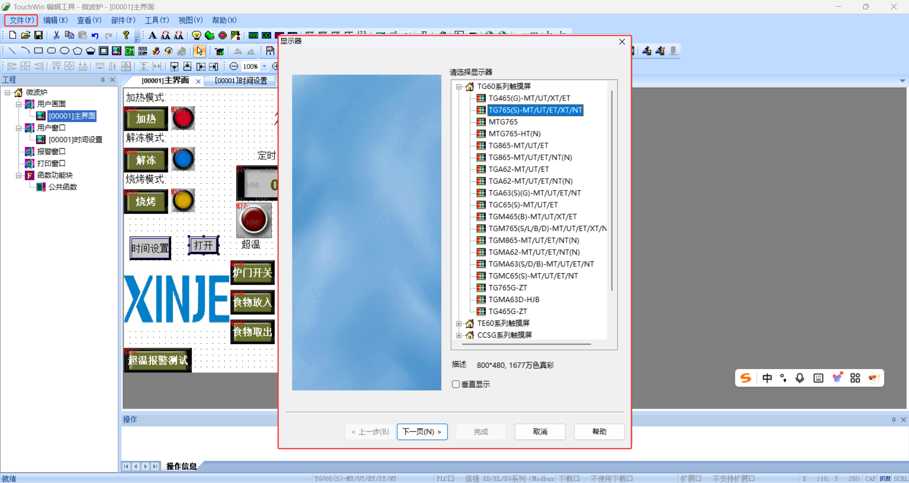
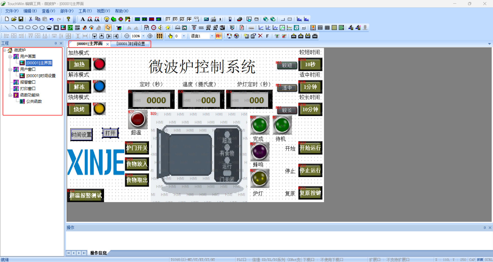
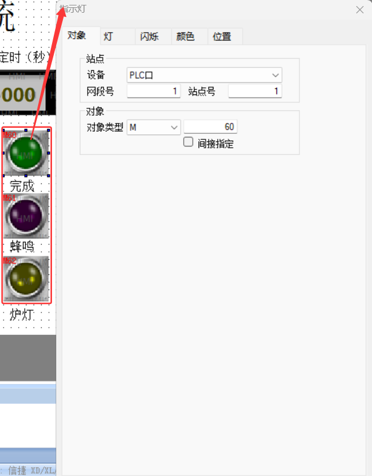
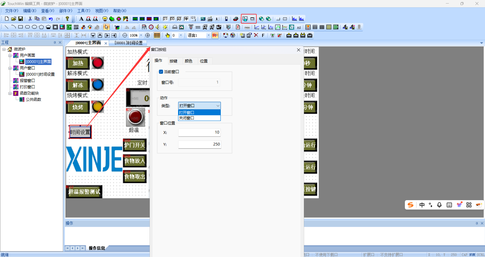
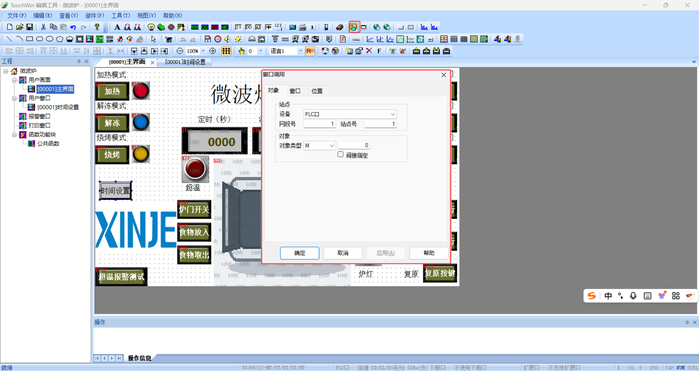
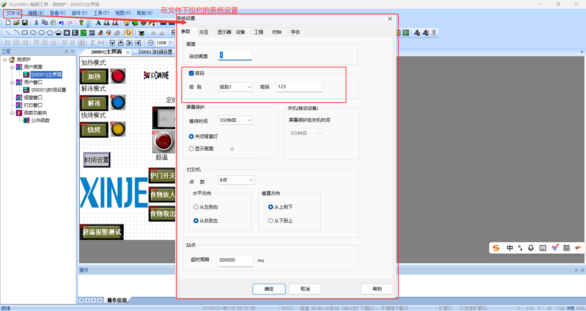
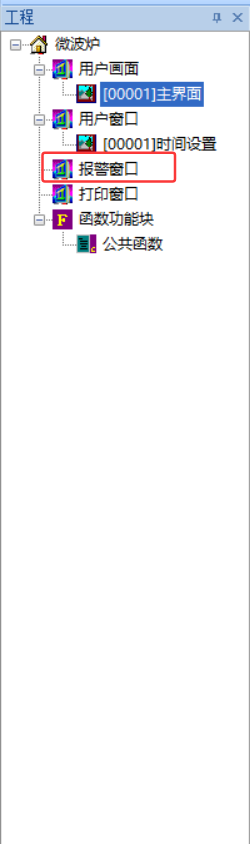

# TouchWin

## 一、HMI概念

官方的TouchWin手册已经非常完善了，可以随时查阅[TouchWin官方手册](../../../../30-资源/PLC-微波炉-工程与手册/TouchWin编辑软件用户手册（HC 02 20240527 1.2）-2024.5.27.pdf)

HMI 可以显示设备状态、接收按钮操作、输入参数、提示报警，但它本身不应代替 PLC 完成关键联锁和安全判断。

| 部分 | 英文全称 | 主要作用 |
|---|---|---|
| HMI | Human-Machine Interface | 完成人机操作和信息显示 |
| LCD | Liquid Crystal Display | 显示文字、数值、图形和画面 |
| Touch Panel | Touch Panel | 检测手指按压位置 |
| CPU | Central Processing Unit | 执行画面、通信和触摸处理 |
| RAM | Random Access Memory | 保存运行中的临时数据 |
| Flash | Flash Memory | 保存工程、字体和保持数据 |
| RTC | Real-Time Clock | 提供日期和时间 |
| PSU | Power Supply Unit | 为触摸屏内部电路供电 |

1. **HMI的作用**

HMI 的主要作用是把 PLC 内部不容易直接观察的数据转换成操作人员能理解的画面。

它可以把位状态显示成指示灯，把寄存器数值显示成温度、速度或数量，也可以把按钮操作写入 PLC 地址。

使用 HMI 时，应该先确定哪些对象只显示，哪些对象允许操作，再给对象分配对应地址。

注意事项：

- HMI 不是安全控制器，因为通信中断、触摸失灵或画面错误都可能使操作失效；
- 急停、安全门和过载保护不能只做在画面上，因为人员安全必须依靠独立硬件回路；
- HMI 显示正常不代表现场设备一定正常，因为画面只显示它读取到的数据。


2. **显示面板 LCD**

LCD（Liquid Crystal Display）是液晶显示面板，用于显示画面中的文字、图片、颜色和数值。

分辨率决定画面能使用的像素数量，例如宽度和高度分别能放多少内容。

使用时要按照实际 HMI 型号建立工程，避免工程分辨率和设备分辨率不一致。

注意事项：

- 字体不能过小，因为现场操作距离通常比电脑编辑距离远；
- 颜色对比要明显，因为强光、灰尘和老化都会降低屏幕可读性；
- 不要把重要状态只用颜色表示，因为部分人员可能无法准确区分颜色。


3. **触摸面板 Touch Panel**

Touch Panel 是触摸检测面板，用于判断按压位置并触发对应画面对象。

主要作用是代替部分实体按钮、选择开关和数字键盘。

使用时要给按钮留出足够尺寸和间距，使手指能够准确按到目标区域。

注意事项：

- 按钮不能贴得太近，因为手指触摸范围大于鼠标指针；
- 重要动作应增加确认条件，因为误触可能造成设备动作；
- 触摸位置偏移时要检查触摸校准，因为画面对象本身可能没有错误。


4. **CPU与存储器**

CPU（Central Processing Unit）负责刷新画面、处理触摸、执行 HMI 内部功能并与 PLC 通信。

RAM（Random Access Memory）保存运行中的临时数据，Flash Memory 保存工程和部分掉电保持数据。

使用时要区分临时内部地址和保持内部地址，避免把频繁变化的数据长期写入 Flash 区域。

注意事项：

- HMI 刷新速度受画面对象数量和通信量影响，因为每个对象都需要读取和处理数据；
- 不要高频写入 Flash 保持区，因为 Flash 存储器有写入寿命；
- 掉电保持数据也要做范围检查，因为旧数据或误输入可能在下次上电继续存在。


5. **电源单元 PSU**

PSU（Power Supply Unit）是电源单元，用于把外部电源转换成 HMI 内部需要的稳定电源。

使用方法是根据触摸屏铭牌确认额定电压、功耗、正负极和接地要求，再连接控制电源。

注意事项：

- 直流电源正负极不能接反，因为接反可能导致设备损坏；
- HMI 和 PLC 共用电源时要核对容量，因为电源压降可能造成触摸屏反复重启；
- 通信线和动力线要分开布置，因为变频器和接触器会产生电磁干扰；
- 保护地要可靠连接，因为接地能降低干扰和触电风险。


6. **通信接口**

通信接口用于 HMI 与 PLC、变频器、仪表或上位机交换数据。

常见接口包括 RS-232、RS-485、USB（Universal Serial Bus）和 Ethernet（以太网）。

使用通信接口时，需要让两端的协议、站号、波特率、校验方式或 IP 参数保持一致。

注意事项：

- 接口外形相同不代表协议相同，因为物理接口只决定电气连接方式；
- RS-485 的 A/B 标记可能因厂家不同而相反，通信失败时要结合说明书判断；
- 以太网通信要检查 IP 地址和子网掩码，因为同一网线不代表设备处于同一网段；
- 通信正常只说明数据能够交换，不代表地址和控制逻辑一定正确。


## 二、TouchWin基础

TouchWin 是信捷触摸屏的组态编辑软件，用于建立 HMI 工程、设置通信设备、编辑画面和配置对象属性。

官方手册已经详细介绍各菜单位置，学习时更重要的是理解工程结构、地址方向和对象之间的关系。


触摸屏显示“正在通信”原因：
1、通信参数不对
2、线不对
3、触摸屏程序地址错误


1. **新建工程**

新建工程就是先选择实际触摸屏型号，再建立与该型号分辨率和资源相匹配的工程。

主要作用是确定画面尺寸、颜色能力、通信接口和可使用功能。

使用时先核对 HMI 铭牌型号，再在软件中选择完全对应的设备，不要只按照屏幕尺寸判断。

注意事项：

- 型号选错可能造成画面尺寸或通信接口不一致，因为同尺寸触摸屏也可能属于不同系列；
- 工程方向和分辨率要在开始排版前确认，因为后期修改会导致大量对象错位；
- 新建后应先保存空工程，因为后续错误操作可以回到干净版本。



2. **设备与通信连接**

设备连接是指在 HMI 工程中添加需要通信的 PLC 或其他下位设备。

主要作用是告诉 TouchWin 使用哪个端口、哪种协议和什么站号读取地址。

使用时先选择 PLC 厂家和系列，再设置串口或以太网参数，最后统一约定地址格式。

| 参数 | 作用 |
|---|---|
| Protocol | 规定通信数据格式 |
| Station Number | 区分同一网络中的设备 |
| Baud Rate | 规定串口传输速度 |
| Data Bit | 规定每个字符的数据位数 |
| Parity | 用于串口数据校验 |
| Stop Bit | 标记串口字符结束 |
| IP Address | 标识以太网设备地址 |
| Port | 标识以太网服务端口 |


注意事项：

- 两端参数必须完全一致，因为任意一项不同都可能导致通信失败；
- 一个串口连接多个设备时站号不能重复，因为 HMI 无法区分相同站号；
- 修改通信参数后要同步记录，因为只改一端会使原本正常的通信中断；
- 地址前的设备名称要确认，因为同一个工程可能连接多个 PLC。


3. **画面管理**

画面管理用于建立、编号、复制和命名不同操作页面。

主要作用是把运行、参数、报警和维护内容分开，避免所有对象堆在一个页面中。

使用时应先列出画面清单，再按照操作流程建立页面，并给每个画面使用清楚的名称。



注意事项：

- 画面编号应稳定，因为跳转对象和 PLC 控制换页可能直接使用画面号；
- 不要随意删除或重排画面号，因为已有跳转关系可能指向错误页面；
- 页面名称要表达用途，因为“画面1”“画面2”不利于维护。


4. **对象属性**

对象属性是每个按钮、文字、指示灯或数值控件的具体设置。

属性通常包括地址、数据类型、颜色、字体、边框、显示条件和操作方式。

使用时先确定对象功能，再设置地址和数据，最后调整外观，避免只看画面效果而忽略控制方向。

如图示按钮的属性设置：


注意事项：

- 地址和数据类型比颜色更重要，因为外观正确但地址错误时功能仍然错误；
- 复制对象后必须检查地址，因为复制会同时保留原对象属性；
- 同类对象应使用一致尺寸和样式，因为不一致会增加操作人员判断时间。


5. **工程备份**

工程备份就是在修改通信、画面结构或大量对象前，保存一份可以回退的工程文件。

主要作用是区分可运行版本和正在修改的版本，避免错误修改后无法恢复。

使用时可在文件名中加入日期、版本或修改内容，并保留最近几个确认可用的版本。


注意事项：

- 不要只保留一个工程文件，因为文件损坏或错误覆盖后没有恢复来源；
- 上传得到的工程不一定包含完整注释和原始素材，所以不能代替本地备份；
- 图片和字体等外部资源也要一起保存，因为只保存工程文件可能缺少素材。


6. **地址清单**

地址清单是记录每个 HMI 对象所使用地址、读写方向和含义的表格。

主要作用是让 HMI 与 PLC 使用同一套地址定义，并减少重复占用和读写冲突。


| 内容 | 说明 |
|---|---|
| 对象名称 | 按钮、指示灯或数值的用途 |
| 地址 | PLC 或 HMI 内部软元件 |
| 方向 | HMI 写、HMI 读或双向 |
| 数据类型 | 位、16 位整数、32 位整数或浮点 |
| 单位 | 秒、摄氏度、转每分等 |
| 范围 | 允许输入或显示的最小值和最大值 |

注意事项：

- 地址表必须和 PLC 程序同时更新，因为只改一边会造成显示或操作错误；
- 读写方向要明确，因为显示对象不应误写 PLC 状态；
- 同一个地址被多个对象写入时要特别检查，因为不同页面也可能互相覆盖。


## 三、画面

HMI 画面由页面和页面中的对象组成。对象的位置、层级、状态和操作范围共同决定最终效果。

1. **画面 Screen**

Screen 是 HMI 中的一张操作页面，用于集中显示同一类信息和操作。

主要作用是按照任务划分内容，例如运行画面负责常用操作，参数画面负责设定，报警画面负责故障信息。

使用时应让每张画面有一个明确目的，不要把不相关功能混在一起。

注意事项：

- 主画面应优先显示当前状态和主要操作，因为操作人员最常停留在这里；
- 参数和维护功能应与普通操作分开，因为误触参数可能改变设备行为；
- 每张画面都要有清楚的返回路径，因为操作人员不能依赖记忆寻找页面。


2. **对象 Object**

Object 是画面中的独立元素，包括文字、图片、按钮、指示灯、数值显示和跳转键等。

主要作用是完成一种明确的显示或操作功能。

使用时应先给对象确定功能，再设置地址、状态和外观。

注意事项：

- 一个对象尽量只承担一个主要功能，因为多功能按钮不容易理解和排查；
- 对象名称应和用途一致，因为复制后只改外观容易忘记改地址；
- 只读对象不要配置写入动作，因为显示行为不应改变 PLC 数据。


3. **坐标与尺寸**

坐标决定对象在画面中的位置，尺寸决定对象占用的宽度和高度。

主要作用是保证按钮容易点击、文字完整显示、对象排列整齐。

使用时可以通过对齐、等间距和统一尺寸工具整理同类对象。

注意事项：

- 按钮尺寸要按照手指操作设计，因为鼠标能点中不代表现场容易触摸；
- 文字要在最长内容状态下检查，因为状态变化后可能出现截断；
- 动态数字要预留位数，因为数值增大后可能超出边框。


4. **层级与遮挡**

层级决定多个对象重叠时谁显示在上面。

主要作用是控制背景、图片、文字和操作对象的前后关系。

使用时应把背景放在底层，把可操作对象和重要提示放在上层。

注意事项：

- 透明对象也可能拦截触摸，因为看不见不等于不存在；
- 大面积对象不要覆盖按钮，因为按钮可能显示正常但无法点击；
- 调整层级后要重新检查触摸范围，因为视觉顺序和操作顺序可能不同。


5. **显示控制**

显示控制用于根据位状态或数值条件决定对象是否可见。

主要作用是只在需要时显示提示、按钮或状态信息。

例如报警位 ON 时显示报警文字，报警位 OFF 时隐藏。

注意事项：

- 隐藏对象不能作为唯一的安全限制，因为隐藏只是画面效果；
- 显示条件要和状态含义一致，因为条件写反会造成提示在错误状态出现；
- 多个对象使用相反条件切换时要检查空白和重叠状态。


6. **使能控制**

使能控制用于决定对象当前能否被操作。

主要作用是在条件不满足时禁止按钮或输入框响应触摸。

使用时可把运行状态、权限状态或允许条件绑定到对象使能属性。

注意事项：

- 禁用按钮最好有明显外观变化，因为没有反馈会让人误以为触摸屏故障；
- HMI 使能不能代替 PLC 联锁，因为地址仍可能被其他画面或通信设备写入；
- 使能条件复杂时应由 PLC 汇总成一个允许状态，因为画面中重复组合条件不利于维护。


7. **公共区域**

公共区域是多个画面重复使用的标题栏、导航栏、状态栏或时间显示区域。

主要作用是保持页面结构一致，使操作人员在不同画面中都能快速找到导航和状态。

使用时应统一位置、颜色、字体和按钮含义。

注意事项：

- 返回和主页按钮位置应固定，因为位置变化会增加误操作；
- 公共状态只显示真正需要持续观察的信息，因为内容过多会占用画面空间；
- 不同页面中的同名按钮必须执行相同动作，因为相同文字不应产生不同结果。


## 四、地址与数据类型

HMI 通过地址读取或写入 PLC 数据，也可以使用自身内部地址保存页面和系统信息。

地址是否正确、数据类型是否一致，是 HMI 显示和操作能否正常工作的基础。

| 数据类别 | 常见形式 | 主要用途 |
|---|---|---|
| 位数据 | X、Y、M、PSB | ON/OFF 状态和按钮命令 |
| 字数据 | D、HD、PSW、PFW | 参数、数量、时间和状态码 |
| 16 位整数 | Word / Int16 | 常用整数数据 |
| 32 位整数 | Double Word / Int32 | 大范围计数和累计值 |
| 浮点数 | Float / Real | 带小数的测量值 |

1. **PLC地址**

PLC 地址是下位控制器中的输入、输出、内部位和数据寄存器地址。

主要作用是让 HMI 读取 PLC 状态或向 PLC 发送操作请求。

使用时要同时确认设备名称、站号、软元件类型和具体地址。

注意事项：

- 同一个字符地址在不同 PLC 厂家中含义可能不同，因为软元件命名规则不统一；
- X/Y 地址可能按八进制风格编号，因为 `X10` 不一定紧跟十进制 `X9`；
- HMI 不要直接写实体输出 Y，因为输出必须经过 PLC 的联锁和保护逻辑。


2. **HMI内部地址**

HMI 内部地址是不依赖 PLC 的触摸屏内部位和内部寄存器。

TouchWin 常见内部对象包括 PSB、PSW 和 PFW。

| 对象 | 含义 | 常见用途 |
|---|---|---|
| PSB | HMI Internal Bit | 内部开关状态和系统标志 |
| PSW | HMI Internal Word | 当前画面号、临时数值和系统数据 |
| PFW | HMI Flash Word | 需要掉电保持的内部参数 |

注意事项：

- 内部地址不能直接代表 PLC 真实状态，因为 PLC 不一定知道 HMI 内部值；
- PFW 不适合高频写入，因为它属于保持存储区域；
- 特殊 PSB/PSW/PFW 的定义要查对应型号手册，因为不同系列可能存在差异。


3. **位数据 Bit**

Bit 是只有 ON 和 OFF 两种状态的数据。

主要用于按钮命令、运行状态、报警状态、允许条件和指示灯。

使用时要明确 HMI 对该位是读取、置位、复位、取反还是点动写入。

注意事项：

- ON/OFF 的文字含义必须写清楚，因为 ON 不一定表示设备正在运行；
- 位地址被 HMI 和 PLC 同时写入时可能互相覆盖，因为两端没有统一所有权；
- 状态位应由 PLC 维护，HMI 只读取，因为状态必须反映最终逻辑结果。


4. **字数据 Word**

Word 是由多个二进制位组成的数值数据，常见为 16 位。

主要用于温度、压力、速度、时间、数量、状态码和参数设定。

使用时要确认寄存器宽度、正负号、显示进制和工程单位。

注意事项：

- 16 位和 32 位设置不一致会读取相邻寄存器，因为 32 位数据通常占两个字；
- 有符号和无符号范围不同，因为最高位可能被解释成符号位；
- 多字数据要确认高低字顺序，因为顺序错误会显示很大的异常数值。


5. **整数、浮点与BCD**

整数用于没有小数或小数由倍率处理的数据，浮点数用于直接保存带小数的数据。

BCD（Binary-Coded Decimal）是二进制编码十进制，每四位二进制表示一个十进制数字。

使用时必须让 HMI 数据格式与 PLC 实际存储格式一致。

注意事项：

- PLC 中保存整数时，HMI 不能随意选择浮点，因为相同二进制会被解释成完全不同的数；
- BCD 不能当普通二进制整数显示，因为编码方式不同；
- 出现随机数时先查数据类型，因为这比怀疑通信故障更常见。


6. **倍率与小数位**

倍率用于把 PLC 原始整数转换成带工程单位的显示值。

例如 PLC 保存 `253` 表示 25.3℃，HMI 可以设置一位小数或使用比例换算显示。

主要作用是在不使用浮点寄存器时显示小数。

注意事项：

- 输入倍率和显示倍率必须采用同一规则，因为只改显示会导致写回值错误；
- 小数位只是显示格式时，PLC 中的原始值并不会自动改变；
- 单位换算应统一放在 PLC 或 HMI 一侧，因为两边同时换算容易重复放大。


## 五、按钮与状态显示

按钮负责向 PLC 发出操作请求，指示灯负责显示 PLC 的实际状态。

两者外观可以放在一起，但命令和状态的地址所有权要分清。

| 按钮方式 | 按下效果 | 适合用途 |
|---|---|---|
| Momentary | 按下 ON，松开 OFF | 开始、停止、复位、点动 |
| Set | 把目标位置为 ON | 请求或允许状态 |
| Reset | 把目标位复位为 OFF | 清除请求 |
| Toggle | 每次按下翻转状态 | 非关键开关选择 |

1. **普通按钮**

普通按钮用于在触摸时向一个位地址写入指定状态。

主要作用是把人的操作转换成 PLC 能识别的命令。

使用时应先确定按钮动作方式，再确认 PLC 如何接收和清除命令。

注意事项：

- 按钮名称要写动作，例如“启动”“停止”，因为状态名称容易和指示灯混淆；
- 关键动作不要直接操作输出位，因为这样会绕过 PLC 的启动条件；
- 按钮按下后要有反馈，因为没有反馈时操作人员可能连续重复点击。


2. **点动按钮 Momentary Button**

点动按钮是按下时写 ON、松开时写 OFF 的按钮。

主要作用是产生一次短暂命令，适合由 PLC 使用上升沿识别。

使用时把按钮绑定到命令位，由 PLC 检查条件后决定是否执行动作。

注意事项：

- 点动时间可能长于 PLC 扫描周期，所以 PLC 通常要用上升沿避免重复执行；
- 通信中断时松开命令可能无法及时传送，因此 PLC 还应有超时或自动清除策略；
- 需要长期保持的运行状态应由 PLC 锁存，因为按钮松开后命令位会恢复 OFF。


3. **置位、复位与取反**

置位按钮把目标位写成 ON，复位按钮把目标位写成 OFF，取反按钮每次按下翻转一次状态。

主要作用是操作需要保持的选择或内部设置。

使用时应根据功能是否允许保持决定按钮方式，不要为了方便统一使用置位。

注意事项：

- 置位按钮没有自动松开效果，因为目标位会一直保持 ON；
- 取反按钮不适合急停和安全功能，因为当前状态不明确时无法预测按下结果；
- PLC 若同时 `OUT` 同一位，HMI 写入可能在下一个扫描周期被覆盖。


4. **指示灯按钮**

指示灯按钮同时具有操作和状态显示能力。

主要作用是在同一位置完成按钮操作，并通过颜色或图形显示当前状态。

使用时最好把操作地址和监视地址分开：操作地址写命令，监视地址读 PLC 最终状态。

注意事项：

- 如果操作地址和监视地址相同，按钮亮起可能只表示命令已写入，不表示动作已经执行；
- 状态颜色要由监视地址决定，因为 PLC 可能因联锁拒绝命令；
- 同一个按钮有多个状态时要逐个检查文字和颜色，因为状态表容易配置错位。



5. **指示灯**

指示灯是只读取位状态或数值状态的显示对象。

主要作用是显示运行、停止、报警、允许和设备位置等状态。

使用时应绑定 PLC 已确认的状态位，而不是绑定按钮命令位。

注意事项：

- 绿色通常表示正常或运行，红色通常表示故障或危险，但含义必须在同一设备中保持一致；
- 灯灭不一定表示停止，因为通信中断也可能使画面无法刷新；
- 重要状态最好同时显示文字，因为只看颜色容易产生误解。


6. **命令与状态分离**

命令与状态分离就是 HMI 写一个请求位，PLC 处理后维护另一个实际状态位。

主要作用是保证所有联锁、报警和允许条件仍由 PLC 决定。

```text
HMI按钮 -> 命令位 -> PLC条件判断 -> 状态位 -> HMI指示灯
```

例如 HMI 写启动请求，PLC 在安全条件成立后置位运行状态，HMI 再读取运行状态显示。

注意事项：

- HMI 写命令不等于 PLC 接受命令，因为允许条件可能不成立；
- 状态位不能由 HMI 直接清除，因为这会让画面改变 PLC 内部流程；
- 简单只读显示可以直接读取 PLC 内部状态，不必为了显示重复复制一套相同状态。


7. **按钮使能与操作许可**

按钮使能用于在条件不满足时禁止按钮操作。

主要作用是减少无效操作，并让操作人员知道当前哪些动作可用。

使用时可以让 PLC 输出一个操作允许位，HMI 用该位控制按钮使能。

注意事项：

- 按钮禁用只是操作提示，PLC 仍必须检查同样的允许条件；
- 禁用状态要明显变灰或改变样式，因为按钮外观不变会造成误判；
- 不要把复杂工艺判断全部写在 HMI 中，因为 PLC 无法验证画面条件是否正确。


## 六、数值输入与显示

数值控件用于显示和修改寄存器数据。正确的数据类型、范围、倍率和单位比外观更重要。

1. **数值显示**

数值显示对象用于读取寄存器并把数据转换成可见数字。

主要作用是显示测量值、设定值、计数值、时间和状态码。

使用时要设置地址、数据类型、位宽、小数位、字体和单位。

注意事项：

- 数值突然变大或变成负数时先查有符号和位宽，因为地址可能没有变化；
- 显示位数要覆盖最大值和负号，因为超出宽度会截断；
- 单位应紧靠数值显示，因为没有单位的数字容易被错误理解。


2. **数值输入**

数值输入对象允许操作人员通过键盘向寄存器写入数据。

主要作用是设定速度、时间、温度、数量和其他工艺参数。

使用时必须设置输入上下限，并确认 PLC 会再次校验输入值。

注意事项：

- HMI 上下限不能代替 PLC 校验，因为地址还可能被其他设备或监控软件修改；
- 输入完成后要有确认结果，因为通信失败时画面输入不一定真正写入 PLC；
- 关键参数应增加权限或确认，因为误输入可能造成设备异常。


3. **数字键盘**

数字键盘是输入数值时弹出的输入界面。

主要作用是提供数字、正负号、小数点、清除和确认操作。

使用时要让键盘类型与数据类型匹配，例如整数参数不需要小数点。

注意事项：

- 确认键和取消键要明显区分，因为误按会写入未完成数据；
- 键盘不能遮挡正在输入的对象和单位，因为操作人员需要看到目标参数；
- 密码和普通参数不要共用同样的明文显示方式。


4. **输入范围**

输入范围是允许写入参数的最小值和最大值。

主要作用是阻止明显错误的负数、零值或过大数值进入 PLC。

使用时要根据设备能力和工艺要求设置范围，并在 PLC 中使用相同或更严格的限制。

注意事项：

- 范围不能只按寄存器容量设置，因为设备允许值通常远小于数据类型上限；
- 最小值是否包含零要根据实际含义确定，因为零可能表示停用，也可能是非法值；
- 修改上下限时要同步说明原因，因为后期维护人员需要知道限制来源。


5. **设定值与反馈值**

设定值是操作人员希望设备达到的目标，反馈值是 PLC 或传感器确认的实际结果。

主要作用是区分“要求多少”和“实际多少”。

使用时可以让 HMI 写设定寄存器，PLC 校验后复制到工作寄存器，再把实际值显示出来。

注意事项：

- 不要只显示设定值，因为设备可能没有达到目标；
- HMI 输入地址和实际反馈地址不应混用，因为 PLC 运算会和操作输入互相覆盖；
- 参数被 PLC 修正后要显示确认值，因为操作人员需要知道最终采用了什么数值。


6. **状态码文字显示**

状态码文字显示是把寄存器中的数字转换成对应文字。

主要作用是让操作人员看到“待机”“运行”“报警”等含义，而不是只看到数字代码。

使用时可以采用多状态文本、多状态指示对象，或者让多个普通文字按条件显示。

注意事项：

- 每个状态码只能有一个明确含义，因为重复含义会导致画面无法判断；
- 未定义状态要显示“未知状态”，因为空白画面不利于排查；
- 状态码由 PLC 统一生成更可靠，因为 HMI 不需要重复组合多个流程条件。


7. **动态图片状态**

动态图片状态是让一个数据寄存器的不同数值对应不同图片。

主要作用是用一个对象显示设备的完整外观，例如位置、物料、运行、完成和报警状态。

使用时先建立状态码表，再让PLC根据实际流程写入状态码，HMI动态图片只读取这一个寄存器。

注意事项：

- 一张完整动态图片只能按一个状态地址切换，所以炉门、物料和流程状态要先在PLC中组合；
- 每个数值应对应一张完整图片，不能只修改其中一个局部后假设其他状态会自动保留；
- 状态码新增后要同时增加图片状态和文字说明，否则会出现空白或旧图片；
- 动态图片只读状态寄存器，不能通过图片对象反向修改PLC流程；
- 多个条件同时成立时，要在PLC中规定写入顺序和显示优先级。


## 七、画面跳转与权限

画面跳转决定操作人员如何在不同页面之间移动，权限决定哪些人员可以进入或操作特定页面。

1. **画面跳转**

画面跳转对象用于按下后切换到指定画面。

主要作用是建立主画面、参数画面、报警画面和维护画面之间的导航关系。

使用时要设置目标画面号，并使用清楚的目标名称作为按钮文字。

注意事项：

- 按钮应写“参数”“报警”等目标页面名称，因为“下一页”无法说明去向；
- 所有子页面都要能返回主画面，因为单向跳转容易使操作人员迷失；
- 画面号改变后要检查全部跳转对象，因为跳转关系可能仍使用旧编号。



2. **PLC控制画面变换**

PLC 控制画面变换是让 HMI 根据一个 PLC 寄存器的数值自动跳到对应画面。

主要作用是在报警、流程切换或维护请求发生时，由 PLC 引导 HMI 显示指定页面。

使用时在 TouchWin 的交互设置中配置控制画面变换寄存器，由 PLC 在事件发生时写入目标画面号。

注意事项：

- PLC 应在事件发生时写一次画面号，不要每扫描重复写，因为 HMI 可能无法进行人工跳转；
- TouchWin 完成跳转后可能把命令寄存器清零，所以 PLC 不应把零当成故障；
- 强制跳转要谨慎，因为频繁跳页会打断操作人员正在进行的输入。



3. **报告当前画面号**

报告当前画面号是让 HMI 把正在显示的页面编号写入一个寄存器。

主要作用是让 PLC 知道操作人员当前位于哪个页面，便于诊断或流程提示。

使用时应使用不同于画面跳转命令的寄存器。

注意事项：

- 命令画面号和当前画面号不能使用同一地址，因为两边写入会互相覆盖；
- 当前画面号只表示页面位置，不表示操作人员已经完成页面中的操作；
- PLC 不应把画面号作为唯一安全条件，因为页面可以因通信或操作变化。


4. **密码与权限**

密码与权限用于限制参数、维护和系统设置等敏感功能。

主要作用是防止无关人员修改重要数据或进入维护页面。

使用时可以给画面跳转、按钮或数值输入设置权限等级。



注意事项：

- 权限用于管理操作，不是安全回路，因为知道密码的人仍可能误操作；
- 默认密码必须修改，因为公开默认值起不到限制作用；
- 权限等级要按岗位划分，因为所有人共用最高权限无法追踪责任；
- 退出或超时后应降低权限，因为维护人员离开后画面可能仍保持登录状态。


## 八、报警与事件

报警用于提示当前存在的异常，事件用于记录某个状态在什么时候发生或消失。

报警条件应由 PLC 判断，HMI 负责显示、确认和查询。

1. **报警显示**

报警显示用于在一个数值超过上限或低于下限时改变显示效果。

主要作用是给温度、压力、速度等数值提供直观提醒。

使用时把对象绑定到数值寄存器，再设置上下限、颜色或闪烁方式。

注意事项：

- HMI 报警显示不能代替 PLC 停机保护，因为画面只负责提示；
- 上下限要和 PLC 报警阈值一致，因为两个阈值不同会出现停机但画面不报警；
- 闪烁不能作为唯一提示，因为操作人员可能没有正在查看该页面。



2. **报警列表**

报警列表用于集中显示多个当前报警信息。

主要作用是让操作人员知道发生了什么、发生时间和当前是否仍然存在。

使用时为每个 PLC 报警位配置唯一文字，并按照重要程度设置顺序或等级。

注意事项：

- 报警文字要说明对象和原因，因为“故障1”无法指导处理；
- 一个报警位对应一个明确条件，因为多个故障共用一位无法定位来源；
- 报警消失和报警复位要区分，因为条件恢复不代表操作者已经确认。


3. **实时事件**

实时事件用于显示最近发生的状态变化和操作提示。

主要作用是观察当前过程中的事件顺序，例如启动、停止、报警出现和报警恢复。

使用时要确定事件由上升沿、下降沿还是状态持续触发。

注意事项：

- 高频变化信号不适合全部记录，因为事件列表会被快速刷满；
- 上升沿和下降沿文字要分别定义，因为“发生”和“恢复”含义不同；
- 普通运行提示和严重报警要区分优先级，因为重要信息不能被大量普通事件淹没。


4. **历史事件**

历史事件用于保存过去发生过的报警或操作记录。

主要作用是帮助维护人员分析故障时间、持续过程和重复规律。

使用时应只记录真正需要追溯的事件，并确认触摸屏存储空间和时间设置正确。

注意事项：

- HMI 时间必须准确，因为错误时间会使故障顺序失去参考价值；
- 不要记录每个高速脉冲，因为存储空间有限且高频写入没有分析价值；
- 历史记录是诊断依据，不是完整生产数据库，因为触摸屏容量和可靠性有限。


5. **报警确认与复位**

报警确认表示操作人员已经看到报警，报警复位表示 PLC 在故障条件消失后清除报警锁存。

两者目的不同，不能只用一个 HMI 位直接清除所有报警状态。

使用时让 HMI 确认对象处理显示确认，让复位按钮写复位请求位，再由 PLC 判断是否允许复位。

注意事项：

- 故障条件没有消失时不应复位成功，因为强行清除会掩盖真实危险；
- HMI 不能直接复位 PLC 报警状态位，因为 PLC 必须检查恢复条件；
- 报警确认后仍要保留故障文字或状态，因为确认不等于故障已经排除。


6. **报警文字**

报警文字应直接说明发生位置、异常类型和必要处理方向。

主要作用是让操作人员不查看程序也能判断先检查什么。

例如“输送电机过载，请检查热继电器”比“电机故障”更容易处理。

注意事项：

- 报警文字不能只写元件地址，因为操作人员不一定知道 PLC 地址含义；
- 不要在报警文字中承诺具体故障原因，因为一个信号可能由多种现场问题造成；
- 同类报警使用统一句式，因为统一格式更容易扫描和比较。

