## IO地址分配

### 1. HMI输入绑定

写入操作命令和参数，PLC负责判断条件、保存步骤状态和驱动输出。除炉门外，按钮均使用瞬时ON。

| HMI操作 | 地址 | HMI动作 | PLC处理 |
|---|---|---|---|
| 炉门开关 | M100 | 保持开关 | ON=开门，OFF=关门 |
| 加热模式 | M101 | 瞬时ON | 选择M10，取消M11/M12 |
| 解冻模式 | M102 | 瞬时ON | 选择M11，取消M10/M12 |
| 烧烤模式 | M103 | 瞬时ON | 选择M12，取消M10/M11 |
| 10秒档 | M104 | 瞬时ON | 选择M20，装载HD10 |
| 1分钟档 | M105 | 瞬时ON | 选择M21，装载HD11 |
| 10分钟档 | M106 | 瞬时ON | 选择M22，装载HD12 |
| 开始/继续 | M107 | 瞬时ON | M1进入M2，或M3返回M2 |
| 放食物 | M108 | 瞬时ON | 开门且处于M0/M1/M3时SET M114 |
| 取食物 | M109 | 瞬时ON | 开门且处于M0/M1/M3/M5时RST M114 |
| 停止 | M110 | 瞬时ON | 运行转暂停；炉灯返回待机；报警时总复位 |
| 复原 | M111 | 瞬时ON | 一次撤销选择或退出炉灯，累计两次总复位 |
| 超温模拟 | M112 | 瞬时ON | 运行中触发M6，供调试使用 |

瞬时按钮按下后只短暂写ON，程序再用 `ANDP` 读取上升沿，因此一次按键只处理一次。HMI不能写入 `M0~M62`、`M114` 或 `D0~D30` 等PLC状态和工作数据。

### 2. 顺序步骤

`M0~M6` 表示微波炉当前处于哪个顺序步骤。

| 地址 | 步骤 | ON时表示 | 主要离开条件 |
|---|---|---|---|
| M0 | 待机 | 可以存取食物、选择模式和时间 | 条件齐全后自动进入M1 |
| M1 | 就绪 | 已关门、有食物、模式和时间已选 | 条件失效回M0；按开始进入M2 |
| M2 | 运行 | 倒计时和温升正在执行 | 完成进M4；停止或开门进M3；超温进M6 |
| M3 | 暂停 | 保留模式、时间和D1剩余时间 | 条件恢复并按开始回M2 |
| M4 | 完成 | 倒计时结束，等待打开炉门 | 开门后进入M5 |
| M5 | 炉灯 | 开门照明和炉灯倒计时 | 计时结束、取食物、停止或复原后进M0 |
| M6 | 报警 | 超温报警锁存，运行已经停止 | 停止、复原或开门后总复位 |

正常情况下，`M0~M6` 只应有一个为ON。

### 3. 选择状态

| 地址 | 名称 | 作用 |
|---|---|---|
| M10/M11/M12 | 加热/解冻/烧烤 | 三种模式互斥，HMI可直接读取显示 |
| M20/M21/M22 | 10秒/1分钟/10分钟 | 三档时间互斥，HMI可直接读取显示 |
| M30 | 模式已选 | 任一模式选择后ON |
| M31 | 时间已选 | 任一时间选择后ON |
| M40 | 一秒脉冲 | T0每到时一次，保持一个扫描周期 |
| M41 | 炉灯闪烁位 | 每秒由ALT翻转一次 |
| M42 | 最后选择类型 | OFF=模式，ON=时间 |
| M50 | 总复位申请 | 上电、两次复原或报警恢复时ON |
| M51 | 炉灯退出申请 | 炉灯计时结束、取食物、停止或复原时短暂ON |
| M60 | 完成提示 | M4或M5时ON |
| M61 | 蜂鸣提示 | M4、M5或M6时ON |
| M62 | 炉灯 | M5 ON并且由M41闪烁控制 |
| M114 | 有食物状态 | PLC维护，HMI只读 |

### 4. 数据寄存器

| 地址 | 名称 | 初始值 | 用途 |
|---|---|---:|---|
| HD10 | 短时间预设 | 10 | HMI输入，单位秒 |
| HD11 | 中时间预设 | 60 | HMI输入，单位秒 |
| HD12 | 长时间预设 | 600 | HMI输入，单位秒 |
| HD13 | 炉灯时间预设 | 10 | HMI输入，单位秒 |
| D10/D11/D12 | 三档确认值 | 对应HD | HMI只读显示 |
| D13 | 炉灯确认值 | HD13 | HMI只读显示 |
| D0 | 当前总时间 | 0 | 选择时间时装载 |
| D1 | 工作剩余时间 | 0 | M2运行时每秒减1 |
| D14 | 炉灯剩余时间 | 0 | 进入M5前由D13装载 |
| D20 | 动画状态码 | 1 | 动态图片只读取该寄存器 |
| D30 | 当前温度 | 25 | M2运行时每秒加5℃ |

`HD` 保存HMI设定值，`D` 保存PLC确认值和运行工作值。运行倒计时只能修改 `D1/D14`，不能递减 `HD10~HD13`。

### 5. D20动画状态

动态图片对象只绑定 `D20`，每个数值对应一张完整的微波炉状态图片。

| D20 | 动态图片含义 | PLC条件 |
|---:|---|---|
| 0 | 炉门开，无食物 | M100=ON，M114=OFF |
| 1 | 炉门关，无食物 | M100=OFF，M114=OFF |
| 2 | 炉门开，有食物 | M100=ON，M114=ON |
| 3 | 炉门关，有食物 | M100=OFF，M114=ON，未运行/完成/炉灯/报警 |
| 4 | 加热中 | M2=ON，M10=ON |
| 5 | 解冻中 | M2=ON，M11=ON |
| 6 | 烧烤中 | M2=ON，M12=ON |
| 7 | 已完成 | M4=ON |
| 8 | 超温报警 | M6=ON |
| 9 | 炉灯中 | M5=ON，炉门已经打开 |

`D20` 同时表达炉门、食物和流程状态，因此动态图片不需要再读取 `M100`、`M114` 或显示镜像位。

### 6. 定时器、计数器和特殊继电器

| 地址 | 设定 | 用途 |
|---|---|---|
| T0 | K10，K100时基 | 约1秒公共节拍 |
| T1 | K10，K100时基 | 炉灯每秒递减节拍 |
| C0 | K2 | 两次复原触发总复位 |
| SM0 | 运行常ON | 持续同步D13并驱动T0 |
| SM2 | 首次扫描ON | 上电初始化 |


## 硬件配置

使用到的主要硬件如下。

| 序号 | 硬件名称 | 数量 | 作用概述 |
|---:|---|---:|---|
| 1 | XDC-32T-E | 1 | 信捷PLC，执行顺序控制、数据运算和输出控制 |
| 2 | TG765-MT | 1 | 信捷触摸屏，负责按钮输入、数值设置和状态显示 |
| 3 | DZ47LE-2P 10A空气开关 | 1 | 提供短路、过载和漏电保护 |
| 4 | LRS-100-24开关电源 | 1 | 将交流电转换为DC24V |
| 5 | USB-COM | 1 | 电脑与PLC串口通信或调试 |
| 6 | USB打印线 | 1 | 电脑与带USB-B接口设备连接 |
| 7 | XVP通信线 | 2 | PLC、HMI和电脑之间通信 |

### 硬件接线

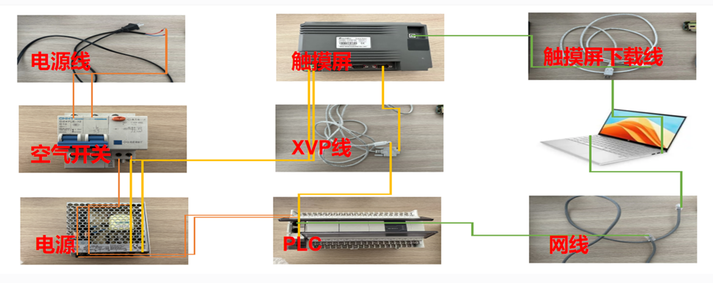

如果需要物理输出，则要使用 `Y0~Y12`。真实设备调试时，加热输出必须另外串联硬件门联锁和独立过温保护，普通PLC程序不能代替安全回路。


## 梯形图网络

当前程序使用8个网络。

| 网络 | 名称 | 主要责任 |
|---:|---|---|
| 1 | 初始化 | 初始化参数，产生一秒脉冲和炉灯闪烁位 |
| 2 | 选择与复原 | 存取食物，模式与时间选择，复原计数和单次撤销 |
| 3 | 运行与转移 | 倒计时、温升、超温、完成、停止和开门暂停 |
| 4 | 待机就绪启动 | M0/M1/M2/M3之间的正常转换 |
| 5 | 完成炉灯报警 | 完成开门、炉灯倒计时、炉灯退出和报警恢复 |
| 6 | 状态码显示 | 生成D20动态图片状态码 |
| 7 | 状态与物理输出 | 生成提示位并统一驱动Y输出 |
| 8 | 总复位 | 集中清除状态并恢复初始条件 |

### 初始化

上电初始化和秒脉冲。

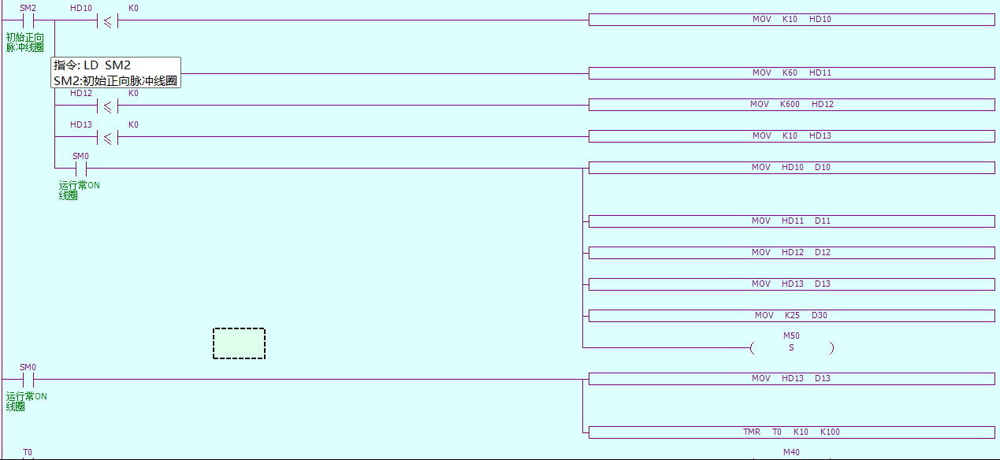

`SM2` 是上电首次扫描，只用于给 `HD10~HD13`、`D10~D13` 和温度 `D30` 初始化。程序先检查 `HD10~HD13` 是否小于等于0，异常时写入默认值，再把四个保持寄存器复制到 `D10~D13`。

`SM0` 是运行常ON，用于持续把炉灯设定 `HD13` 同步到确认值 `D13`，因为炉灯时间可能在PLC运行后由HMI修改。不能每次扫描把默认值写回HD13，否则HMI刚输入的新数值会立即被覆盖。

`TMR T0 K10 K100` 生成约1秒节拍，`T0` 到时后置位 `M40` 一个扫描周期，通过OUT控制输出M40，可以让M40和T0同时ON同时OFF。`RST T0` 在同一扫描末尾清除定时器，使下一扫描重新开始计时，所以M40会周期性地每秒出现一次。

`ALT M41` 在T0每次到时时翻转一次。第一次到时由OFF变ON，下一次到时由ON变OFF，因此M41形成约1秒亮、1秒灭的闪烁位。M40是每秒只出现一次的运算脉冲，M41是保持一秒后再翻转的显示状态。

`SET M50` 提出一次总复位请求。在同一扫描后部统一清除旧步骤、选择和数据，最后只留下M0待机状态。


- 默认值只能在 `SM2` 首次扫描时写入，不能每扫描覆盖HMI参数；
- `T0` 和倒计时运算只能保留一份，否则D1和D14会变快；


### 待机状态选择

食物操作、模式选择、时间选择和复原,按钮直接使用 `ANDP` 读取上升沿。

**食物操作：**

放食物要求炉门打开，并处于待机、就绪或暂停。取食物另外允许 `M5` 炉灯阶段；M114被复位后，网络5会提出M51炉灯退出请求。

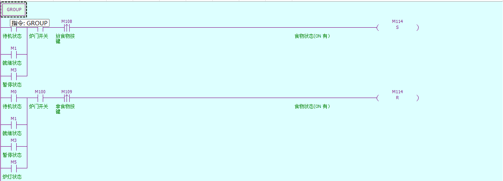


**模式选择**

加热模式选择，主要是在待机或者就绪或者暂停状态下有按键反应则选择加热模式，解冻和烧烤使用同样结构，只是分别置位 `M11/M12`。每次置位当前模式并复位另外两个，保证模式唯一；`M30` 表示模式已选，`RST M42` 记录最后一次选择属于模式。

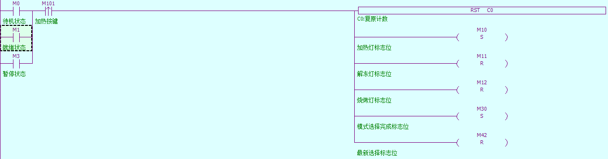

**时间选择**

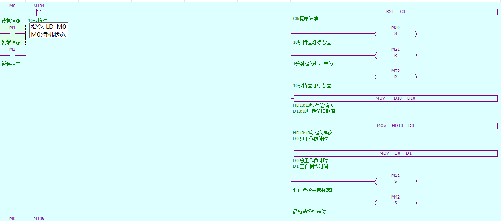

另外两档时间结构相同，分别使用 `HD11/M21` 和 `HD12/M22`。`D0` 保存当前总时间，`D1` 保存剩余时间；选择新时间时两者同时装载。


**复原**

一次复原只在 `M0/M1/M3` 中撤销最后选择。`M42=ON` 撤销时间，`M42=OFF` 撤销模式。运行中第一次复原不会改动模式和D1，只让C0计数；第二次复原才总复位。

每次重新选择模式或时间都会 `RST C0`，所以“两次复原”指没有重新选择或重新启动打断的连续复原操作。

`LD M0 OR M1 OR M3` 表示选择和食物操作在待机、就绪、暂停三个步骤中都可以执行。模式和时间不受炉门及食物影响，因此可以先完成选择，再开门放食物；只有存取食物额外串联 `M100`，保证炉门打开时操作才有效。

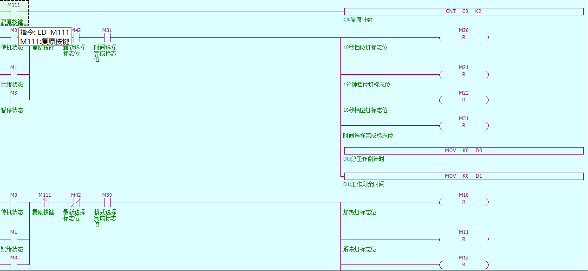


炉灯阶段已经有食物，不需要再次执行放入动作。取食物增加 `OR M5`，使完成后开门照明期间能够取出食物。M109复位M114后，网络5检测到M114为OFF，再通过M51结束炉灯并返回M0。

`ANDP M101~M111` 直接读取HMI瞬时按钮的上升沿。即使按钮ON的时间跨过多个PLC扫描周期，对应逻辑也只在OFF变ON的第一个扫描周期执行，不需要再增加一组中间脉冲位。

M42记录最后一次选择的类型。选择模式时RST M42，选择时间时SET M42，因此一次复原可以判断应该撤销模式还是时间。C0独立统计复原次数，当C0达到2时只SET M50，真正的清除仍交给网络8完成。


- M114是PLC维护的真实食物状态，HMI只能通过M108/M109提出请求，不能直接写M114；
- 每次选择新模式、时间或开始运行都要RST C0，否则上一次复原计数可能残留；
- 运行步骤M2中一次复原只计数，不撤销选择，避免D1突然归零导致误完成；
- 炉灯步骤M5中一次复原由网络5退出到M0，第二次复原才触发总复位。


### 运行

运行各状态周期动作和异常转移。

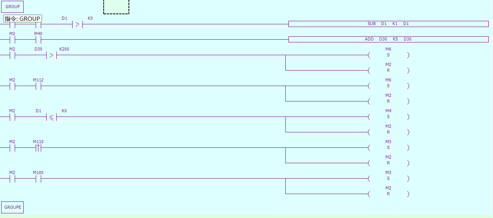


设置倒计时，M2运行标志为ON，M40秒脉冲为ON，总时间D1大于0则让D1自减1，SUB D1 K1 D1.
模拟温度上升，M2运行标志为ON，M40秒脉冲为ON，让温度D30自加5，ADD D30 K5 D30.

报警触发，M2触点导通，D30大于等于200，                     ----|
模拟超温触发，M2触点导通并且超温模拟位M112为ON，---- |-》   则设置系统状态为M6报警状态，RST M2.

运行完成，M2触点导通并且总时间D1小于等于0，则设置系统状态为M4完成，RST M2.

进入暂停，M2触点导通并且暂停脉冲M110上升沿导通，则设置系统状态为M3暂停，RST M2.
M2触点导通并且炉门打开也进入暂停状态，设置系统状态为M3暂停，RST M2.

进入运行，M1就绪状态下，模式和时间都选择好了，M30，M31都是ON，门关闭M100 OFF，有食物M114 ON，运行上升沿M107导通，总时间D0幅值给剩余时间D1，设置系统状态为M2运行状态，rst m1，复位复原状态计数器C0


### 复原

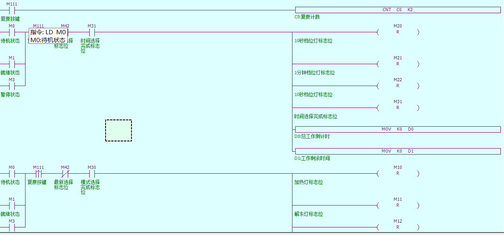

按下复位按键M111，先设置复位计数器C0,2次导通为ON，
一次复原，当在(M0待机 | M1就绪 | M3暂停）的情况下，有M111上升沿脉冲，如果M42是ON并且时间选择完成标志位M31是ON，复位时间灯M20 和M21 和M22和时间选择完成标志位M31，D0和D1幅值为0
当在(M0待机 | M1就绪 | M3暂停）的情况下，有M111上升沿脉冲，如果M42是OFF并且模式选择完成标志M30为ON，复位模式灯M10和M11和M12和模式选择完成标志M30，
二次复原，如果C0导通，则导通总复原标志位M50


注意事项：

- 报警使用SET M6锁存，温度下降后不会自动恢复；
- M112只用于模拟超温，正常运行不应由HMI长期保持ON；
- 倒计时或温升过快时，应检查T0、M40和本网络是否被重复编写；
- 同一扫描同时出现完成和超温时，程序按当前顺序优先进入超温报警。


### 待机

正常步骤 是`M0待机 -> M1就绪 -> M2运行`，以及 `M3暂停 -> M2继续`。

就绪进入待机，当M1触点导通时，模式选择标志位M30或者时间选择标志位M31为OFF，或者炉门打开M100 ON，或者没有食物M114 OFF，就设置系统状态为M0待机状态，set m0，rst m1
待机进入就绪，M0触点导通，模式选择标志位M30和时间选择标志位M31都是ON，炉门关闭M100OFF，有食物M114 ON，则设置系统状态为M1待机状态，set m1，rst m0

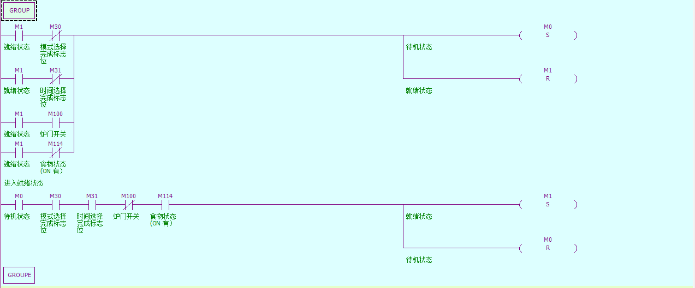


注意事项：

- M0到M1是条件满足后的自动转换，M1到M2还必须等待开始按钮上升沿；
- 启动许可必须同时包含关门和有食物，不能只在HMI上禁用按钮；
- 暂停后若炉门仍开、食物不存在或选择被撤销，按开始不会进入M2；
- M0、M1、M2、M3是互斥步骤，转换时应先SET下一步，再RST当前步。

### 炉灯、报警

进入炉灯状态，自M4触点导通（完成状态）下，开门M100 ON，先把炉灯倒计时总时间D13幅值给剩余时间D14，设置系统状态为M5炉灯状态，复位M4，set m5，rst m4
设置炉灯定时器，m5触点导通下，设置独立秒脉冲T1：TMR T1 K10 K100，
炉灯倒计时，T1触点导通，炉灯剩余时间D14大于0，则让D14自减1，SUB D14 K1 D14，同时复位T1，保持秒脉冲正常。
炉灯状态退出，M5触点导通，炉灯剩余时间D14小于0,或者炉门打开M100 ON，或者食物取出M114 OFF，或者按下复原M111上升沿导通，四种状态下都设置炉灯退出标志位M51为ON
炉灯退出进入就绪，炉灯退出标志位M51导通，复位M5和T1和M51，D14剩余时间清零 MOV K0 D14，温度恢复默认MOV K25 D30，设置系统状态为M0待机状态。

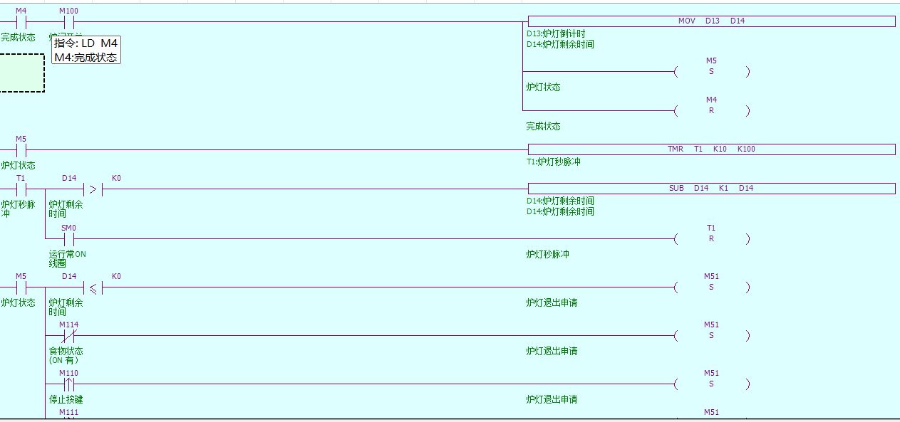

M51统一表示炉灯退出请求，共有四种来源，D14到0、取出食物使M114为OFF、按停止、按复原。退出时只清除炉灯状态并回到M0，不执行总复位，所以模式、时间、炉门和未被取出的食物可以保留。

炉灯阶段第一次复原同时会使C0计数为1；退出到M0后再按一次复原，C0达到2并触发M50总复位。

M4是完成提示步骤。只有M4为ON且M100为ON，也就是工作完成后实际打开炉门，程序才把D13复制到D14并进入M5。`MOV D13 D14` 写在 `SET M5` 前面，保证M5第一次扫描时D14已经得到正确的炉灯时间。

M5是整个炉灯倒计时阶段，不是炉灯亮灭的瞬时状态。T1在M5持续成立时计时，每到约1秒执行一次 `SUB D14 K1 D14`，随后RST T1重新计时；真正的灯光闪烁由网络7中的 `M5 AND M41` 产生。

M51是炉灯退出申请。D14到0、取出食物、按停止或按复原都会SET M51，后面只写一份统一收尾逻辑。这样四个退出条件不会各自重复清除M5、T1和D14，也不容易漏掉某个复位动作。

**报警恢复**：

报警必须由明确操作恢复，不能因为温度下降自动消失。

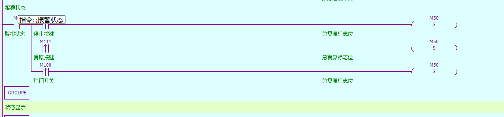

M6报警恢复，停止、复原和开门都使用ANDP，只在人工操作发生的一瞬间SET M50，避免炉门一直打开时报警刚产生就被持续条件立即清除。

注意事项：

- D13是炉灯设定值，D14是炉灯剩余值，倒计时不能直接修改D13或HD13；
- 炉灯退出必须走M51，不能把四组相同复位指令分散到不同条件下；
- 炉灯中第一次复原会退出到M0并保留C0=1，再按一次才进入总复位；
- 取食物后返回M0时，因为M114=OFF，不会自动进入M1就绪。

### 系统状态

内部状态转换成动态图片读取的 `D20`。

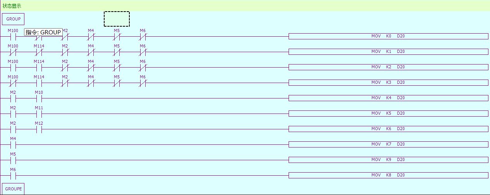

前四组先写炉门和食物基础状态0~3，后面再写运行、完成、炉灯和报警状态。PLC从上到下扫描，后写入的流程状态会覆盖基础状态。

D20的0~3是炉门和食物的组合状态。每个基础支路都串联M2、M4、M5、M6的常闭条件，表示只有不在运行、完成、炉灯和报警步骤时。

D20的4~6由M2与M10~M12组合产生，分别表示加热、解冻和烧烤运行。D20=7由M4产生，D20=9由M5产生，D20=8由M6产生，HMI只需要根据一个寄存器选择完整动态图片。

注意事项：

- 动态图片只绑定D20，不能再分别绑定M100、M114和M62来控制同一个对象；
- HMI必须完整配置0~9，缺少状态9时炉灯阶段会继续显示旧图片或空白；
- 调整MOV顺序会改变显示优先级，修改后必须检查报警、完成和炉灯图片；
- D20由PLC每扫描生成，HMI只能读取，不能作为按钮写入地址。

### 状态

生成提示状态。

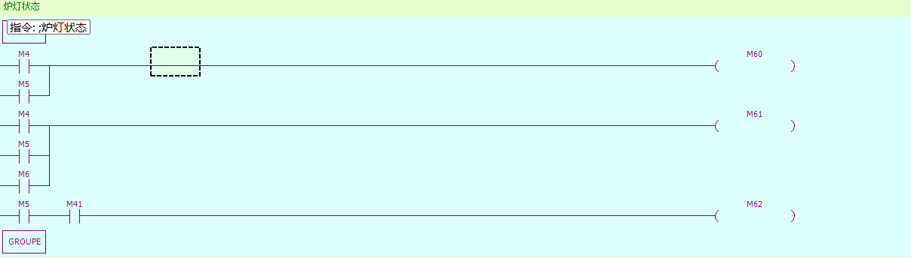

模式和时间灯分别由 `M10~M12`、`M20~M22` 。运行输出Y6在M2之外还检查炉门关闭，形成输出端的再次联锁。

M60/M61在M5中继续保持，表示完成提示延续到炉灯阶段；M62只在M5且M41为ON时输出，因此炉灯会闪烁。

M60、M61和M62都使用OUT，不使用SET锁存。OUT会在每次扫描时重新计算：条件成立就ON，条件不成立就OFF，因此离开M4/M5/M6后提示会自动消失，不需要在其他网络逐个RST。


### 网络8：总复位

处理所有总复位请求。

```text
LD  M50
RST  M0
RST  M1
RST  M2
RST  M3
RST  M4
RST  M5
RST  M6
RST  M10
RST  M11
RST  M12
RST  M20
RST  M21
RST  M22
RST  M30
RST  M31
RST  M41
RST  M42
RST  M51
RST  M114
RST  C0
RST  T0
RST  T1
RST  M100
MOV  K0  D0
MOV  K0  D1
MOV  K0  D14
MOV  K25  D30
MOV  K1  D20
SET  M0
RST  M50
```

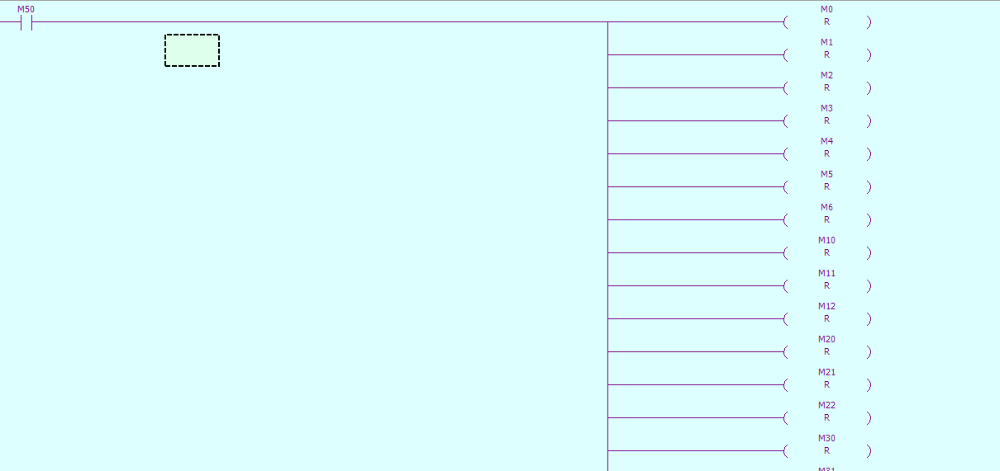

M50必须最后复位。若提前 `RST M50`，后面的复位指令可能失去执行条件。

M50是总复位请求位，可以由上电初始化、C0达到2或报警恢复动作置位。网络8放在主程序后部，前面网络在本扫描中提出M50后，本网络可以在同一扫描末尾统一处理。

复位顺序先清除M0~M6步骤，再清除模式、时间、汇总标志、闪烁位、炉灯退出申请和食物状态，随后复位C0、T0、T1并清零工作数据。这样不会留下旧步骤、旧选择或未完成的定时状态。

最后SET M0重新进入待机，再RST M50结束本次复位请求。RST M50放在最后，是为了保证前面的所有RST、MOV和SET都在M50条件成立时执行完成。

网络8只用于真正回到初始状态。正常炉灯结束、取食物、炉灯中停止或第一次复原只通过M51返回M0，不应该调用M50，否则模式、时间、炉门和食物会被全部清除。


- D20初值必须与M100和M114复位后的组合状态一致；
- M50只能由请求条件SET，集中复位完成后再由网络8自身RST；


## HMI界面设计

主界面如下：


### 1. 主界面绑定

| 区域 | 对象 | 地址 |
|---|---|---|
| 动态图片区 | 整机动态图片 | D20，状态0~9 |
| 模式区 | 三个瞬时按钮/三个指示灯 | M101~M103 / M10~M12 |
| 时间区 | 三个瞬时按钮/三个指示灯 | M104~M106 / M20~M22 |
| 操作区 | 开始、放食物、取食物、停止、复原 | M107~M111 |
| 炉门 | 保持开关 | M100，ON=开门 |
| 数据区 | 总时间、剩余时间、温度、炉灯剩余 | D0、D1、D30、D14 |
| 提示区 | 完成、蜂鸣、炉灯、报警 | M60、M61、M62、M6 |

动态图片只绑定D20。M100和M114用于PLC内部判断，不再作为同一动态图片的第二、第三个读取地址。

### 2. 时间设置界面

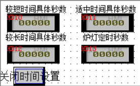

| 设置项 | HMI输入 | PLC确认显示 | 默认值 |
|---|---|---|---:|
| 短时间档 | HD10 | D10 | 10秒 |
| 中时间档 | HD11 | D11 | 60秒 |
| 长时间档 | HD12 | D12 | 600秒 |
| 炉灯时间 | HD13 | D13 | 10秒 |

数值输入和显示统一使用16位十进制整数，倍率为1。D14只显示炉灯剩余时间，不允许HMI写入。

## 流程实现

1. **上电启动**

SM2初始化参数、温度并提出M50总复位请求。网络8清除全部步骤和选择，关闭炉门、清除食物，设置D20=1，最后进入M0待机。

模式和时间选择

在M0、M1或M3中都可以选择模式和时间，二者相互独立。模式使用M10~M12并通过M30汇总，时间使用M20~M22并通过M31汇总；M42记录最后选择类型。

2. **开始运行**

关门、有食物、模式和时间已选后，M0自动转为M1就绪。按开始后，M1把D0装入D1并进入M2。M2中每秒递减D1并增加D30。

3. **暂停继续**

运行中按停止或打开炉门，M2转为M3。重新关门并按开始后，M3直接回M2，不重新装载D1，所以从暂停时的剩余时间继续。

4. **运行完成**

D1到0后，M2转为M4。M60完成提示和M61蜂鸣提示开启，D20显示7，等待打开炉门。

5. **炉灯阶段**

M4中打开炉门时，D13先装入D14，再进入M5。D20显示9，M62按M41闪烁，D14每秒减1。倒计时结束、取出食物、按停止或按一次复原都会通过M51返回M0。

6. **一次与两次复原**

M0/M1/M3中按一次复原，根据M42撤销最后选择。M2运行中第一次复原不改变运行数据。M5中第一次复原只退出炉灯回M0。没有被重新选择或开始操作清零时，第二次复原使C0达到2并触发总复位。

7. **超温报警**

M2中D30超过200℃或M112被按下时进入M6，运行立即停止。报警锁存后，按停止、按复原或打开炉门都会提出M50总复位请求，恢复到关门、无食物、温度25℃的M0初始状态。
