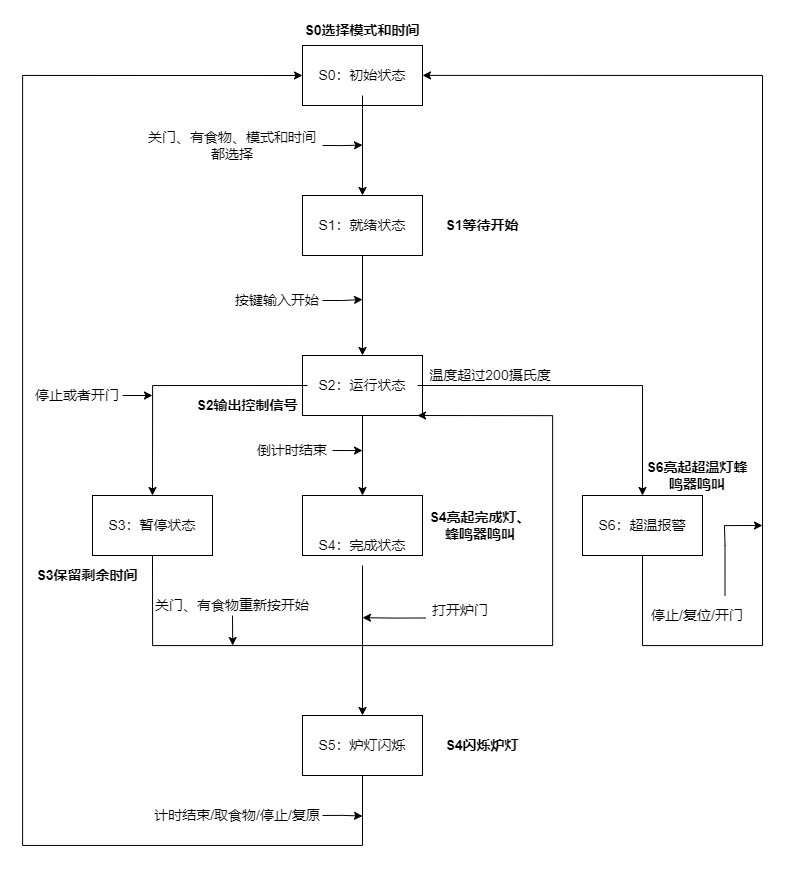
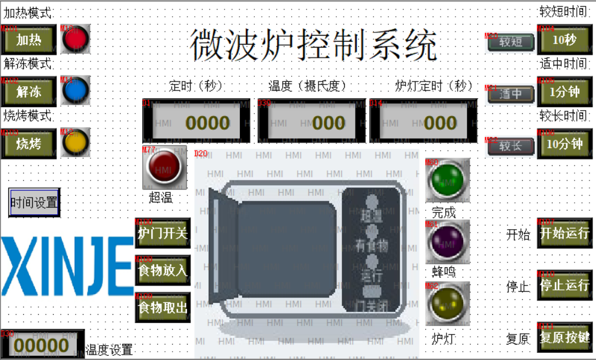

## 设计思路

验收功能修改：

1. 解冻（50)和烧烤(180)的时候温度上升到一定温度就不上升了

2. 工作过程中打开炉门，温度下降

3. 掉电的时候，倒计时应该继续保持掉电之前的状态。


### 1. 功能要求

| 功能 | 要求 |
|---|---|
| 工作模式 | 加热、解冻、烧烤三种模式，只能选择一种 |
| 工作时间 | 10秒、1分钟、10分钟三档时间，只能选择一种 |
| 启动条件 | 炉门关闭、有食物、模式已选、时间已选 |
| 运行过程 | 剩余时间每秒减1，温度每秒增加5℃ |
| 完成提示 | 倒计时结束后完成灯和蜂鸣器动作 |
| 炉灯动作 | 完成后打开炉门进入炉灯阶段，按设定时间倒计时并闪烁 |
| 暂停继续 | 停止或运行中开门后保留剩余时间，重新开始后继续计时 |
| 超温报警 | 温度超过200℃时停止运行并锁存报警 |
| 复原 | 一次撤销最后选择；运行中一次无效；炉灯中一次返回待机；累计两次总复位 |

HMI需要显示当前整机动画、模式、时间档、总时间、工作倒计时、炉灯倒计时、当前温度和报警状态。


### 2. 状态设计

`M0~M6` 分别表示待机、就绪、运行、暂停、完成、炉灯和报警。

| 步骤 | 状态 | 进入条件 | 离开条件 |
|---|---|---|---|
| M0 | 待机 | 上电总复位、炉灯退出 | 条件齐全后自动进入M1 |
| M1 | 就绪 | 关门、有食物、模式和时间已选 | 条件失效回M0；按开始进M2 |
| M2 | 运行 | M1首次启动或M3继续 | 完成进M4；停止/开门进M3；超温进M6 |
| M3 | 暂停 | M2中停止或开门 | 条件恢复并按开始回M2 |
| M4 | 完成 | D1减到0 | 打开炉门后进M5 |
| M5 | 炉灯 | M4中打开炉门 | 计时结束、取食物、停止或复原后进M0 |
| M6 | 报警 | 运行中超温 | 停止、复原或开门后总复位 |

正常流程为：

```text
上电初始化
  -> M0待机
  -> M1就绪
  -> M2运行
  -> M4完成
  -> M5炉灯
  -> M0待机
```

异常和人工中断流程为：

```text
M2运行 --停止或开门--> M3暂停 --条件恢复并开始--> M2运行
M2运行 --超温--------> M6报警 --人工恢复------> 总复位 -> M0待机
```



系统上电后进入 S0 初始状态，用户可通过 HMI 选择加热、解冻或烧烤模式以及对应的工作时间；

当炉门关闭、食物存在、模式和时间均已选择时，系统转入 S1 就绪状态。

按下开始键后进入 S2 运行状态，PLC输出运行控制信号，剩余时间每秒递减，温度按设定规律上升；

倒计时结束后进入 S4 完成状态，完成指示灯点亮并启动蜂鸣器；

打开炉门后进入 S5 炉灯阶段，炉灯按照设定时间闪烁并进行倒计时，计时结束、取出食物、按停止或按复原后返回 S0，等待下一次工作。

运行过程中按下停止键或打开炉门，系统进入 S3 暂停状态并保留剩余时间，重新关好炉门、确认食物存在并按下开始键后，可以从保留的时间继续运行。

运行温度超过 200℃时，系统立即停止工作并进入 S6 超温报警状态，点亮超温报警灯并启动蜂鸣器；此时可通过停止、复原或打开炉门解除报警并执行总复位，使模式、时间、倒计时、温度和内部状态恢复到初始值，系统重新返回 S0 初始状态。


## 梯形图

| 分组 | 名称 | 责任 |
|---:|---|---|
| 1 | 初始化 | 初始化参数，生成M40一秒脉冲和M41闪烁位 |
| 2 | 选择与复原 | 处理食物、模式、时间、单次撤销和两次复原 |
| 3 | 运行与转移 | 执行倒计时、温升、报警、完成和暂停转移 |
| 4 | 待机 | 管理M0/M1/M2/M3正常步骤转换 |
| 5 | 炉灯、报警 | 处理完成开门、炉灯倒计时、M51退出和报警恢复 |
| 6 | 系统状态 | 根据门、食物和步骤生成D20=0~9 |
| 7 | 状态 | 生成处理M60~M62 |
| 8 | 总复位 | 清除步骤、选择、食物、计时和报警，恢复M0 |

主要过程：

```text
HMI瞬时按钮M101~M112
        |
        v
网络2选择/复原 --------> M10~M22、M30/M31、M42、M114、C0
        |                                      |
        v                                      v
网络4就绪/启动 <------ M100、M114、选择状态 ----+
        |
        v
网络3运行/转移 --------> M3/M4/M6、D1、D30
        |
        v
网络5完成/炉灯 --------> M5、M51、D14、M50
        |
        +-------------> 网络6生成D20
        +-------------> 网络7生成提示和Y输出
                                      |
                         M50 --------> 网络8总复位
```

首次启动必须同时满足：

```text
M1就绪
AND M30模式已选
AND M31时间已选
AND NOT M100炉门关闭
AND M114有食物
AND M107开始上升沿
```


炉灯阶段使用，避免四种退出条件重复写一整组复位指令。

```text
D14到0
OR 食物被取出
OR 按停止
OR 按复原
        -> SET M51
        -> 清除M5和T1
        -> 清零D14、恢复D30
        -> SET M0
        -> RST M51
```

## HMI界面设计

HMI主界面以状态明显、操作简单为原则。主界面放常用操作和核心显示，参数修改放在时间设置界面。

### 1. 主界面

| 区域 | 内容 | 绑定地址 |
|---|---|---|
| 动态图片区 | 炉门、食物、运行、完成、报警、炉灯整机图片 | D20 |
| 模式选择区 | 加热、解冻、烧烤按钮 | M101~M103 |
| 模式显示区 | 三种模式指示灯 | M10~M12 |
| 时间选择区 | 三档时间按钮 | M104~M106 |
| 时间显示区 | 三档时间指示灯 | M20~M22 |
| 操作区 | 开始、放食物、取食物、停止、复原 | M107~M111 |
| 炉门操作 | 炉门保持开关 | M100，ON=开门 |
| 数据显示区 | 总时间、剩余时间、温度、炉灯剩余 | D0、D1、D30、D14 |
| 提示区 | 完成、蜂鸣、炉灯和超温 | M60、M61、M62、M6 |



动态图片对象只读取D20，按0~9选择完整图片：

| D20 | 图片状态 |
|---:|---|
| 0 | 开门无食物 |
| 1 | 关门无食物 |
| 2 | 开门有食物 |
| 3 | 关门有食物 |
| 4 | 加热中 |
| 5 | 解冻中 |
| 6 | 烧烤中 |
| 7 | 已完成 |
| 8 | 超温报警 |
| 9 | 开门炉灯中 |

### 2. 时间设置界面

| 设置项 | 输入地址 | 确认地址 | 默认值 |
|---|---|---|---:|
| 短时间档 | HD10 | D10 | 10秒 |
| 中时间档 | HD11 | D11 | 60秒 |
| 长时间档 | HD12 | D12 | 600秒 |
| 炉灯时间 | HD13 | D13 | 10秒 |


输入和显示使用16位十进制整数，倍率为1。工作倒计时读取D1，炉灯倒计时读取D14，HMI不能写入这两个工作寄存器。

