# IAR

IAR Embedded Workbench for Arm（简称 IAR EWARM）是用于 Arm MCU 的集成开发环境，包含代码编辑器、工程管理器、C/C++ 编译器、汇编器、链接器、下载器和调试器等完整的开发工具链。其核心任务是将用户编写的源代码编译链接成目标板能够运行的程序，并配合调试器进行下载和在线调试。

可以通俗理解为：IAR 是工具链和集成开发环境，而芯片库、BSP、HAL、SPL、SDK 等则是芯片厂商或项目提供的上层代码。

## 目录

[TOC]

---

## 一、工程操作

### 各类型文件含义


IAR 工程中常见的文件类型及其作用：

| 文件类型/后缀 | 含义 | 说明 |
| :--- | :--- | :--- |
| `.eww`（**E**mbedded **W**orkbench **W**orkspace） | 工作区文件 | 工作区的入口文件，关联多个工程，双击即可打开整个工作区 |
| `.ewp`（**E**mbedded **W**orkbench **P**roject） | 工程文件 | 单个工程的配置文件，包含源文件列表、编译选项、链接设置等 |
| `.ewd`（**E**mbedded **W**orkbench **D**ebug） | 调试配置文件 | 工程的调试器配置（仿真器选择、下载选项等） |
| `.c` / `.cpp` | C/C++ 源文件 | 用户编写的源代码 |
| `.h` | 头文件 | 函数声明、宏定义、类型定义等 |
| `.s` / `.asm`   **S**ource (**Assem**bly) | 汇编源文件 | 汇编语言编写的源文件（如启动文件） |
| `.o` / `.obj` | 目标文件 | 编译器生成的中间文件，每个源文件对应一个 |
| `.out` / `.elf` | 可执行文件 | 链接器生成的最终可执行文件，可下载到目标板运行 |
| `.hex` | Hex 烧录文件 | 十六进制格式的可执行文件，用于烧录器烧写 |
| `.bin`  （**Bin**ary File） | 二进制烧录文件 | 纯二进制格式的可执行文件 |
| `.map` | 映射文件 | 链接后生成的内存布局文件，记录函数/变量的地址分布 |
| `.icf`  (**I**nitialization **C**ontrol **F**ile) | 链接配置文件 | 定义芯片的内存布局（Flash、RAM 的起始地址和大小） |
| `.a` / `.lib`  (**A**rchive File Unix/GCC 风格 /   **Lib**rary File Windows/IAR 风格) | 静态库文件 | 预编译好的代码库，可链接到工程中使用 |
| `.ewt` | 测试配置文件 | 包含静态检查和动态检查的配置，属于可删除文件,删除后不影响编译和下载，仅丢失测试相关配置 |
| `.dep` | IAR 编译器在编译过程中自动生成的**项目依赖关系记录文件**。 | 记录了当前工程中源文件（`.c`）与头文件（`.h`）之间的引用关系。 |

> 一个工作区（`.eww`）可以包含多个工程（`.ewp`），比如同时包含应用工程和库工程，方便管理多工程项目。


map文件：

​	


### 新建/打开工作区

1. **新建工作区**：

点击菜单栏 `File` → `New Workspace`

注意原有的工作区会被关闭，如有未保存内容会提示保存,并且新建的工作区为空白状态，需要后续添加工程


2. **打开工作区**：

点击菜单栏 `File` → `Open` → `Workspace`,在文件浏览器中选择 `.eww` 文件，点击 `打开`，工作区及其包含的所有工程会被加载

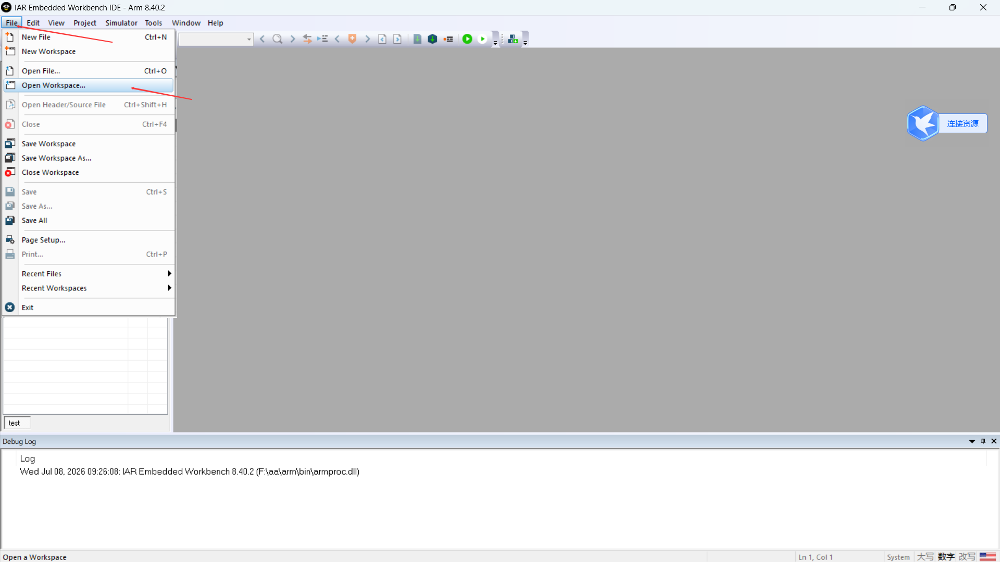

> 也可以直接在文件管理器中双击 `.eww` 文件打开工作区。


### 新建/打开工程

**新建工程**：

1. 点击菜单栏 `Project` → `Create New Project...`

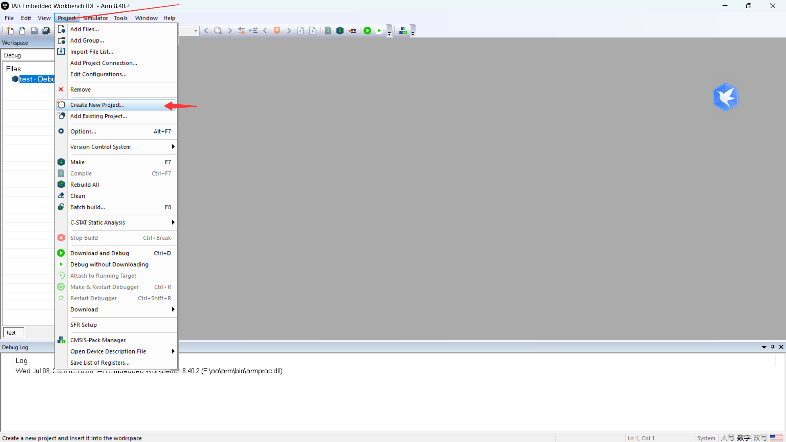


2. 在弹出的对话框中选择工程模板（通常选择 `Empty project` 或对应的芯片模板）

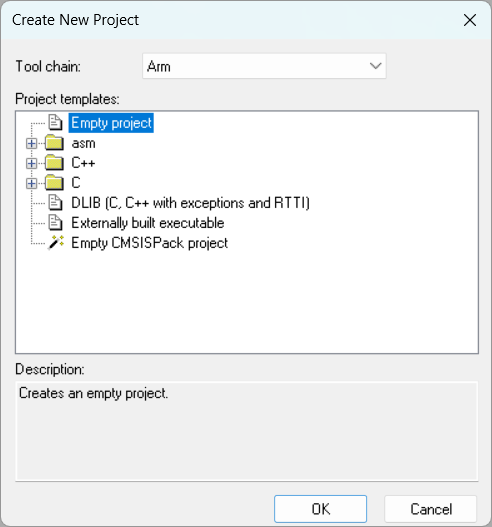

2. 点击 `OK`，选择工程文件的保存路径并输入工程名称
3. 点击 `保存`，新工程即被创建并添加到当前工作区


**打开/添加已有工程**：

1. 点击菜单栏 `Project` → `Add Existing Project...`

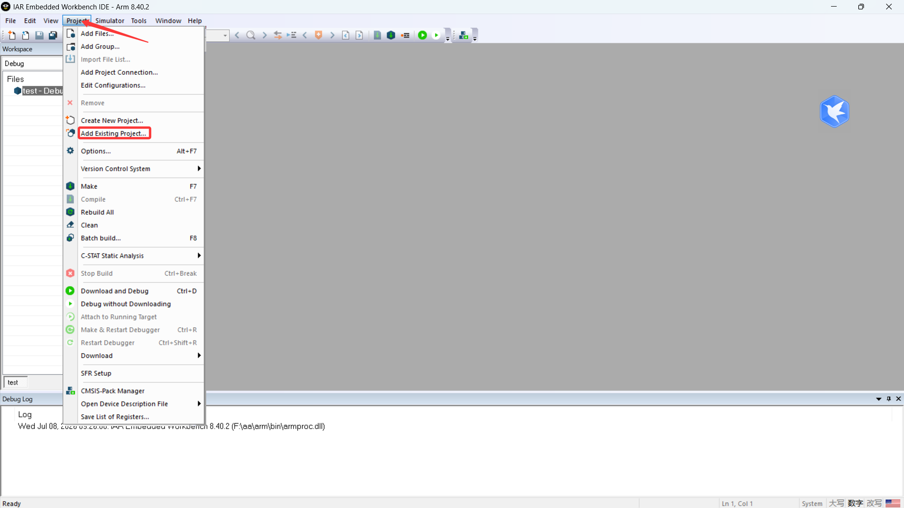

1. 在文件浏览器中选择 `.ewp` 文件
2. 点击 `打开`，工程即被添加到当前工作区


### 工作区中导入/添加工程

使用 `Project` → `Add Existing Project...` 即可将已有工程导入当前工作区，和之前操作一致。

如果需要将工程从一个工作区迁移到另一个：

1. 打开目标工作区
2. `Project` → `Add Existing Project...` → 选择要导入的 `.ewp` 文件
3. 工程即出现在当前工作区的工程列表中

> 一个工作区可包含多个工程，在左侧 Workspace 窗口中可以切换当前活动工程（右键工程 → `Set as Active`）。


### 新建分组

工程中的源文件可以按逻辑分组管理（如 `APP`、`BSP`、`Driver`、`Lib` 等）：

1. 在 Workspace 窗口中，右键点击工程名
2. 选择 `Add` → `Add Group...`
3. 输入分组名称（如 `APP`），点击 `OK`
4. 新建的分组会出现在工程目录树中

注意：

- IAR可以添加多级组，类似于文件夹下可以再建文件夹，一直下去。

- Keil只能添加单级组，类似于文件夹下面只能添加文件，而不能在添加文件夹。

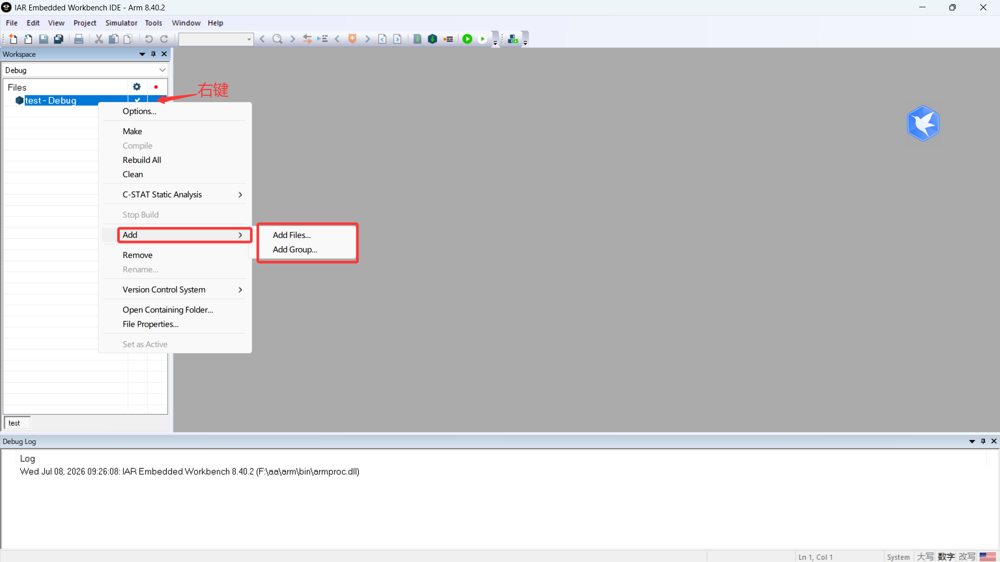

**向分组中添加文件**：

1. 右键点击分组名 → `Add` → `Add Files...`
2. 选择要添加的源文件，点击 `打开`
3. 文件即被加入到该分组中

> 分组只是工程内的逻辑分类，**不影响文件在磁盘上的实际目录结构**。同一个文件可以属于多个分组，但不推荐这样做。

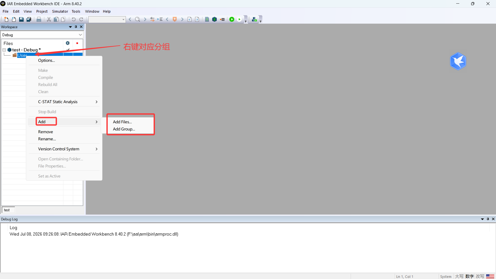

### 新建/打开文件


**新建文件**：

1. 点击菜单栏 `File` → `New File`（或按 `Ctrl+N`）
2. 在新建的空白编辑窗口中编写代码
3. 点击 `File` → `Save`（或按 `Ctrl+S`），选择保存路径并命名
4. 保存后，右键工程分组 → `Add` → `Add Files...` 将文件加入工程


**打开已有文件**：

1. 点击菜单栏 `File` → `Open` → `File...`（或按 `Ctrl+O`）
2. 在文件浏览器中选择文件，点击 `打开`

> 直接双击 Workspace 窗口中工程目录树里的文件名也可打开文件。

### 工程目录与文件目录

工程文件记录源文件的路径（相对路径或绝对路径），编译时根据该路径去文件目录中查找并编译源码。

| 概念 | 说明 |
| :--- | :--- |
| **工程目录** | 工程在 IAR 中的逻辑组织结构（分组、虚拟文件夹等） |
| **文件目录** | 文件在磁盘上的实际物理存放路径 |

- 工程中的**分组**（Group）只是逻辑分类，不改变文件在磁盘上的实际位置
- 删除工程中的分组或从分组中移除文件，**不会删除磁盘上的实际文件**
- 工程文件（`.ewp`）中记录的是文件的**相对路径**或**绝对路径**，因此移动工程目录时建议使用相对路径

文件目录包含工程目录

> **建议**：工程文件（`.ewp`、`.eww`）放在源码根目录，源文件按功能放在不同子文件夹中，工程内的分组与实际目录结构保持一致，便于维护。
>
> 工程目录可以独立于文件目录存在，一个文件目录中的源码可以被多个工程目录引用。

---


### 完整流程

| 步骤阶段        | 主要操作                             | 预期结果                              |
| :-------------- | :----------------------------------- | :------------------------------------ |
| **1. 建工作区** | `File` → `New` → `Workspace`         | 获得一个空的 .eww 空间                |
| **2. 建项目**   | `Project` → `Create New Project`     | 生成 .ewp 项目文件和 main.c           |
| **3. 配置选项** | 右键项目 → `Options` 配 MCU 和仿真器 | 烧录接口和芯片型号已对齐              |
| **4. 添加代码** | 右键项目 → `Add Files` 导入源文件    | 项目树中能正常展开看到代码            |
| **5. 编译**     | `Project` → `Make (F7)`              | Build 窗口无 Error，生成 .hex 或 .bin |
| **6. 调试**     | `Ctrl + D` 烧录，按 `F10/F11` 单步   | 程序能下载，运行并观察变量变化        |


## 二、工程配置

右键点击工程名 → `Options...`（或选中工程后按 `Alt+F7`），打开工程选项配置对话框。

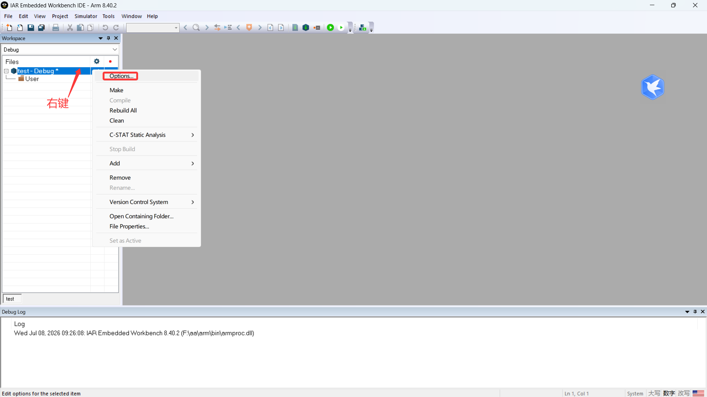


### 设备配置

主要是**告诉 IAR 目标芯片的底层硬件特征**。选定设备后，IAR 会自动匹配对应的：

- 内核架构（Core）和指令集。
- 默认的链接器配置文件（`.icf`），自动划分好 Flash 和 RAM 的地址范围。
- 片内外设寄存器地址的头文件（`.h` 文件），为底层开发提供基础。


在 `General Options` → `Target` 标签页：

1. 点击 `Device` 右侧的 `...` 按钮
2. 在弹出的对话框中按厂商和系列选择目标芯片型号（如 `ST` → `STM32F407VG`）
3. 确认选择后，IAR 会自动加载对应的芯片描述文件

> **设备选型**决定了编译器使用的指令集（如 ARM Cortex-M4）、寄存器定义文件、链接配置等。选错芯片会导致编译失败或生成的代码无法在目标板上运行。

| 配置项            | 功能说明                                                     | 适用场景/备注                                                |
| :---------------- | :----------------------------------------------------------- | :----------------------------------------------------------- |
| **Core**          | **手动指定 CPU 内核架构。** 例如 ARM7TDMI、Cortex-M3 等。    | **一般不动**。如果勾选此项，IAR 会根据你选的内核生成通用代码。通常推荐用下方的 **`Device`**，让编译器根据具体芯片自动适配内核。 |
| **CMSIS-Pack**    | **从 CMSIS 标准包中加载芯片定义。** 如果你安装了符合 CMSIS 标准的支持包，勾选此项，下方列表会自动列出支持的系列。 | 较新的 IAR 版本（8.x以上）支持。如果你用的是官方标准的 SDK，勾选此项可以省去手动选芯片的麻烦。 |
| **Endian mode**   | **字节序（大小端）配置。** - **Little（小端）：** 低位字节存低地址（ARM Cortex-M 默认） - **Big（大端）：** 高位字节存低地址。 | **ARM Cortex-M 系列强制使用 Little（小端）**。如果你在做网络协议栈开发时，可能会遇到大端小端转换的问题，但工程配置里**保持 Little 即可**，不要改。 |
| **FPU**           | **硬件浮点运算单元。** 如果你的芯片带有硬件 FPU（如 Cortex-M4/M7 带 F 后缀的型号），下拉框里会出现 `FPv4-SP-D16` 或 `FPv5` 选项。 | 如果选了带 FPU 的芯片，**一定要把这里改成对应的 FPU 型号**，否则 IAR 会默认用软件模拟浮点运算，导致程序运行极度缓慢，且无法发挥硬件性能。 |
| **D registers**   | **设置 FPU 的 D 寄存器数量。**                               | 此项通常与上面的 `FPU` 选项**联动**。选了硬件 FPU 后，这里会自动填上正确数量，无需手动改。 |
| **DSP Extension** | **是否启用 DSP 扩展指令集。** 某些 Cortex-M4/M7 芯片支持 SIMD（单指令多数据）等 DSP 加速指令。 | 如果你的代码里用到了复杂的数学运算（如 FFT、滤波），且芯片支持 DSP，勾选此项可以大大提升运算速度。**如果不确定，保持不勾选即可。** |
| **TrustZone**     | **启用 ARM TrustZone 安全区技术。** 只有支持 TrustZone 的芯片（如 Cortex-M33）才会出现此选项。 | 用于将 Flash/RAM 划分为“安全区”和“非安全区”。普通裸机开发**无需勾选**。 |
| **Mode / Secure** | **设置 TrustZone 的安全模式。**                              | 同上，只有开启 TrustZone 并做安全隔离开发时才需要设置。      |


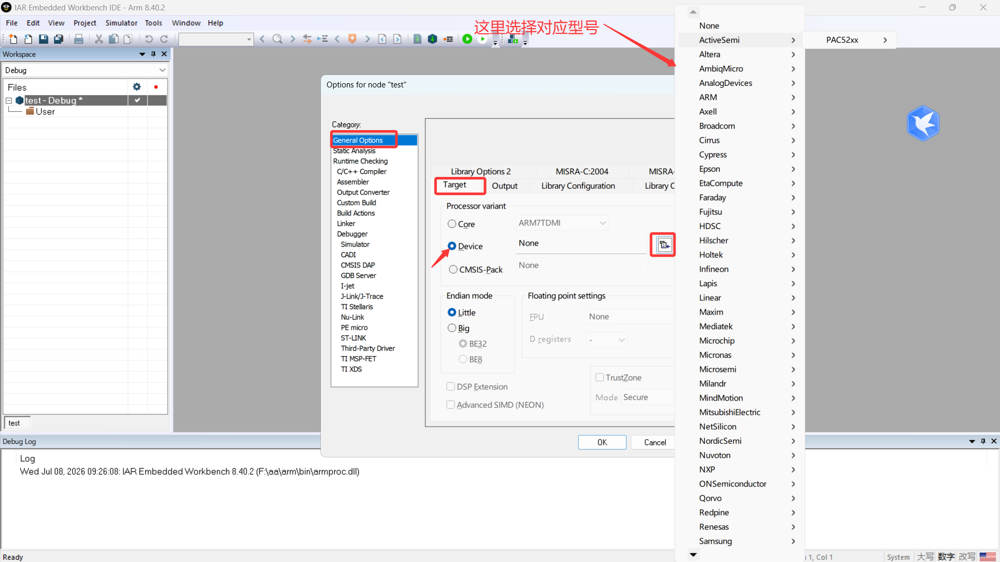

### 编译配置

编译配置集中在 `C/C++ Compiler` 和 `Assembler` 中，以下为关键配置项：

#### 优化等级

主要是为了**平衡代码体积、运行速度和调试便利性**，需要注意高等级优化可能会导致**调试器跟踪错乱**，比如变量被优化掉、断点异常。

在 `C/C++ Compiler` → `Optimizations` 标签页：

| 优化级别 | 说明 | 适用场景 |
| :--- | :--- | :--- |
| `None` | 不优化，代码与源码一一对应 | 调试阶段，便于单步跟踪和查看变量 |
| `Low` | 低等级优化，基本不影响调试 | 调试后期，需要一定性能 |
| `Medium` | 中等优化，平衡代码大小和速度 | 大部分开发阶段 |
| `High` | 高等级优化，代码大小或速度优先 | 发布版本、对性能或空间有严格要求 |

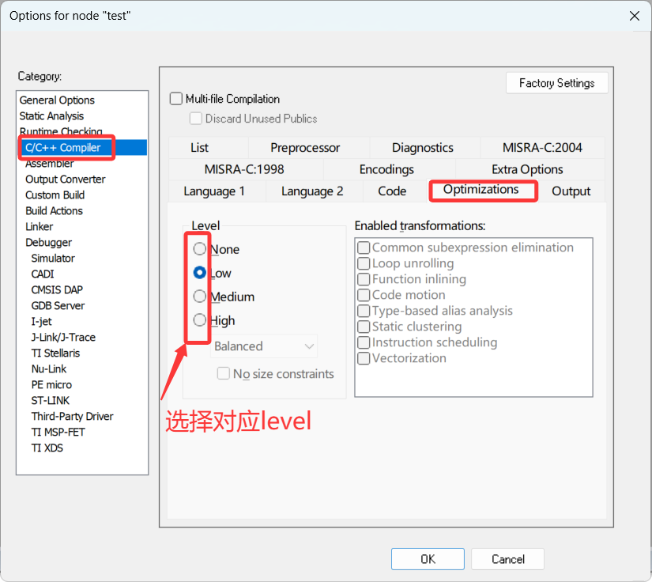

**优化越高，速度越快，编译越慢；与实时运行无关，代码量只会减少不会增加。**


#### 硬件浮点

用于**决定是否使用芯片内部的硬件加速器来计算浮点数**，能够**提升浮点运算速度**，**减小代码体积**

在 `General Options` → `Target` 标签页：

1. `FPU` 选项：选择 `VFPv4` 或 `VFPv5`（取决于芯片是否支持硬件浮点，如 Cortex-M4F 支持）
2. 在 `C/C++ Compiler` → `Code` 标签页 → `Floating-point`：勾选 `Use hardware floating-point`

> 能够设置硬件浮点的芯片系列必须内置硬件 FPU 单元。常见的支持硬件浮点的系列包括 STM32F4（Cortex-M4F 内核）、STM32H7（Cortex-M7 内核）等带有 FPU 的 Cortex-M 系列。Cortex-M3 内核的芯片（如 STM32F1 系列）不支持硬件浮点，开启此选项后运行时会进入 HardFault。在 `General Options` → `Target` 中查看 `FPU` 下拉框是否有可选类型，即可判断当前芯片是否支持硬件浮点。

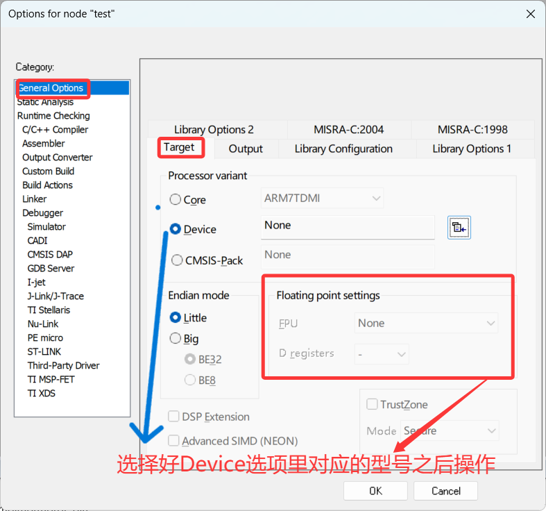

#### 预处理

在 `C/C++ Compiler` → `Preprocessor` 标签页：

1. **Defined symbols**（宏定义）：在文本框中添加全局宏定义，每行一个
   
   ```
   STM32F40_41xxx
   USE_STDPERIPH_DRIVER
   DEBUG=1
   ```
   - 等效于在代码中写 `#define STM32F40_41xxx`
   - 带值的宏使用 `NAME=VALUE` 格式
   
   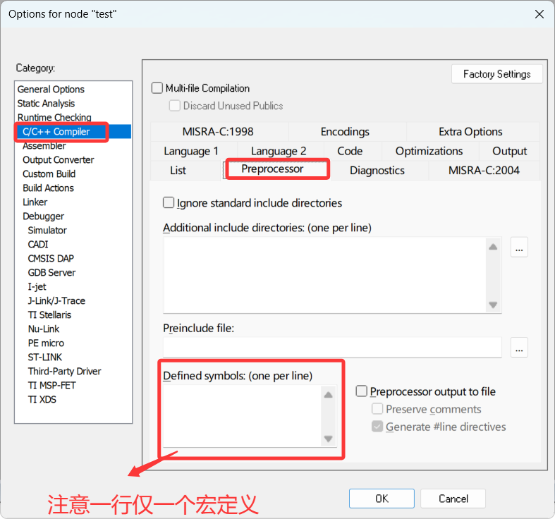
   
2. **Additional include directories**（头文件路径）：添加 `$PROJ_DIR$` 变量引用
   ```
   $PROJ_DIR$\..\Libraries\CMSIS\Include
   $PROJ_DIR$\..\Libraries\STM32F4xx_StdPeriph_Driver\inc
   $PROJ_DIR$\BSP\inc
   ```
   - `$PROJ_DIR$`：工程文件（`.ewp`）所在目录
   - `$TOOLKIT_DIR$`：IAR 安装目录
   - `..`：上级目录
   
   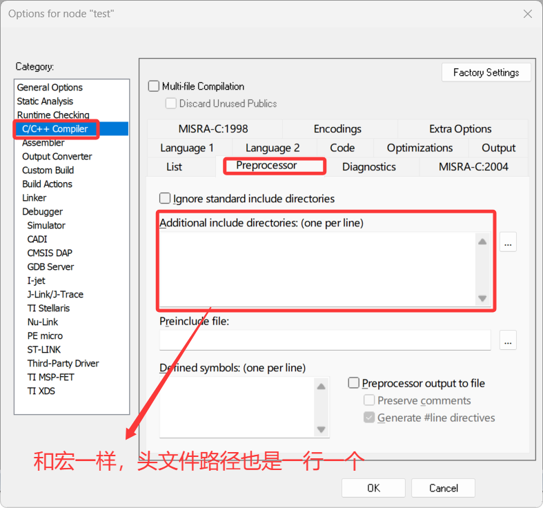

> `Ignore standard include directories`（忽略标准头文件路径）,勾选之后，IAR 将**不再搜索**其默认安装路径下的标准库头文件（如 `<stdio.h>`、`<string.h>`）
>
> 在添加路径时，推荐使用 IAR 内置变量（如 `$PROJ_DIR$`），这样整个工程移动到其他位置时路径依然有效。

> 在Preinclude file里添加的头文件会强制编译器在编译**每个源文件之前**都先包含指定的头文件，相当于在每个 `.c`/`.cpp` 文件最前面自动加上 `#include "xxx.h"`


| 功能名称                              | 作用详解                                                     | 使用场景 / 避坑说明                                          |
| :------------------------------------ | :----------------------------------------------------------- | :----------------------------------------------------------- |
| `Multi-file Compilation`              | 多文件编译优化。让编译器同时处理多个文件，以进行更深层的全局优化。 | 极少使用。开启后会影响编译依赖关系，常规项目保持**不勾选**即可。 |
| `Discard Unused Publics`              | 丢弃未使用的公共符号。如果某些全局函数或变量未被外部调用，链接器会自动将其移除，减小体积。 | 配合库项目使用较多，普通应用保持**不勾选**。                 |
| `Ignore standard include directories` | 忽略标准包含目录。                                           | **勾选后**：IAR 将不再去安装路径下寻找 `<stdio.h>`、`<string.h>` 等标准库。**一般不做修改，保持不勾选，除非使用完全独立的定制库。** |
| `Additional include directories`      | **附加头文件路径（核心配置）**。添加外部 `.h` 头文件所在的文件夹路径。 | **必配项**。如果代码里写了 `#include "my_lib.h"` 却报找不到文件，就是这里没加路径。建议使用 **`$PROJ_DIR$`** 相对路径，防止工程拷到别人电脑上失效。 |
| `Preinclude file`                     | 预包含文件。指定一个 `.h` 文件，编译器会在编译所有源文件前，**先自动包含**这个文件。 | 通常用于全局配置宏或统一引入公共头文件。非必要不配置，避免增加不必要的编译依赖。 |
| **`Defined symbols`** *(图中红框)*    | **定义预处理宏**。在此处定义的宏，等价于在代码所有文件顶部写 `#define XXX`。 | **控制条件编译的关键**。如定义 `DEBUG` 宏，让代码中的 `#ifdef DEBUG` 调试代码生效。 ** 注意：** 截图中的红字提示非常重要——**`(one per line)`，即一行只能写一个宏定义**，多个宏需分多行书写。 |
| `Preprocessor output to file`         | 将预处理后的文件输出到磁盘。                                 | 勾选后，编译时会生成一个 `.i` 扩展名的中间文件，展示宏展开后的完整代码。**不常用**，仅用于排查复杂的宏定义错误。 |
| `Generate #line directives`           | 在预处理输出中保留行号信息。                                 | 配合上方选项使用，保持勾选即可，方便调试器定位原始代码行。   |


#### 链接文件

在 `Linker` → `Config` 标签页：

1. 勾选 `Override default`
2. 点击 `Edit...` 选择或编辑 `.icf` 链接配置文件
3. `.icf` 文件定义了芯片的内存布局：

```c
// 示例：STM32F407VG 的内存布局
define symbol __ICFEDIT_region_ROM_start__ = 0x08000000;
define symbol __ICFEDIT_region_ROM_end__   = 0x080FFFFF;
define symbol __ICFEDIT_region_RAM_start__ = 0x20000000;
define symbol __ICFEDIT_region_RAM_end__   = 0x2001FFFF;
```

> `.icf` 文件非常重要，错误的链接配置会导致程序下载失败或运行时异常。不同芯片的 Flash/RAM 地址和大小不同，需要根据芯片型号选择正确的 `.icf` 文件。

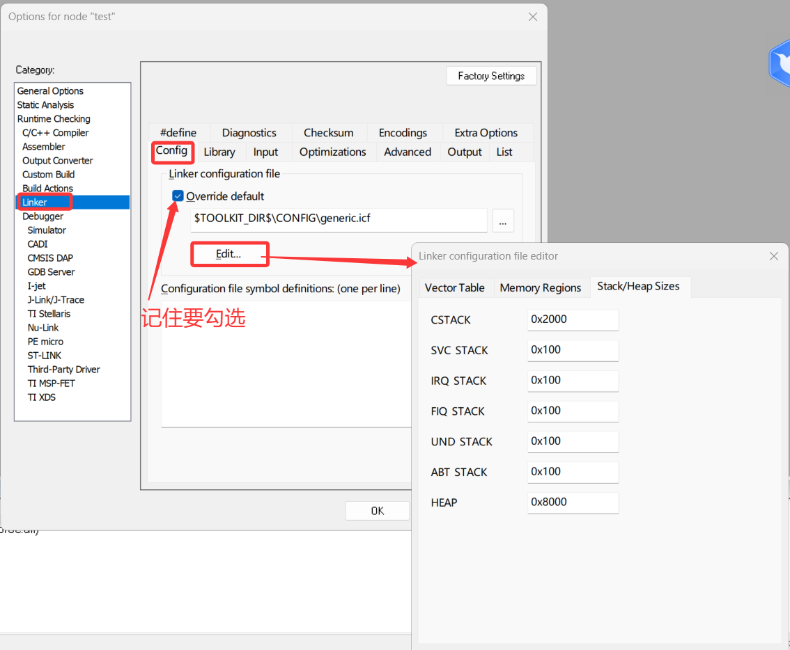

- **`Override default`**：默认情况下，IAR 会使用安装目录下通用的 `.icf` 文件。勾选此项，意味着需要**手动接管**内存布局的控制权。
- **`Linker configuration file`**：指定当前项目实际使用的 `.icf` 文件路径。
- **Edit...**：点击此按钮，会弹出右侧的 **`Linker configuration file editor`**。**可以直接修改堆栈大小、内存区域划分，而不需要去手动敲代码改 `.icf` 文件。**


在 IAR 中，链接文件（通常是 `.icf` 文件）定义了代码和数据如何映射到单片机的物理内存上。主要作用是**定义物理内存布局**，**划分内存块**，**放置代码段**。

| 选项                           | 概念     | 本质解释                                                     |
| :----------------------------- | :------- | :----------------------------------------------------------- |
| **可编址的存储空间**（Space）  | 顶层容器 | 芯片能访问的全部地址范围（如 32 位 MCU 为 4GB）              |
| **不同的存储地址区域**(Region) | 物理分区 | 划分出的具体物理内存，如 **Flash**（存代码）和 **RAM**（存数据） |
| **不同的地址块**(Block)        | 区域子块 | 在区域内部再次细分出的块（如保留特定块给系统堆栈）           |
| **放置**Section                | 最终分配 | 将编译器生成的 `.text`、`.data` 等段，放入上述区域或块中     |

**就是在可编址的空间里划定区域，在区域里划分块，然后把代码段（Section）放进去。**


#### 文件路径配置

IAR 中涉及路径的配置主要有以下几处，推荐使用相对路径变量：

| 配置项 | 位置 | 常用变量 |
| :--- | :--- | :--- |
| 头文件路径 | `C/C++ Compiler` → `Preprocessor` | `$PROJ_DIR$`、`$TOOLKIT_DIR$` |
| 汇编头文件路径 | `Assembler` → `Preprocessor` | 同上 |
| 库文件路径 | `Linker` → `Library` | 同上 |
| 链接配置文件路径 | `Linker` → `Config` | 同上 |

**IAR 常用路径变量**：

| 变量 | 含义 |
| :--- | :--- |
| `$PROJ_DIR$` | 当前工程文件（`.ewp`）所在目录 |
| `$EWP_DIR$` | 同上，工程文件所在目录 |
| `$WS_DIR$` | 当前工作区文件（`.eww`）所在目录 |
| `$TOOLKIT_DIR$` | IAR 安装目录下的 ARM 工具链目录 |
| `$PROJ_FNAME$` | 当前工程文件名（不含路径） |


#### 输出文件路径

在`General Options` → `Output`页：

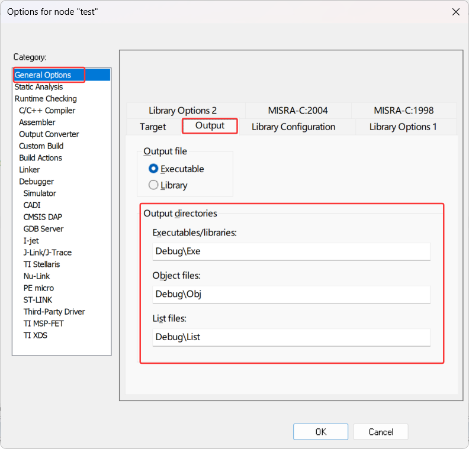


| 设置项             | 路径                                                         |
| :----------------- | :----------------------------------------------------------- |
| **可执行文件路径** | `General Options` → `Output` → `Output directories` → `Executables` |
| **列表文件路径**   | `General Options` → `Output` → `Output directories` → `Listings` |
| **目标文件路径**   | `General Options` → `Output` → `Output directories` → `Object` |

一般默认路径：

- `Executables`：`$PROJ_DIR$\Debug\Exe`（或 `Release\Exe`）
- `Listings`：`$PROJ_DIR$\Debug\List`
- `Object`：`$PROJ_DIR$\Debug\Obj`


在 `Linker` → `Output` 标签页更改输出文件名称：

`Output filename`：指定最终可执行文件的名称

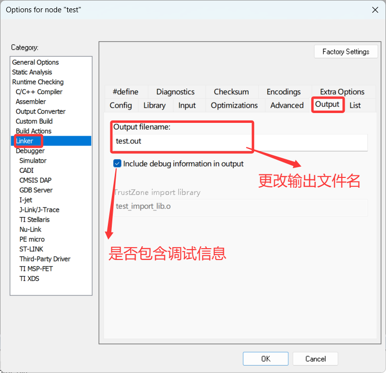


#### 输出文件配置

在 `Output Converter` 中配置额外输出：

1. 勾选 `Generate additional output`
2. `Output format` 选择：
   - `Intel Extended hex` → 生成 `.hex` 烧录文件
   - `Binary` → 生成 `.bin` 烧录文件
3. 勾选 `Override default` 可自定义输出文件名

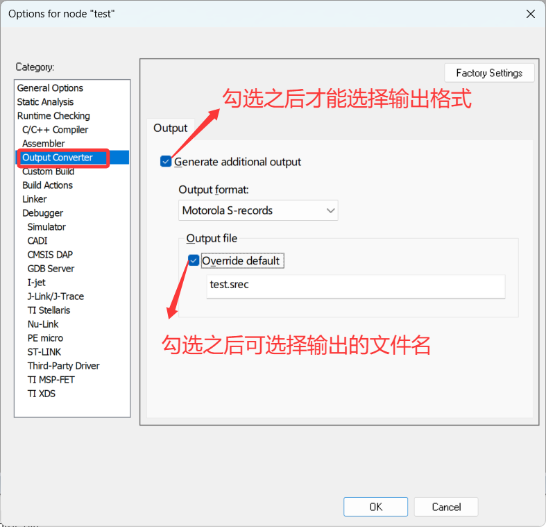


在 IAR 的 `General Options` → `Output` 标签页中：

| 选项           | 含义                                 | 适用场景                                |
| :------------- | :----------------------------------- | :-------------------------------------- |
| **Executable** | 生成**可执行文件**（`.out`/`.elf`）  | 正常的应用程序工程，最终下载到 MCU 运行 |
| **Library**    | 生成**静态库文件**（`.a` 或 `.lib`） | **静态库工程**，供其他工程链接使用      |


### 调试接口：JTAG 与 SWD

配置路径：`Alt+F7` → `Debugger` → `Setup` → `Driver` 下拉框选择仿真器类型。然后在 `Debugger` → `J-Link/J-Trace`（以 J-Link 为例）→ `Interface` 中选择 `SWD` 或 `JTAG`。`Speed` 建议 `Auto` 或从低速开始（如 100kHz），连接稳定后再调高。

IAR 支持两种调试接口协议：

**标准 JTAG 接口**：20 条信号线。核心信号包括 TDI（测试数据输入）、TDO（测试数据输出）、TMS（测试模式选择）、TCK（测试时钟）、TRST（测试复位），其余为 GND 和电源引脚。JTAG 在 ARM7/ARM9 时代是标准调试接口，支持多芯片菊花链连接——一个 JTAG 接口可以同时调试板上的多个芯片。20 根线全部有定义，占用引脚多。


在IAR工程调试中，JTAG定义了6条信号线,`TCK`、`TMS`、`TDI`、`TDO`、`nTRST`（测试复位）,**`nSRST`（系统复位）**

**SWD**：串行线调试接口，仅需 SWCLK、SWDIO 和 GND 三条线即可完成调试和下载。SWO 信号用于串行线输出跟踪数据，在 SWD 中属于可选信号——不接 SWO 仍可正常下载和断点调试，只是无法使用实时跟踪功能。

SWO（串行线输出）是可选的第四根线——它用于实时跟踪数据输出，不接 SWO 不影响下载和断点调试，只是无法使用 printf 重定向到调试器的 ITM 功能。

> 目前嵌入式开发中 SWD 更常用，占用引脚少且速度足够。JTAG 在早期 ARM7/ARM9 时代更普遍。


### 调试器配置

在 `Debugger` → `Setup` 标签页：

1. `Driver` 下拉框选择调试器类型：

| 调试器驱动 | 适用场景 |
| :--- | :--- |
| `J-Link/J-Trace` | SEGGER J-Link 仿真器，最常用 |
| `ST-Link` | STM32 官方仿真器 |
| `CMSIS DAP` | ARM 官方调试接口 |
| `TI XDS100` | TI 芯片专用仿真器 |
| `Simulator` | 软件模拟器，无需硬件即可调试 |

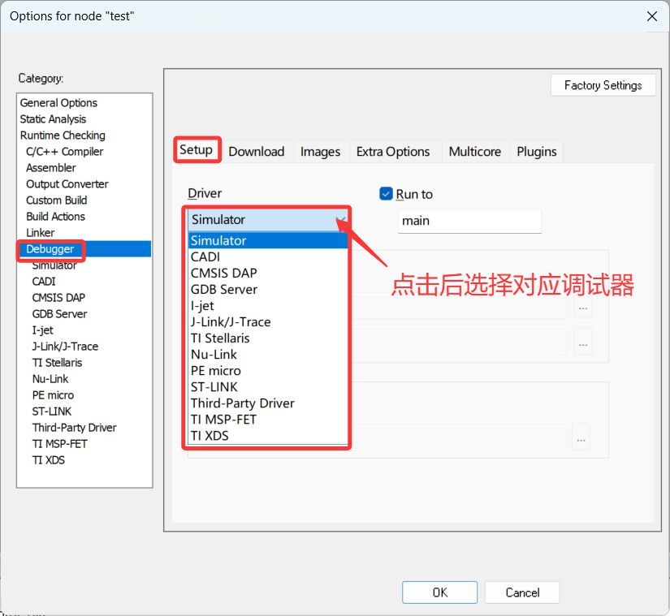

2. 勾选 `Run to main`：下载后自动运行到 `main` 函数
3. 勾选 `Use macro file(s)`：可加载调试宏文件（`.mac`），用于初始化 SFR 等
4. 点击旁边的 **`Download`** 子选项卡，**一定要勾选 `Use flash loader(s)`**。如果不勾选，IAR 只会把代码扔进 RAM 里运行，下次断电就没了。

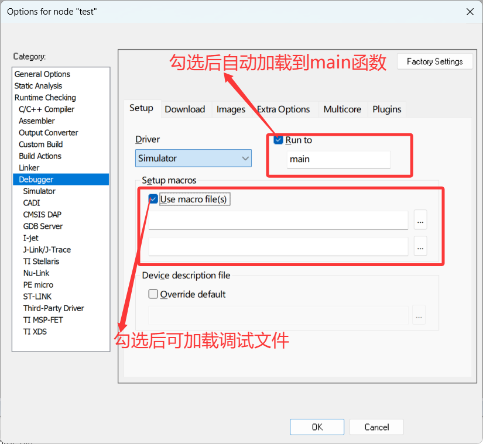

以 J-Link 为例,**J-Link 具体设置**：

在 `Debugger` → `J-Link/J-Trace` 标签页：
- `Interface`：选择 `SWD`（常用）或 `JTAG`
- `Speed`：选择通信速度，建议 `Auto` 或从低速开始


### 库相关配置

在 IAR 的 `Options` → `General Options` → `Library Configuration` 选项卡中，`Library` 下拉框有4 个选项。它们的核心区别在于**是否支持文件描述符（File Descriptor）**和**多字节字符**

| 选项 (Library) | 是否链接库     | 库特点                         | 文件描述符       | 多字节操作       |
| :------------- | :------------- | :----------------------------- | :--------------- | :--------------- |
| **None**       | 不链接运行库   | 极简模式，不调用标准库函数     | &#10060; 不支持  | &#10060; 不支持  |
| **Normal**     | 链接普通运行库 | **最常用**，节省 Flash 空间    | &#10060; 不支持  | &#10060; 不支持  |
| **Full**       | 链接完整运行库 | 功能最全，占用 Flash 最大      | &#9989; **支持** | &#9989; **支持** |
| **Custom**     | 链接自定义库   | 可在下方文本框指定用户配置文件 | (取决于用户配置) | (取决于用户配置) |


**辅助功能开关**:

| 选项                                 | 作用                                                         |
| :----------------------------------- | :----------------------------------------------------------- |
| **Enable thread support in library** | 开启库的**多线程支持**。如果使用 RTOS（如 FreeRTOS）且调用了标准库函数，需勾选此项以防止多线程竞争导致崩溃。 |
| **CMSIS** (Use CMSIS / DSP library)  | 是否链接 ARM 官方的 CMSIS 标准库或 DSP 数学加速库。通常与底层硬件驱动相关。 |

**底层输入输出实现**,这里决定的是 `printf`（打印）和 `scanf`（输入）的数据要往哪里送。

| 选项                | 作用与说明                                                   |
| :------------------ | :----------------------------------------------------------- |
| **None**            | 标准库的输入输出函数**不做任何处理**。调用 `printf` 不会有任何反应。 |
| **Semihosted**      | **半主机模式（默认）**。通过仿真器（如 J-Link/ST-Link）将 `printf` 的数据直接传回给 IAR 软件的 `Terminal I/O` 窗口显示。**调试时最常用，简单方便。** |
| **IAR breakpoint**  | 通过断点机制实现输出，速度较慢，仅在特定仿真环境下使用。     |
| **Via semihosting** | 半主机模式的具体实现方式，作用同 `Semihosted`。              |
| **Via SWO**         | 通过 **SWO（Serial Wire Output）** 引脚输出调试信息。不占用普通串口，调试性能和速度更好，但需要硬件引脚支持。 |


**使用外部库（链接库文件）**:

当需要使用第三方库或自己编译好的 `.a` / `.lib` 库文件时，需要配置以下两处：

**1. 添加库文件到工程**

- 在工程名称上右键 → `Add` → `Add File...`
- 选择要链接的 `.a` 或 `.lib` 库文件
- 或在工程目录中直接创建 `Lib` 文件夹，将库文件放入，然后在工程中右键 `Add` 添加


**2. 配置库文件搜索路径**

如果库文件不在工程目录中，需要告诉 IAR 去哪里找：

- 在工程名称上右键 → `Options` → `Linker` → `Library` 标签页
- 在 **`Additional library directories`** 中添加库文件所在的文件夹路径
- 也可以直接在工程中添加库文件（推荐，路径更清晰）

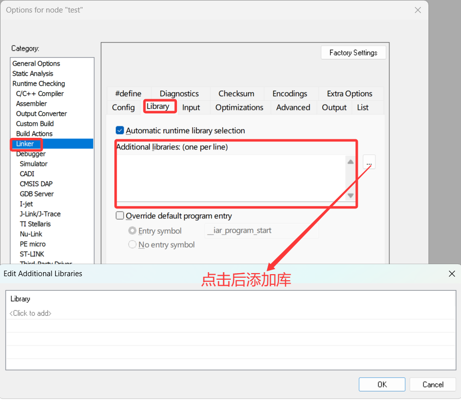

**3. 配置头文件搜索路径**

使用库时，通常还需要对应的 `.h` 头文件：

- `Options` → `C/C++ Compiler` → `Preprocessor` → `Additional include directories`
- 添加库对应的头文件所在文件夹


### 静态库的封装

静态库的封装是指将一部分代码编译成 `.a` 库文件，供其他工程使用。

**操作步骤**：

1. **创建库工程**：`Project` → `Create New Project...` 

   1. 选择 `Empty project`，点击 `OK`，输入工程名称和路径，完成创建
   2. 在工程名称上右键 → `Options`，切换到 `General Options` → `Library Configuration`(**可选，但一般不选**)

      在 `Library` 下拉框中选择有时候可以选择 `None`（`Library` 下拉框默认是 `Normal`，表示链接 C 运行时库（如 `printf`、`memcpy` 等）。库工程如果本身不需要这些函数的具体实现，选择 `None` 可以避免链接不必要的库代码，减小库文件体积，同时提高编译速度。）

   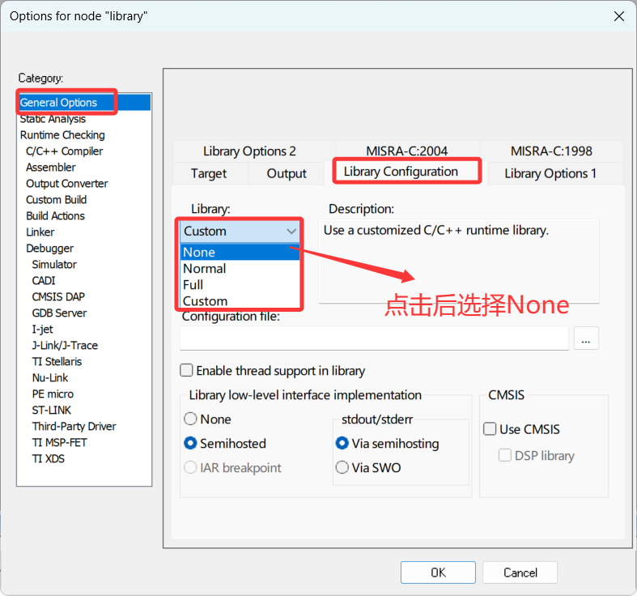

   

2. **添加源文件**：将需要封装的 `.c`/`.h` 文件添加到库工程中

3. **配置工程选项**（`Alt+F7`）：
   
   - `General Options` → `Target`：选择与目标工程相同的芯片型号
   - `C/C++ Compiler` → `Optimizations`：根据需要设置优化等级
   - 在IAR 的 `General Options` → `Output` 标签页中，**Output File选择Library**

   > 注意库工程**不需要** `.icf` 链接文件、不需要调试器配置，因为库本身不直接运行。
   
4. **编译生成库**：右键库工程 → `Make`（或按 `F7`），编译后在输出目录生成 静态库库文件

5. IAR 中静态库文件的扩展名由工程类型决定：

   - 默认生成 `.a` 文件（Archive 格式）
   - 如需生成 `.lib` 格式，需要自己修改

> 库工程的工作区可以和应用工程放在同一个工作区中，方便同时维护和调试。
>
> 这样配置后，编译生成的就不是 `.out` 可执行文件，而是 `.a` 静态库文件。


### 静态库的调用

调用静态库即在应用工程中链接已编译好的 `.a` 文件。

**操作步骤**：

1. **添加库文件路径**：
   - 打开应用工程的 `Options`（`Alt+F7`）
   - `Linker` → `Library` → `Additional libraries` 中添加库文件路径，例如：
     ```
     $PROJ_DIR$\..\Lib\mylib.a
     ```

2. **添加库的头文件路径**：
   
   - `C/C++ Compiler` → `Preprocessor` → `Additional include directories` 中添加库的头文件路径：
     ```
     $PROJ_DIR$\..\Lib\inc
     ```
   
3. **在代码中包含库头文件**：在应用代码中 `#include "mylib.h"`

4. **编译应用工程**：链接器会自动将库中的函数链接到最终可执行文件中

> 将库工程和应用工程放在同一工作区中，可以在库工程上右键 → `Set as Active` 先编译库，再编译应用工程，便于开发调试。
>
> 在Debug阶段，最好把优化等级调成None,放置编译器优化函数跳过执行

---


## 三、工程调试

**C-SPY** 是 IAR Embedded Workbench 内置的**调试器（Debugger）**，用于下载程序到目标板并进行在线调试。


### 断点

断点是调试中最常用的功能，让程序在指定位置暂停运行，以便检查变量、寄存器、内存等状态。

#### 设置断点

- **方法一**：在代码编辑区的行号左侧灰色区域直接点击，出现红色圆点即设置成功
- **方法二**：光标停在目标行，按 `F9` 快捷键
- **方法三**：右键点击代码行 → `Toggle Breakpoint`

> 断点只能设置在**有效的可执行代码行**上，空行、注释行、变量声明行上无法设置断点。代码断点的数量受限于硬件断点的数量，但如果使用软件断点或在RAM中运行应用程序，则可以不受限制

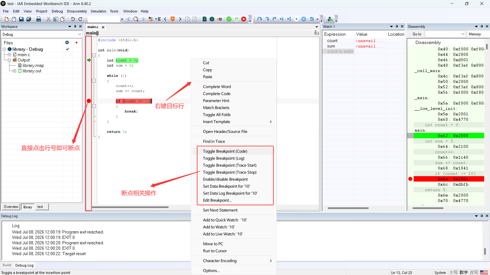


#### 禁用断点

- 右键点击已设置的断点（红色圆点）→ `Breakpoint Usage` → 勾选 `Disable`
- 禁用后断点变为**灰色圆点**，程序运行不会在此暂停，但断点配置被保留

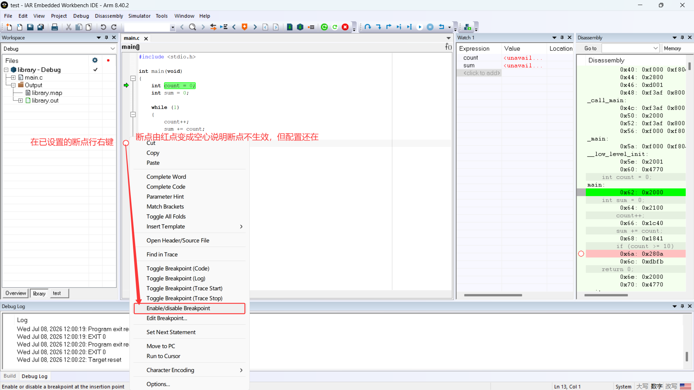


#### 启用断点

- 右键点击被禁用的断点（灰色圆点）→ `Breakpoint Usage` → 取消勾选 `Disable`
- 断点恢复为红色，程序运行到此会再次暂停

> 在主菜单 `View` → `Breakpoints` 窗口中可以集中管理所有断点（批量启用/禁用/删除）。

与禁用断点操作一致，也可以在View选项栏里的`Breakpoints` 窗口进行启用


#### 删除断点

- **方法一**：直接点击红色断点圆点
- **方法二**：光标停在目标行，按 `F9`
- **方法三**：在 `Breakpoints` 窗口中右键断点 → `Delete`

与创建断点基本一致，`Breakpoints` 窗口在顶部的View选项栏


#### 条件断点

条件断点让程序在满足特定条件时才暂停，避免手动反复跳过不需要的场景。

**设置方法**：

1. 先设置一个普通断点
2. 右键点击断点 → `Edit Breakpoint...`
3. 在弹出的对话框中设置条件：

| 条件类型 | 说明 | 示例 |
| :--- | :--- | :--- |
| `Condition` | 表达式为真时触发 | `i == 100` |
| `Skip Count` | 跳过 改条件断点N 次后才触发 | 跳过前 99 次，第 100 次触发 |
| `Condition True` | 条件从假变真时触发 | 配合变量变化使用 |
| `Condition Changed` | 条件值改变时触发 | 变量值每次变化都触发 |

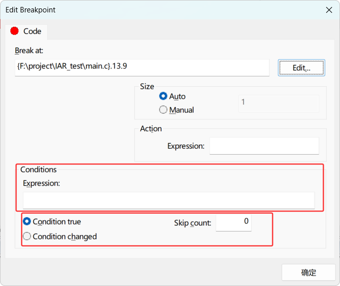

| 配置区域                | 选项/控件                | 含义与作用                                                   |
| :---------------------- | :----------------------- | :----------------------------------------------------------- |
| **Size** （断点大小）   | **Auto（自动）**         | **推荐选项**。IAR 调试器会根据当前行或选中符号，自动决定断点占用的硬件资源（通常不影响使用）。 |
|                         | **Manual（手动）**       | 手动指定断点占用的字节数/指令数。一般仅在调试极度底层的汇编代码、或硬件断点资源极度稀缺时才会用到，普通 C 语言调试无需理会。 |
| **Action** （动作配置） | **Expression（表达式）** | **高级功能**。这里通常填入**赋值语句**或**宏调用**。 **作用：** 当程序运行到断点处时，**如果不暂停程序**，而是去执行某个动作（例如：在后台自动打印日志、改变某个变量的值）。 |

> 条件断点非常实用，例如在循环中可以指定在 `i == 100` 时暂停，而不需要手动按 99 次运行。


### 监控信息

监控窗口用于实时查看变量的当前值。

**Watch 窗口**：最常用的监控窗口，可监控全局变量、局部变量及自定义表达式。可通过 `View` → `Watch` 打开，支持同时开多个。右键变量名 → `Add to Watch` 添加监控，也可直接输入表达式（如 `array[0]`、`a+b`）。变量值变化时以红色高亮，双击值可直接修改。

**Locals 窗口**：专门显示当前函数内的局部变量，自动随函数调用切换内容。进入新函数时自动更新为该函数的局部变量列表，无需手动添加。

**Auto 窗口**：自动显示当前执行语句附近的相关变量和表达式，随代码单步执行动态刷新，省去手动查找变量的操作。

**Live Watch 窗口**：专用于监控 **静态变量** 或全局变量，在程序 **全速运行** 时也能实时刷新变量值，适合观察持续变化的传感器数据或计数器。

**Quick Watch 窗口**：临时弹窗式监控，快速查看单个变量或表达式的值后即关闭，不占用面板空间。

> 监控信息不仅限于变量值——还可以监控寄存器值（通过 Registers 窗口）和内存值（通过 Memory 窗口）。认为监控信息只能监控变量值为常见误解。


**打开方式**：

- 菜单栏 `View` → `Watch` → `Watch 1`（可打开多个监控窗口）
- 在调试状态下右键变量名 → `Add to Watch` → 选择具体监控窗口

**使用技巧**：

- 监控窗口中可直接输入表达式（如 `array[0]`、`*ptr`、`a+b`）
- 变量值变化时以**红色**高亮显示
- 双击值可以**直接修改**变量的值（方便模拟各种测试场景）

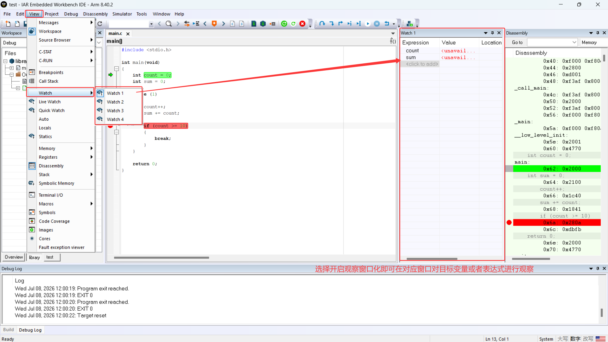


### 寄存器信息

查看 CPU 内核寄存器（R0-R15、SP、LR、PC、xPSR 等）和外设寄存器的当前值。

**打开方式**：

- 菜单栏 `View` → `Registers`
- 窗口分类显示：
  - `CPU Registers`：内核寄存器（通用寄存器、控制寄存器）
  - `Peripheral Registers`：外设寄存器（GPIO、USART、SPI 等）

> 寄存器窗口在调试硬件底层问题（如中断配置、时钟设置）时非常有用。

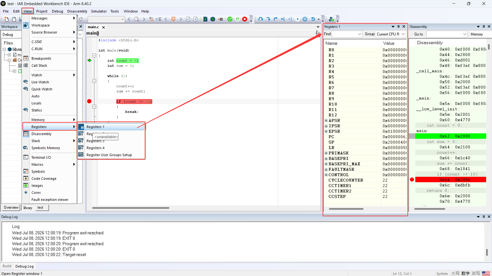


### 内存信息

查看指定内存地址的原始数据。

**打开方式**：

- 菜单栏 `View` → `Memory`
- 可打开多个内存窗口，以不同视角（8-bit、16-bit、32-bit）查看同一内存区域

**使用操作**：

1. 在 `Go to` 输入框中输入地址（如 `0x20000000`）或变量名（如 `&myArray`）
2. 右键内存窗口可切换显示格式：`Hex`（十六进制）、`ASCII`、`Decimal` 等
3. 可以直接在内存窗口中**编辑内存值**

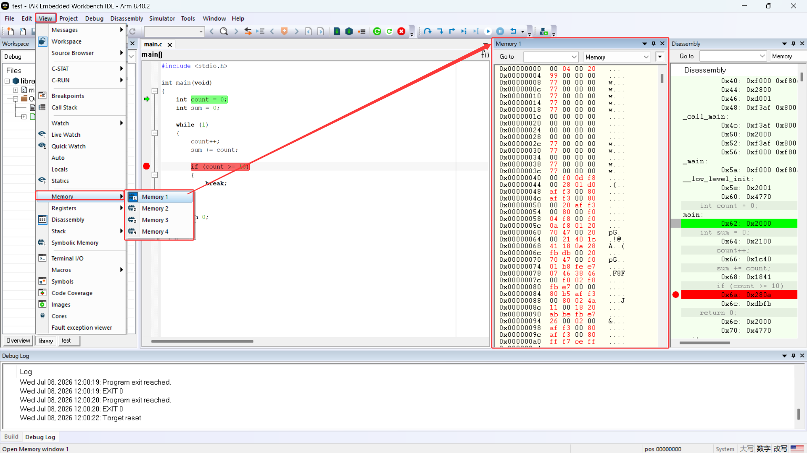


### 栈信息

查看当前任务的栈使用情况。

**打开方式**：

- 菜单栏 `View` → `Stack`
- 窗口显示当前栈指针（SP）位置和栈使用量

> 栈溢出（Stack Overflow）是嵌入式开发中的常见问题，栈信息窗口可用于判断栈空间是否充足。

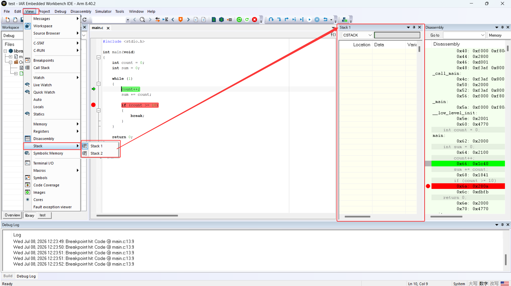


### 汇编信息

查看当前 C 代码对应的汇编指令，用于底层分析和性能调试。

**打开方式**：

- 菜单栏 `View` → `Disassembly`
- 在 C 代码编辑窗口中右键 → `Go to Disassembly`

**窗口内容**：
- 左侧为内存地址
- 中间为机器码（十六进制）
- 右侧为汇编指令和对应的 C 源码对照

> 汇编窗口配合寄存器窗口使用，可以进行指令级别的精确调试。优化等级较高时，C 代码和汇编的对应关系会变得不直观。

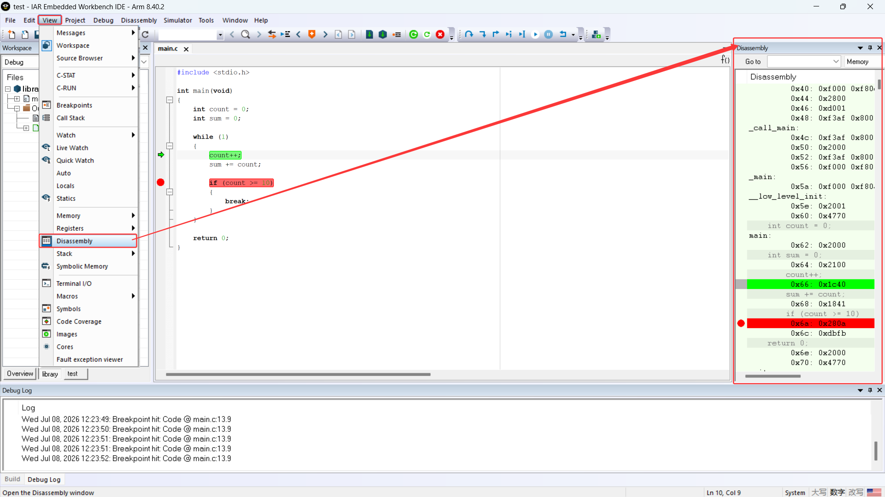


### 调用堆栈信息

查看当前函数调用链，即从 `main` 到当前函数的完整调用路径。

**打开方式**：

- 菜单栏 `View` → `Call Stack`
- 双击堆栈中任意一层函数调用，可直接跳转到对应的调用位置

**用途**：

- 定位程序的执行路径，理解代码走向
- 当程序崩溃时（如 HardFault），调用堆栈可以帮助追踪到崩溃前的函数调用链

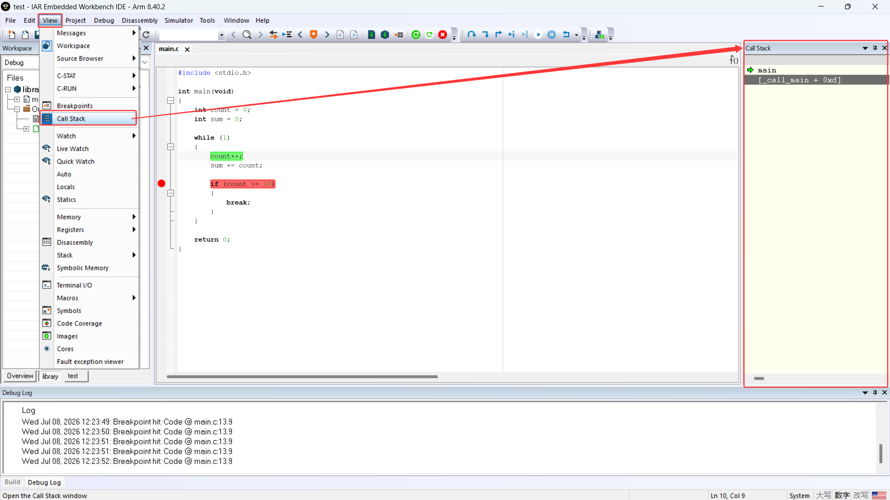


### 单步调试

单步调试让程序一步步执行，仔细跟踪每行代码的行为。


#### 逐过程

| 操作 | 快捷键 | 说明 |
| :--- | :--- | :--- |
| 逐过程执行 | `F10` | 执行当前行，**不进入**函数内部，将函数调用当作一步完成 |

> 当确定某函数内部没有问题，只想确认调用结果时，使用逐过程快速跳过。

#### 逐语句

| 操作 | 快捷键 | 说明 |
| :--- | :--- | :--- |
| 逐语句执行 | `F11` | 执行当前行，**进入**函数内部，逐行跟踪函数内的代码 |

> 当需要深入函数内部排查问题时，使用逐语句。


#### Next Statement

Next Statement 是 IAR 中的 "运行到下一个语句"，将程序运行到当前源代码行的下一条语句后暂停。它不等同于逐语句调试——逐语句 `F11` 是单步执行每一条指令并进入函数内部，而 Next Statement 是连续运行直到到达下一行代码。如果当前行是一个函数调用，Next Statement 会执行完整个函数在下一行暂停，效果类似于逐过程 `F10`，但执行逻辑不同。

#### 跳出

| 操作         | 快捷键      | 说明                                         |
| :----------- | :---------- | :------------------------------------------- |
| 跳出当前函数 | `Shift+F11` | 执行完当前函数的剩余代码，返回到上一层调用处 |

> 当跟踪进一个函数后，发现没有问题，使用跳出快速返回。


#### 运行/复位

| 操作 | 快捷键 | 说明 |
| :--- | :--- | :--- |
| 全速运行 | `F5` | 从当前位置全速运行，遇断点暂停 |
| 复位 | `Ctrl+Shift+R` | 复位芯片，程序从头开始执行 |
| 停止调试 | `Ctrl+Shift+D` | 终止当前调试会话 |

---

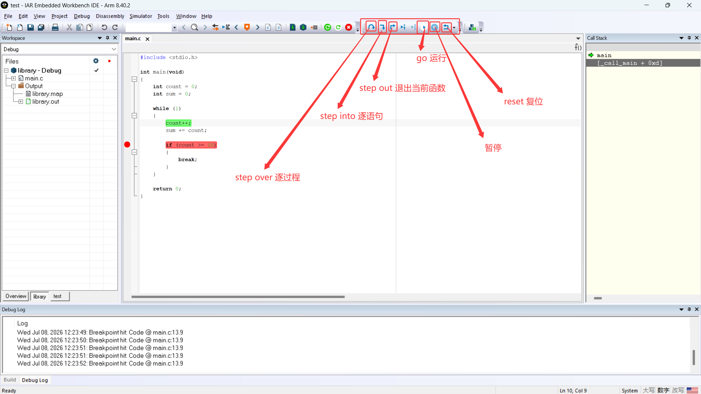


## 四、常用操作

### 文件与工程快捷键

| 操作 | 快捷键 |
| :--- | :--- |
| 新建文件 | `Ctrl+N` |
| 打开文件 | `Ctrl+O` |
| 保存文件 | `Ctrl+S` |
| 编译当前文件 | `Ctrl+F7` |
| 编译工程 | `F7` |
| 编译所有工程 | 菜单 `Project` → `Rebuild All` |
| 工程选项 | `Alt+F7` |
| 下载并调试 | `Ctrl+D` |
| 下载（不调试） | `Ctrl+Shift+D` → 仅下载 |

### 调试快捷键

| 操作 | 快捷键 |
| :--- | :--- |
| 开始调试 / 全速运行 | `F5` |
| 逐过程 | `F10` |
| 逐语句 | `F11` |
| 跳出 | `Shift+F11` |
| 设置/取消断点 | `F9` |
| 运行到光标处 | 右键 → `Run to Cursor` |
| 复位 | `Ctrl+Shift+R` |
| 停止调试 | `Ctrl+Shift+D` |

### 调试窗口快捷键

| 操作 | 快捷键/方式 |
| :--- | :--- |
| 监控窗口 | `View` → `Watch` |
| 寄存器窗口 | `View` → `Registers` |
| 内存窗口 | `View` → `Memory` |
| 调用堆栈窗口 | `View` → `Call Stack` |
| 断点窗口 | `View` → `Breakpoints` |
| 栈信息窗口 | `View` → `Stack` |
| 汇编窗口 | `View` → `Disassembly` |

---

## 五、常见问题与注意事项

1. **编译提示找不到头文件**：检查 `C/C++ Compiler` → `Preprocessor` 中的头文件路径是否正确，注意路径是相对于 `.ewp` 文件的位置。

2. **链接提示 undefined symbol**：检查是否缺少源文件或库文件的添加，确认函数名拼写正确。

3. **下载失败/Cannot connect to target**：检查调试器驱动连接是否正常、`Debugger` → `Setup` 中的 Driver 选择是否正确、目标板是否正常供电。

4. **程序运行后进入 HardFault**：检查栈大小是否充足、芯片型号是否选对、`.icf` 文件内存配置是否正确。

5. **优化后代码行为异常**：高优化等级可能打乱代码顺序或优化掉某些变量，降低优化等级排查是否是优化导致的问题。

6. **变量值不可查看（显示 unavailable）**：可能是因为优化导致变量被寄存器化或完全消除，降低优化等级或声明变量为 `volatile`。

7. **添加文件使用相对路径**：在 `Project` → `Options` 中所有路径配置尽量使用 `$PROJ_DIR$` 变量，确保工程可移植。

8. **库配置选项的区别**：`Linker` → `Library` 中 `None` 表示不链接运行库；`Normal` 链接普通运行库，不支持文件描述符和多字节操作；`Full` 链接完整运行库，支持文件描述符和多字节操作；`Custom` 链接用户自定义库。

9. **`.map` 文件可以删除**：`.map` 文件是内存映射信息文件，存放了堆栈的起始/终止地址和函数地址分布，是分析内存占用情况的重要文件。但它不是编译必需的——删除 `.map` 仅丢失分析参考，不影响工程编译和运行。

10. **监控信息不仅限于变量值**：Watch 窗口可以监控变量值，Registers 窗口可监控寄存器值，Memory 窗口可监控指定内存地址的内容。不要误认为监控信息只能看变量。

11. **断点数量限制**：代码断点受硬件断点数量限制。但如果使用软件断点或在 RAM 中运行程序，则断点数量可以不受硬件限制。

12. **高优化等级的影响**：高优化等级会加快执行速度，但可能增加编译时间、改变代码执行顺序。高优化不一定导致代码体积增大——`Size` 方向的高优化实际上会减小代码体积。
