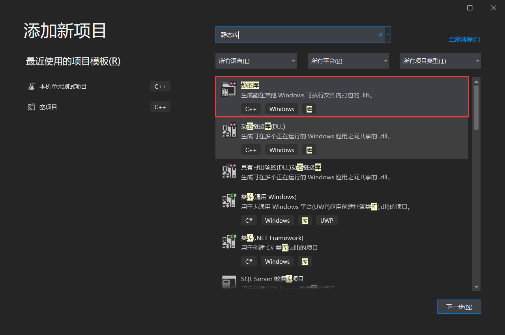

# 库

在多个项目之间复用同一套代码时，不应直接复制源文件——这会导致版本不一致和维护成本上升。正确的做法是将公共代码封装为库，编译后供需要的项目引用。

库就是把一组相关的函数封装起来，提前编译好，生成一个独立的文件，其他项目直接引用这个文件就能调用里面的函数，不用关心内部实现。

VS2019 支持两种库。**静态库**在链接阶段将代码嵌入可执行文件，编译完成后不再依赖库文件。**动态库**在运行时加载，可执行文件中仅记录函数地址，实际代码保留在 `.dll` 中。	

## 目录

[TOC]

------

## 一、编译与链接

C/C++ 程序从源码到可执行文件经历的四个阶段:

**预处理**：处理 `#include`、`#define`、`#ifdef` 等指令。`#include` 直接将头文件内容复制插入到源文件中。`#define` 做文本替换。预处理后的文件是纯文本的 `.i` 文件。

**编译**：将预处理后的 `.i` 文件翻译为汇编代码 `.s`。编译器在此阶段进行语法检查、类型推导、优化。编译后的代码仍然是文本形式的汇编指令。

**汇编**：将汇编代码 `.s` 翻译为机器指令，生成目标文件 `.obj`。`.obj` 文件已经是二进制格式，包含机器码和数据，但其中的函数调用地址和全局变量地址尚未确定——这些占位符将在链接阶段被填充。

**链接**：将一个或多个 `.obj` 文件以及所需库文件合并，解析所有符号引用，填充地址，最终生成可执行文件 `.exe` 或库文件。这是理解静态库和动态库区别的关键阶段。


链接器的核心工作包含两部分：**符号解析**和**地址重定位**。

当一个 `.obj` 文件中调用了另一个文件中的函数（如 `main.obj` 调用了 `Add` 函数），`main.obj` 中调用 `Add` 的位置只会留一个占位符——因为编译 `main.c` 时编译器不知道 `Add` 函数最终会被放在内存的哪个位置。链接器的任务就是在所有 `.obj` 文件和库文件中找到 `Add` 函数的定义，将其地址填入那个占位符。这个过程就是重定位。


每个 `.obj` 文件内部维护了两张表：导出符号表记录本文件提供了哪些函数和全局变量供外部使用；未解析符号表记录本文件引用了哪些外部函数和变量但尚未找到定义。链接时链接器遍历所有 `.obj` 和库文件，逐一匹配未解析符号，直到所有引用都找到定义。如果最终仍有无法解析的符号，链接器报错 `LNK2019: unresolved external symbol`。

从上面角度来看，静态库和动态库，它们的本质区别就在于链接发生的时间和地址填充的方式。


## 二、静态库

静态库就是把源代码编译成一个独立的 `.lib` 文件，然后在你自己的程序链接时，链接器会把 `.lib` 里的代码完整地复制一份到最终生成的 `.exe` 文件里。

相当于链接器直接把库代码内嵌进了最终输出程序，所以程序一旦编译完成就不再需要 `.lib` 文件， `.exe` 可以独立运行。

但最终`.exe` 文件的体积会变大，因为里面包含了库的全部代码。而且如果库的代码更新了，所有用到这个库的程序都必须重新编译链接，否则还是旧版本。

由于库代码在编译时嵌入，库发生更新后，所有引用该库的程序都必须重新编译链接才能生效。这一特性使得静态库适用于代码稳定、变更频率低的场景，例如成熟的算法库、通信协议栈等。


静态库本质上是一组 `.obj` 文件的打包集合，后缀为 `.lib`。可以把 `.lib` 理解为一个压缩包——里面存放着多个已经编译好的 `.obj` 文件。当链接器打开一个静态库时，它并不是把整个 `.lib` 复制进 `.exe`。链接器只从静态库中提取那些真正被引用的 `.obj` 文件，将其中的代码和数据链接到最终可执行文件中。没有被引用的函数不会进入 `.exe`，因此不用担心静态库体积大导致最终的 `.exe` 膨胀。

链接过程发生在编译之后、生成可执行文件之前。因为链接时库代码已经被完整复制进 `.exe`，所以运行时不再需要 `.lib` 文件——`.exe` 包含了运行所需的全部代码。这也意味着如果静态库更新了，所有引用它的程序必须重新链接才能生效——因为旧代码已经被固化在 `.exe` 内部了。


### 静态库生成

#### 创建模板

在 VS2019 新建项目时模板选择"静态库"，Visual Studio 会自动把项目的配置类型设为静态库。

项目创建后添加源文件和头文件，生成解决方案即可在输出目录获得 `.lib` 文件。

静态库项目与可执行项目的一项关键区别在于它不需要 `main` 函数。静态库本身并非可执行程序，仅是一组编译后的函数集合。

链接器处理静态库时不会因为缺少入口函数而报错。



对静态库项目，需要把项目属性里的配置和平台里的所有项目和所有平台，配置属性的常规里的输出目录选择对应的Debug路径，然后对静态库项目右键选择生成，通过后检查刚刚选择的选择对应的Debug路径里有没有正确的.lib文件

在创建对应的静态库之后，会自动创建几个文件：

| 文件          | 作用                                                         | 怎么处理                                                     |
| :------------ | :----------------------------------------------------------- | :----------------------------------------------------------- |
| `framework.h` | 预编译头的主入口文件，包含了 Windows 基础类型定义            | 不使用预编译头时删除                                         |
| `pch.h`       | 预编译头文件，把不常改动的系统头文件预先编译好，后续编译跳过这些头文件加快速度 | 不使用预编译头时删除                                         |
| `pch.cpp`     | 预编译头的实现文件，仅一行 `#include "pch.h"`，编译时生成预编译头缓存 `.pch` | 必须存在，且必须开启 `/Yc` (预编译头)编译选项。不使用预编译头时删除。 |
| `项目名.cpp`  | **项目的主源文件 / 静态库实现文件**。包含了项目业务逻辑的具体代码，或者是静态库要对外提供的函数实现。 | 对于**静态库项目**，此文件中没有 `main()` 函数；对于**控制台应用**，此文件必须包含 `main()` 或 `WinMain()` 入口点。 |

如果不需要`pch.h`,`pch.cpp`，在删除 `pch.h`、`pch.cpp` 等预编译头文件后，必须告诉 VS 不再使用预编译头，否则编译会报错找不到 `pch.h`：

1. 右键项目 → `属性` → `C/C++` → `预编译头` → `预编译头` 下拉框选 `不使用预编译头`。
2. 同时检查 `C/C++` → `预编译头` → `预编译头文件`——如果里面有 `pch.h` 的残留引用，清空它。


#### 创建流程

**（1）新建解决方案和静态库项目**

`文件` → `新建` → `项目` → 左侧 `C++` → `Windows` → `桌面` → 选 `静态库`。

**（2）清理模板文件**（可选）

新建后项目中会看到 `framework.h`、`pch.h`、`pch.cpp`。全选 → 右键 → `移除` → `删除`。


**（3）关闭预编译头**（可选,在清理模版文件后必须执行）

右键项目 → `属性` → `C/C++` → `预编译头` → `预编译头` → 选 `不使用预编译头`。点击`应用`后`确定`。


**（4）添加源文件**

右键项目 → `添加` → `新建项` → `头文件(.h)`：

```c
#ifndef ADD_H   //防止重复包含
#define ADD_H

int Add(int a, int b);  //静态库函数

#endif
```


右键项目 → `添加` → `新建项` → `C++ 文件(.cpp)`：

```c
#include "add.h"  //包含静态库自己的头文件

int Add(int a, int b) //静态库函数实现
{
    return a + b;
}
```


**（5）编译生成静态库**

右键静态库项目 → `生成`。去输出目录下确认 `.lib` 已生成。


### 静态库调用

#### 在工程配置中调用

1. **头文件声明**：代码中 `#include "头文件.h"`,声明函数。

2. **属性配置加载**：右键项目 -> 属性，依次配置：

   - `C/C++` -> `常规` -> **附加包含目录**,填入 `.h` 路径。

   - `链接器` -> `常规` -> **附加库目录**,填入 `.lib` 路径。

   - `链接器` -> `输入` -> **附加依赖项,**填入具体的 `.lib` 文件名。

     > 完成后直接编译，链接器自动查找并完成链接。


调用静态库需要在自己的项目中完成三项配置，分别对应编译器查找头文件和链接器查找库文件的需求。

**第一步，配置头文件路径。** 

项目需要 `#include` 库的头文件才能使用其函数声明。右键项目 → `属性` → `C/C++` → `常规` → `附加包含目录`，填入库头文件所在的目录。建议使用 `$(ProjectDir)` 等宏变量编写路径，当解决方案整体移动位置时路径不会失效。


**第二步，配置库文件搜索路径。**

 链接器需要知道去哪里查找 `.lib` 文件。在 `链接器` → `常规` → `附加库目录` 中填入 `.lib` 文件所在目录。头文件目录和库文件目录通常不在同一位置——头文件一般在 `include` 目录下，库文件在 `lib` 或编译输出目录下。


**第三步，指定库文件名。** 

一个目录下可能存在多个 `.lib` 文件，链接器不会自动选择。需要在 `链接器` → `输入` → `附加依赖项` 中填入 `.lib` 文件名，多个库之间用分号分隔。

完成上述配置后，在代码中 `#include` 库头文件即可直接调用库函数。


#### 在代码中语句加载

1. **头文件声明**：代码中 `#include "头文件.h"`。

2. **指令加载库**：代码中另起一行写 `#pragma comment(lib, "库名.lib")`。

   > *若 `.lib` 不在当前代码根目录下，仍需在`链接器` → `常规` → `附加库目录`里指明路径。)*


效果等同于在附加依赖项中填写库名。该方式的优点是库依赖关系与源代码绑定，其他开发者阅读代码时能够直接了解所需库；

缺点是库名和路径写入代码中，项目结构调整后可能需要修改源码。

实际项目中两种方式常配合使用——工程配置管理通用路径，`#pragma comment` 处理特定模块的依赖。


## 三、动态库

动态库编译后生成两类文件：`.dll` 文件包含实际的库代码，配套的 `.lib` 文件称为导入库，仅在链接阶段提供函数地址信息，不含实际代码。

动态库与静态库的核心区别在于链接时机。动态库在**运行时**才被加载到内存，可执行文件本身不包含库代码，因此体积较小。库更新时只需替换 `.dll` 文件，引用该库的程序无需重新编译。多个程序可以同时使用同一份 `.dll`，Windows 系统目录中的 `kernel32.dll`、`user32.dll` 等即以此方式被系统中所有程序共享。

动态库的代价主要体现在部署阶段：运行时 `.dll` 文件必须位于程序能够找到的路径中，否则程序启动时将报错。


### 动态库生成

在 VS2019 中新建项目，模板选择"动态链接库"。


完整流程：

1. `文件` → `新建` → `项目`，模板选 `动态链接库(DLL)`，输入项目名称（如 `MyDynamicLib`），选择存放位置。VS 自动将配置类型设为动态库。

2. 删除模板文件、关闭预编译头：与静态库项目同样的操作——删除自动生成的 `pch.h` 等文件，然后在项目属性 → `C/C++` → `预编译头` 中选择 `不使用预编译头`。

3. 添加源文件和头文件：右键项目 → `添加` → `现有项`，导入 `.h` 和 `.c` 文件。如果有 `.def` 文件也一同导入。

4. 配置预处理器定义：右键项目 → `属性` → `C/C++` → `预处理器` → `预处理器定义`，在已有的宏列表末尾加上 `MYDLL_EXPORTS`（多个宏用分号分隔）。这个宏让头文件中的 `#ifdef MYDLL_EXPORTS` 生效，将 `MYDLL_API` 展开为 `__declspec(dllexport)`。

5. 如果使用 `.def` 文件导出，需要配置模块定义文件路径：右键项目 → `属性` → `链接器` → `输入` → `模块定义文件`，填入 `.def` 文件名（如 `MyDynamicLib.def`）。注意此处只需文件名，不需要路径——前提是 `.def` 文件在项目目录下。

6. 确认配置类型：`配置属性` → `常规` → `配置类型`，确认 `所有配置` 和 `所有平台` 下都设为 `动态库(.dll)`。

7. 编译：右键项目 → `生成`。生成完成后到输出目录确认两个产物——`MyDynamicLib.dll` 和 `MyDynamicLib.lib`（导入库）。

动态库生成时，会自动创建下面的文件：

| 文件名            | 类型           | 核心作用                                            | 必知必会                                             |
| :---------------- | :------------- | :-------------------------------------------------- | :--------------------------------------------------- |
| **`framework.h`** | 预编译头主入口 | 包含 Windows 基础类型定义（`windows.h` 等）。       | 未使用预编译头时可删除。                             |
| **`pch.h`**       | 预编译头文件   | 存放不常改动的系统头文件，加速编译。                | 未使用预编译头时可删除。                             |
| **`pch.cpp`**     | 预编译头实现   | 仅包含 `#include "pch.h"`，用于生成 `.pch` 缓存。   | **需单独对此文件开启 `/Yc` 选项**。                  |
| **`dllmain.cpp`** | DLL 入口函数   | 包含 `DllMain` 函数，负责 DLL 加载/卸载时的初始化。 | **不能删除**，DLL 依赖它才能运行。                   |
| **`项目名.h`**    | 导出头文件     | 声明需要对外暴露给 `.exe` 调用的函数/类。           | **必须用 `__declspec(dllexport)` 修饰导出函数**。    |
| **`项目名.cpp`**  | 主源文件       | 实现导出头文件中声明的函数的具体逻辑。              | 包含 `#include "pch.h"` 和 `#include "(项目名).h"`。 |


在程序启动时，操作系统的加载器读取 `.exe` 文件的导入表，找到它依赖的 DLL 列表，逐个将 DLL 加载到进程的地址空间，然后根据导入表中的函数地址信息填充 `.exe` 内部的函数指针——这个过程叫导入地址表绑定。完成绑定后，程序调用 DLL 中的函数就像调用程序自己的函数一样。

因此动态库生成的`.exe` 体积小（不含库代码），多个程序可以共享同一份 DLL 的物理内存页，更新 DLL 时只需要替换文件无需重新编译程序。代价是运行时 DLL 必须能在搜索路径中被找到，且加载过程有额外时间开销。

编译动态库会产生两个文件：`.dll` 是真正的库代码，`.lib` 是导入库。导入库和静态库虽然后缀相同但内容完全不同——导入库很小，里面没有实际代码，只有一张表记录了每个导出函数的名字及其在 DLL 中的位置信息。链接器在编译调用方程序时读取导入库，将函数地址信息写入 `.exe` 的导入表，真正的函数调用在运行时才被解析到 DLL 中。

> 两种 `.lib` 不能互换使用，把静态库的 `.lib` 当导入库用会链接失败（因为里面是实际代码而非导入信息），反之亦然。


编译动态库时有一个静态库不需要的步骤**导出函数**。未显式导出的函数对外部代码不可见。

#### 导出函数

**方式一：使用 `__declspec(dllexport)` 导出。** 

在函数声明前添加该指令，编译器即将函数符号放入导出表。工程实践中更规范的做法是通过宏进行封装：

```cpp
// MyDll.h
#ifdef MYDLL_EXPORTS
    #define MYDLL_API __declspec(dllexport)   // 生成 DLL 时
#else
    #define MYDLL_API __declspec(dllimport)   // 调用 DLL 时
#endif

MYDLL_API int Add(int a, int b);
MYDLL_API int Subtract(int a, int b);
```

在编写动态库的 `.h` 文件时，使用 `__declspec(dllexport)` 关键字明确标记需要导出的函数/类。
**调用过程：**

1. **定义宏**：在头文件中定义条件编译宏（如 `#ifdef DLL_EXPORTS ... #endif`），用于内外切换。
2. **声明导出**：函数前加上 `__declspec(dllexport)`，如 `__declspec(dllexport) void MyFunc();`。
3. **编译生成**：直接编译项目，编译器根据声明将函数导出到 `.dll` 和 `.lib` 文件中。


**方式二：使用 `.def` 模块定义文件导出。** 

创建 `.def` 文件，在其中声明库名称和导出函数列表：

```def
LIBRARY MyDll
EXPORTS
    Add
    Subtract
```

使用文本形式的模块定义文件（`.def`）来指示链接器具体需要导出哪些符号。
**调用过程：**

1. **创建文件**：在项目中添加一个后缀为 `.def` 的文本文件。
2. **编写规则**：在 `.def` 文件中写入标准格式，包含 `EXPORTS` 关键字及随后的导出函数名列表（如 `MyFunc @1`）。
3. **配置应用**：在项目属性的 `链接器` -> `输入` -> `模块定义文件` 中，填入该 `.def` 文件名。
4. **编译生成**：编译项目，链接器会忽略代码中的导出声明，严格按照 `.def` 文件指定的名称和序号进行导出。


将 `.def` 文件添加到项目中，链接器会自动按列表导出函数。该方式不修改源代码，导出信息集中管理，便于维护。

C 语言项目更倾向于使用 `.def` 文件，C++ 项目由于名字修饰机制通常使用 `__declspec` 方式。

无论选择哪种导出方式，导出声明必须与实际实现的函数签名完全一致，否则链接阶段将报告符号不匹配错误。

- **静态库 `.lib`**：大文件，含完整代码。链接时嵌入 exe。运行时不需要了。
- **动态库导入 `.lib`**：小文件，仅含函数地址。链接时记录位置。运行时真正代码在 `.dll`。
- 两种 `.lib` 后缀相同但完全不同，不能互换。
- DLL 要有导出声明（`__declspec` 或 `.def`），没有导出的函数外面根本看不到。


### 动态库调用

调用动态库有三种方式。


#### 工程配置方式

操作流程与调用静态库相同：

1. 配置头文件路径


2. 配置库文件搜索路径


3. 在附加依赖项中填入导入库文件名。


该方式最为简单，编译链接一次完成程序启动时，操作系统的加载器自动查找并加载 `.dll`，填充导入地址表。这种方式最为简单，编译链接一把过，但风险在于如果 `.dll` 缺失，程序会在启动时直接弹出错误框，没有机会做任何补救。


#### 在代码中语句加载lib调用

 在代码中写入 `#pragma comment(lib, "MyDll.lib")`，仅解决链接阶段的问题，运行时仍要求 `.dll` 文件位于正确位置。


调用动态库时，编译链接通过只完成了第一步。运行时 `.exe` 必须能找到 `.dll` 文件。有四种常用做法将 DLL 放到正确位置。

**1.统一输出目录（推荐，最干净）**

将 DLL 项目和 EXE 项目的输出目录设为同一个路径，编译后所有产物自然汇聚在一起。

操作步骤：右键 DLL 项目 → `属性` → `配置属性` → `常规` → `输出目录`，将默认的 `$(SolutionDir)$(Configuration)\` 改为与 EXE 项目相同的输出目录，例如 `$(SolutionDir)$(Configuration)\`。同时修改 EXE 项目的输出目录为同一路径。这样 `Ctrl+Shift+B` 生成解决方案后，`.exe` 和 `.dll` 都在同一个文件夹下，无需手动复制。

每个配置（Debug/Release）和每个平台（Win32/x64）的输出目录需要分别设置。在属性页顶部确认当前的"配置"和"平台"下拉框对应要修改的目标，修改完当前组合后切换到其他组合继续修改。

**2.生成后事件（自动复制 DLL）**

在 EXE 项目的属性中配置一条命令，每次编译完成后自动将 DLL 复制过来。

操作步骤：右键 EXE 项目 → `属性` → `生成事件` → `生成后事件` → `命令行`，输入：

```
xcopy /y /d "$(SolutionDir)MyDll\$(Configuration)\MyDll.dll" "$(OutDir)"
```

各参数含义：`/y` 覆盖已有文件不提示，`/d` 仅当源文件比目标文件新时才复制。`$(SolutionDir)` 是解决方案目录，`$(Configuration)` 是当前配置名（Debug 或 Release），`$(OutDir)` 是当前项目的输出目录。

点击命令行输入框右侧的 `编辑...` 按钮可以打开多行编辑窗口，支持写多条命令。如果 DLL 生成在多个子目录下，可以写多行 `xcopy` 命令。

**3.项目引用自动复制**

如果在解决方案中添加了 DLL 项目的项目引用（右键 EXE → `添加` → `引用` → 勾选 DLL 项目），VS 会自动将 DLL 复制到 EXE 的输出目录。这种方式最简单但仅适用于 DLL 和 EXE 在同一个解决方案中的情况。

**4.手动复制**

开发调试阶段直接将 `.dll` 文件拖到 `.exe` 所在文件夹。简单直接但不适合频繁编译的场景——每次重新生成 DLL 后都要手动操作一遍。


#### 在代码中语句加载dll调用

不依赖工程配置，通过 Windows API 在运行时手动控制 DLL 的加载与释放：

```cpp
#include <windows.h>

HMODULE hDll = LoadLibrary(L"MyDll.dll");
if (hDll == NULL) {
    // DLL 不存在时的容错处理
    return;
}

typedef int (*AddFunc)(int, int);
AddFunc Add = (AddFunc)GetProcAddress(hDll, "Add");

if (Add != NULL) {
    int result = Add(3, 5);
}

FreeLibrary(hDll);
```

该方式无需在工程配置中设置任何库相关选项，也无需引入头文件——仅需知晓函数名和函数签名。其核心优势在于程序能够自主决定是否加载某个 DLL。典型应用场景为插件系统：程序启动时扫描指定目录，根据实际存在的 DLL 动态加载对应功能模块，缺失的模块不影响程序正常运行。

#### 动态调用注意事项

需要注意，动态调用时，`GetProcAddress(hDll, "函数名")` 的第二个参数是一个字符串，它和 DLL 导出表中的名字做**精确匹配**——一个字符不对就返回 NULL。因此能否调用成功，只取决于 DLL 导出表里存的是什么名字，跟主程序的代码怎么写无关。

- 用 `.def` 导出 + 源文件是 `.cpp`（C++ 编译） → `GetProcAddress("Mul")` **直接成功**。因为 `.def` 告诉链接器导出名就是 `Mul`，编译器修饰对它无效。

- 用 `__declspec(dllexport)` 导出的源文件是 `.cpp` → `GetProcAddress("Mul")` **失败**。导出名被 C++ 修饰为 `?Mul@@YAHHH@Z`，字符串不匹配。需在头文件中加 `extern "C"` 阻止修饰，也就是在头文件声明函数的部分使用。

  - ```
    extern "C" {
    	MUL_API int Mul(int x, int y);
    }
    
    #ifdef __cplusplus
    extern "C" {
    #endif
    
    	MUL_API int Mul(int x, int y);
    
    #ifdef __cplusplus
    }
    #endif
    ```

- 用 `__declspec(dllexport)` 导出 + 源文件是 `.c`（C 编译） → `GetProcAddress("Mul")` **直接成功**。C 编译器不做名字修饰。因为绕过了编译时的导入表绑定，所以完全不需要头文件和导入库——只需要知道函数名和函数签名。DLL 不存在时程序不会崩溃，可以根据业务逻辑选择降级处理、提示用户或使用替代方案。插件系统几乎都采用这种方式。


##### Windows 动态库加载 API 速查表

| 分类             | 函数名           | 参数                                                     | 返回值类型 | 成功返回           | 失败返回       | 注意事项                                                     |
| :--------------- | :--------------- | :------------------------------------------------------- | :--------- | :----------------- | :------------- | :----------------------------------------------------------- |
| **加载**         | `LoadLibraryA`   | `LPCSTR lpLibFileName`                                   | `HMODULE`  | 模块句柄（非NULL） | `NULL`         | 不推荐，中文路径可能乱码                                     |
| **加载**         | `LoadLibraryW`   | `LPCWSTR lpLibFileName`                                  | `HMODULE`  | 模块句柄（非NULL） | `NULL`         | **推荐**，支持中文路径                                       |
| **加载**         | `LoadLibraryExA` | `LPCSTR lpLibFileName`, `HANDLE hFile`, `DWORD dwFlags`  | `HMODULE`  | 模块句柄（非NULL） | `NULL`         | 可控制加载行为，如指定搜索路径                               |
| **加载**         | `LoadLibraryExW` | `LPCWSTR lpLibFileName`, `HANDLE hFile`, `DWORD dwFlags` | `HMODULE`  | 模块句柄（非NULL） | `NULL`         | 推荐宽字符版，支持标志位控制                                 |
| **获取函数地址** | `GetProcAddress` | `HMODULE hModule`, `LPCSTR lpProcName`                   | `FARPROC`  | 函数指针（非NULL） | `NULL`         | 参数名不区分大小写；仅适用于 `extern "C"` 导出函数；C++ 类成员函数需处理名称修饰 |
| **释放**         | `FreeLibrary`    | `HMODULE hModule`                                        | `BOOL`     | 非零（`TRUE`）     | `0`（`FALSE`） | 引用计数减1，减到0时卸载；必须与 `LoadLibrary` 配对使用      |
| **错误处理**     | `GetLastError`   | 无                                                       | `DWORD`    | 上一次调用的错误码 | —              | 在 API 失败后**立即**调用；配合 `FormatMessage` 可获取可读错误描述 |
| **错误处理**     | `FormatMessage`  | 多参数（详见文档）                                       | `DWORD`    | 格式化后的字符数   | `0`            | 将 `GetLastError()` 的数字转为中文/英文描述，便于调试日志    |

> **要点**：`LoadLibrary` 与 `FreeLibrary` 必须成对出现；`GetProcAddress` 获取的指针需强制转换为对应函数原型；失败时务必用 `GetLastError()` 记录原因。


------

三种方式的对比：

|            | 工程配置 | `#pragma`              | 动态加载           |
| :--------- | :------- | :--------------------- | :----------------- |
| 需要头文件 | 是       | 是                     | 否                 |
| 需要导入库 | 是       | 是（通过 pragma 指定） | 否                 |
| DLL 缺失时 | 启动崩溃 | 启动崩溃               | 程序继续运行       |
| 代码复杂度 | 低       | 低                     | 高                 |
| 适用场景   | 常规依赖 | 常规依赖               | 插件系统、可选功能 |

### Windows DLL 搜索顺序

程序启动时，Windows 按照以下顺序搜索 DLL：

1. 程序所在目录
2. 系统目录（`C:\Windows\System32`）
3. 16 位系统目录（`C:\Windows\System`）
4. Windows 目录（`C:\Windows`）
5. 当前工作目录
6. PATH 环境变量中的目录（按顺序）

> 如果启用了安全 DLL 搜索模式（SafeDllSearchMode，默认启用），当前工作目录会被移到 PATH 之后，防止恶意 DLL 劫持。

开发时最简单的做法是把 `.dll` 复制到 `.exe` 同目录。VS 可以在项目属性的生成后事件中配置自动拷贝命令：`xcopy /y "$(SolutionDir)MyDll\$(Configuration)\*.dll" "$(OutDir)"`。


## 四、静态库与动态库的对比

静态库编译时链接，生成的程序自包含，部署简单。但如果多个程序都用了同一个静态库，每个程序都各自包含一份库代码，占用磁盘空间大，而且库更新时必须全部重新编译。

动态库运行时加载，生成的程序体积小，更新库只需替换 `.dll` 文件，多个程序能共享同一份 DLL。但部署时必须确保 `.dll` 文件在正确的位置，运行时也多了加载 DLL 的时间开销。

实际选哪种要看具体场景。嵌入式或者需要独立部署的小工具通常用静态库，省心。桌面软件、有插件扩展需求的系统用动态库，灵活。在同一个解决方案里也可以混用，核心模块用静态库保证稳定，扩展模块用动态库方便热更新。

| 对比维度       | 静态库             | 动态库                     |
| :------------- | :----------------- | :------------------------- |
| 产物           | `.lib`             | `.dll` + 导入库 `.lib`     |
| 链接时机       | 编译时（链接阶段） | 运行时（加载时或按需）     |
| 代码位置       | 嵌入 `.exe` 内部   | 独立 `.dll` 文件中         |
| 可执行文件体积 | 较大               | 较小                       |
| 运行时依赖     | 无                 | 必须能访问 `.dll`          |
| 库更新         | 重编译所有引用程序 | 替换 `.dll` 即可           |
| 多程序共享     | 各自独立拷贝       | 操作系统共享同一份物理内存 |
| 部署复杂度     | 低，仅需 `.exe`    | 需附带 `.dll`              |
| 启动速度       | 无额外开销         | 需加载 DLL 和绑定导入表    |


## 五、实操演示

### 1.创建解决方案和静态库，实现 Add

**（1）新建解决方案和静态库项目**

`文件` → `新建` → `项目` → 左侧 `C++` → `Windows` → `桌面` → 选 `静态库`。项目名称填 `StaticAdd`，位置选 `F:\project\Visual_Studio\Library_test`，勾选 `将解决方案和项目放在同一目录中`，点击 `创建`。


**（2）清理模板文件**

新建后项目中会看到 `framework.h`、`pch.h`、`pch.cpp`。全选 → 右键 → `移除` → `删除`。


**（3）关闭预编译头**

右键项目 → `属性` → `C/C++` → `预编译头` → `预编译头` → 选 `不使用预编译头`。点击 `确定`。


**（4）添加源文件**


右键项目 → `添加` → `新建项` → `头文件(.h)`：

```c
#ifndef ADD_H   //防止重复包含
#define ADD_H

int Add(int a, int b);  //静态库函数

#endif
```

右键项目 → `添加` → `新建项` → `C++ 文件(.cpp)`：

```c
#include "add.h"

int Add(int a, int b)
{
    return a + b;
}
```


**（5）编译生成静态库**

右键 `StaticAdd` 项目 → `生成`。去 `Library_test\StaticAdd\Debug\` 下确认 `StaticAdd.lib` 已生成。


---

### 2.创建动态库，用导出语句实现 Sub

**（1）添加动态库项目**

右键解决方案 → `添加` → `新建项目` → 选 `动态链接库(DLL)`。名称填 `DllSub`，位置保持 `Library_test`。创建后删除模板文件（`framework.h`、`pch.h`、`pch.cpp`、`dllmain.cpp`），关闭预编译头。


**（2）添加源文件**

添加 `sub.h`：

```c
#ifndef SUB_H
#define SUB_H

#ifdef DLLSUB_EXPORTS
    #define DLLSUB_API __declspec(dllexport)
#else
    #define DLLSUB_API __declspec(dllimport)
#endif
//防御措施，提高安全性


DLLSUB_API int Sub(int a, int b);

#endif
```

添加 `sub.c`：

```c
#include "sub.h"

int Sub(int a, int b)
{
    return a - b;
}
```

**（3）配置预处理器定义**

右键项目 → `属性` → `C/C++` → `预处理器` → `预处理器定义`，在末尾加上 `DLLSUB_EXPORTS`（用分号与前面的宏隔开）。点击 `确定`。


**（4）编译**

右键 `DllSub` → `生成`。去输出目录下确认 `DllSub.dll` 和 `DllSub.lib`（导入库）都已生成。

---

### 3.创建动态库，用模块定义文件实现 Mul

**（1）添加动态库项目**

右键解决方案 → `添加` → `新建项目` → `动态链接库(DLL)`。名称填 `DllMul`。删除模板文件，关闭预编译头。


**（2）添加源文件和 .def 文件**

添加 `mul.h`：

```c
#ifndef MUL_H
#define MUL_H

int Mul(int a, int b);

#endif
```

添加 `mul.c`：

```c
#include "mul.h"

int Mul(int a, int b)
{
    return a * b;
}
```

添加 `.def` 文件：右键项目 → `添加` → `新建项` → 左侧 `代码` → `模块定义文件(.def)`，命名为 `DllMul.def`：

```def
LIBRARY DllMul
EXPORTS
    Mul
```

**（3）配置模块定义文件路径**

右键项目 → `属性` → `链接器` → `输入` → `模块定义文件`，填入 `DllMul.def`。点击 `确定`。


> 注意：`.def` 方式不需要在头文件中加 `__declspec(dllexport)`，函数签名保持纯粹即可。也不需要预处理器定义。

**（4）编译**

右键 `DllMul` → `生成`。

---

### 4.创建应用程序，实现 Div 功能

**（1）添加控制台应用项目**

右键解决方案 → `添加` → `新建项目` → `控制台应用`。名称填 `AppDiv`。删除模板文件，关闭预编译头。

**（2）添加源码**

添加 `div.h`：

```c
#ifndef DIV_H
#define DIV_H

float Div(int a, int b);

#endif
```

添加 `div.c`：

```c
#include "div.h"

float Div(int a, int b)
{
    if (b == 0) return -1.0f;
    return (float)a / (float)b;
}
```

添加 `main.c`（先写个简单的，后面几步逐渐扩展）：

```c
#include <stdio.h>
#include "div.h"

int main(void)
{
    printf("Div(10, 3) = %.2f\n", Div(10, 3));
    return 0;
}
```

**（3）编译运行**

右键 `AppDiv` → `设为启动项目`。`F5` 运行，确认输出 `Div(10, 3) = 3.33`。

---

### 5.在 Div 中调用静态库 Add

**（重要发现：项目引用的自动汇聚机制）**

在实际操作中，如果通过右键 `AppDiv` → `添加` → `引用` → 勾选 `StaticAdd` 来添加项目引用，VS 会自动做三件事：将库项目的输出目录统一到主项目的输出路径下——即 `StaticAdd.lib` 直接生成在 `AppDiv\Debug\` 中；自动将库的输出目录加入主项目的附加库目录；自动设置项目编译顺序确保先编译库再编译主项目。因此不需要手动配置 `附加库目录` 路径，也不需要手动复制文件。考试中如果时间紧迫，直接使用项目引用是最快的方式。

但如果考题要求手动配置路径（即不使用项目引用），则按下面的三步走。

**（1）配置头文件路径**

右键 `AppDiv` → `属性` → `C/C++` → `常规` → `附加包含目录`，填入 `..\StaticAdd`。点击 `确定`。

**（2）配置库文件搜索路径**

右键 `AppDiv` → `属性` → `链接器` → `常规` → `附加库目录`，填入 `..\StaticAdd\Debug`。点击 `确定`。

**（3）配置附加依赖项**

右键 `AppDiv` → `属性` → `链接器` → `输入` → `附加依赖项`，填入 `StaticAdd.lib`。点击 `确定`。

**（4）修改 main.c，调用 Add**

```c
#include <stdio.h>
#include "add.h"
#include "div.h"

int main(void)
{
    printf("Add(3, 5)  = %d\n",   Add(3, 5));
    printf("Div(10, 3) = %.2f\n", Div(10, 3));
    return 0;
}
```

**（5）编译运行**

`Ctrl+Shift+B` → `F5`。静态库的 Add 函数已被链接进 `AppDiv.exe`。

---

### 6.在 Div 中静态调用动态库 Sub

"静态调用"指通过导入库 `.lib` 在链接时绑定——与调用静态库的配置方式完全一样。

**（1）配置头文件路径**

`AppDiv` 属性 → `C/C++` → `常规` → `附加包含目录`，追加 `..\DllSub`（多个路径用分号隔开）。

**（2）配置库文件搜索路径和附加依赖项**

`链接器` → `常规` → `附加库目录`，追加 `..\DllSub\Debug`。

`链接器` → `输入` → `附加依赖项`，追加 `DllSub.lib`。

**（3）修改 main.c**

```c
#include <stdio.h>
#include "add.h"
#include "sub.h"
#include "div.h"

int main(void)
{
    printf("Add(3, 5)  = %d\n",   Add(3, 5));
    printf("Sub(10, 4) = %d\n",   Sub(10, 4));
    printf("Div(10, 3) = %.2f\n", Div(10, 3));
    return 0;
}
```

**（4）确保 DLL 在 EXE 同目录**

右键 `AppDiv` → `属性` → `生成事件` → `生成后事件` → `命令行`，填入：

```
xcopy /y /d "$(SolutionDir)DllSub\Debug\DllSub.dll" "$(OutDir)"
```

**（5）编译运行**

`Ctrl+Shift+B` → `F5`。

---

### 7.在 Div 中动态调用动态库 Mul

"动态调用"指用 `LoadLibrary` + `GetProcAddress` 在运行时加载，不依赖导入库。

**（1）修改 main.c，加入 Mul 的动态加载**

```c
#include <stdio.h>
#include <windows.h>
#include "add.h"
#include "sub.h"
#include "div.h"

int main(void)
{
    printf("Add(3, 5)  = %d\n",   Add(3, 5));
    printf("Sub(10, 4) = %d\n",   Sub(10, 4));
    printf("Div(10, 3) = %.2f\n", Div(10, 3));

    /* ---- 动态调用 DllMul.dll 中的 Mul ---- */
    typedef int (*MulFunc)(int, int);

    HMODULE hDll = LoadLibrary(L"DllMul.dll");
    if (hDll != NULL)
    {
        MulFunc pMul = (MulFunc)GetProcAddress(hDll, "Mul");
        if (pMul != NULL)
        {
            printf("Mul(6, 7)  = %d\n", pMul(6, 7));
        }
        else
        {
            printf("Mul: GetProcAddress failed\n");
        }
        FreeLibrary(hDll);
    }
    else
    {
        printf("Mul: DllMul.dll not found\n");
    }

    return 0;
}
```

**（2）配置 DLL 复制**

生成后事件命令行中追加一行：

```
xcopy /y /d "$(SolutionDir)DllMul\Debug\DllMul.dll" "$(OutDir)"
```

**（3）编译运行**

`Ctrl+Shift+B` → `F5`。动态调用不需要配头文件路径和附加依赖项——只需要 DLL 在运行时可被找到。

---

### 8.对 Div 做单元测试

**（1）被测代码准备：确保 Div 不含 main**

单元测试要求被测函数的源文件干净——不能含有 `main` 函数，因为测试项目由测试框架提供入口点。在 `AppDiv` 项目中确认 `main` 已拆分到单独的 `main.c`，`div.c` 中只包含 `Div` 函数的实现和头文件引用。

如果被测项目是 `.exe` 类型且未被拆分为静态库，测试项目通过项目引用（`添加` → `引用`）仍可链接到其 `.obj`。但 `main` 必须在独立文件中，否则链接时报 `LNK2019: unresolved external _main`。

**（2）创建单元测试项目**

右键解决方案 → `添加` → `新建项目` → 搜索 `本机单元测试项目`。名称填 `TestDiv`。VS 自动生成 `pch.h`、`pch.cpp`、`UnitTest1.cpp`。测试项目**不要删除** pch 文件——测试框架依赖预编译头。单元测试项目的配置类型默认为 `DynamicLibrary`——它不是可独立运行的程序，由 VS 测试运行器加载执行。不要将其改为 `.exe`。


**（3）添加被测项目引用**

右键 `TestDiv` → `添加` → `引用` → 勾选 `AppDiv` → `确定`。项目引用自动处理链接——不需要在测试项目的 `附加依赖项` 中手动填写库名。


**（4）配置头文件路径**

右键 `TestDiv` → `属性` → `C/C++` → `常规` → `附加包含目录`，填入 `..\AppDiv` 以及其他被测项目头文件所在目录（用分号隔开）。项目引用只解决链接问题，不解决头文件搜索问题——编译阶段编译器仍然需要知道去哪里找 `#include` 的文件。

**（5）配置库文件路径**

`链接器` → `常规` → `附加库目录`，追加 `..\DllSub\Debug`。

`链接器` → `输入` → `附加依赖项`，追加 `AppDiv.lib`。

**（6）编写测试代码**

打开 `UnitTest1.cpp`，替换为：

```cpp
#include "pch.h"
#include "CppUnitTest.h"

extern "C" {          // 关键：被测代码是 C，测试是 C++，必须加 extern "C"
#include "div.h"
}

using namespace Microsoft::VisualStudio::CppUnitTestFramework;

namespace TestDiv
{
    TEST_CLASS(DivTest)
    {
    public:
        TEST_METHOD(Div_NormalDivision_ReturnsQuotient)
        {
            Assert::AreEqual(3.333f, Div(10, 3), 0.001f);
        }

        TEST_METHOD(Div_ByZero_ReturnsMinusOne)
        {
            Assert::AreEqual(-1.0f, Div(10, 0));
        }

        TEST_METHOD(Div_ZeroByNumber_ReturnsZero)
        {
            Assert::AreEqual(0.0f, Div(0, 5));
        }
    };
}
```

**（6）运行测试**

`测试` → `运行所有测试`（`Ctrl+R, A`）。测试资源管理器中三个测试应全部绿勾。


### 注意事项

**项目引用与头文件路径**：项目引用处理链接阶段，告诉链接器去哪找函数实现，头文件路径处理编译阶段，告诉编译器去哪找函数声明。两步缺一不可。添加项目引用后不需要在测试项目的 `附加依赖项` 中额外填写库名。

**C/C++ 混编**：测试项目是 C++，被测代码如果是 C，`#include` 头文件必须用 `extern "C" { }` 包裹。同时确保被测源文件后缀是 `.c` 而非 `.cpp`——VS 对 `.cpp` 按 C++ 编译，函数名被修饰后 C++ 链接器找不到 C 风格的符号。

**预编译头冲突**：测试项目默认使用预编译头（`pch.h`）。如果把被测项目的 `.c` 文件直接加到测试项目，该文件会因不含 `#include "pch.h"` 而报 C1010 错误。解决办法：右键该文件 → `属性` → `C/C++` → `预编译头` → 选 `不使用预编译头`。更好的做法是不添加源文件，只通过项目引用链接。

**被测项目类型**：最干净的做法是把被测函数放在静态库 `.lib` 项目中，主程序和测试项目分别引用。如果是 `.exe` 项目，则必须把 `main` 拆分到独立文件，确保测试项目引用到的 `.obj` 中不含 `main`。


## 六、常见问题

1. **LNK2019：无法解析的外部符号**

这是配置库时最常见的链接错误。根因是链接器在搜索路径中找不到对应函数的定义。排查顺序：确认附加依赖项中填写了正确的 `.lib` 文件名、确认附加库目录路径指向正确的文件夹、确认该路径下确实存在该 `.lib` 文件。静态库的 `.lib` 和动态库的导入库 `.lib` 都需要这首步。

2. **运行时找不到 DLL**

程序启动时报 "无法启动此程序，因为计算机中丢失 xxx.dll"。根因是 Windows 的 DLL 搜索路径中找不到该文件。最常见的两种处理方式：将 `.dll` 复制到 `.exe` 同目录，或将 `.dll` 所在目录添加到 PATH。VS 可在项目属性的生成后事件中配置自动拷贝。

3. **Debug 正常，Release 崩溃**

根因通常是所有项目的运行库配置不一致。在项目属性 → `C/C++` → `代码生成` → `运行库` 中，确认静态库、动态库和主程序使用同一套配置：Debug 统一用 `/MTd` 或 `/MDd`，Release 统一用 `/MT` 或 `/MD`。不一致时不同模块使用不同的堆管理器，在一个模块中分配的内存在另一个模块中释放会导致堆损坏。

4. **动态库的函数调用不到**

用 `dumpbin /exports MyDll.dll` 查看 DLL 导出表。如果列表中缺少期望的函数名：检查是否遗漏了 `__declspec(dllexport)` 声明或 `.def` 文件中的导出条目。C++ 项目中导出名可能被修饰为 `?Add@@YAHHH@Z` 形式——加上 `extern "C"` 声明或使用 `.def` 文件来控制导出名。

5. **同名 DLL 冲突**

当不同版本的同一 DLL 同时存在于系统的不同位置时，加载器可能加载了错误的版本，导致函数行为异常或崩溃。解决方案：将 DLL 放在 `.exe` 同目录下（优先级最高），或使用应用程序清单文件显式指定 DLL 版本。

6. **静态库和导入库混淆**

拿到一个 `.lib` 文件但不知道它是静态库还是导入库。判断方法：用 `dumpbin /symbols xxx.lib` 查看——如果能看到大量函数符号定义，这是静态库；如果只有 `__imp_` 前缀的导入符号，这是导入库。`lib /list xxx.lib` 也可以快速判断——静态库会列出多个 `.obj` 文件名。

7. **运行库混用的根因**

每个运行库（`/MT` 和 `/MD`）维护自己独立的堆管理器。如果用 `/MD` 编译的 DLL 中 `malloc` 了一块内存，在用 `/MT` 编译的 EXE 中 `free`，会出现堆损坏。这是因为 `free` 尝试将内存归还给 `/MT` 的堆管理器，但这块内存是从 `/MD` 的堆管理器分配的。解决方案是确保所有模块使用相同的运行库配置。

8. **DLL 的引用计数**

`LoadLibrary` 每次被调用时，DLL 的引用计数加一。同一个进程多次加载同一个 DLL 不会重新加载——系统只增加引用计数并返回同一个模块句柄。`FreeLibrary` 每次调用引用计数减一，减到零时 DLL 才真正被卸载。因此动态加载时要保证 `LoadLibrary` 和 `FreeLibrary` 的调用次数匹配。