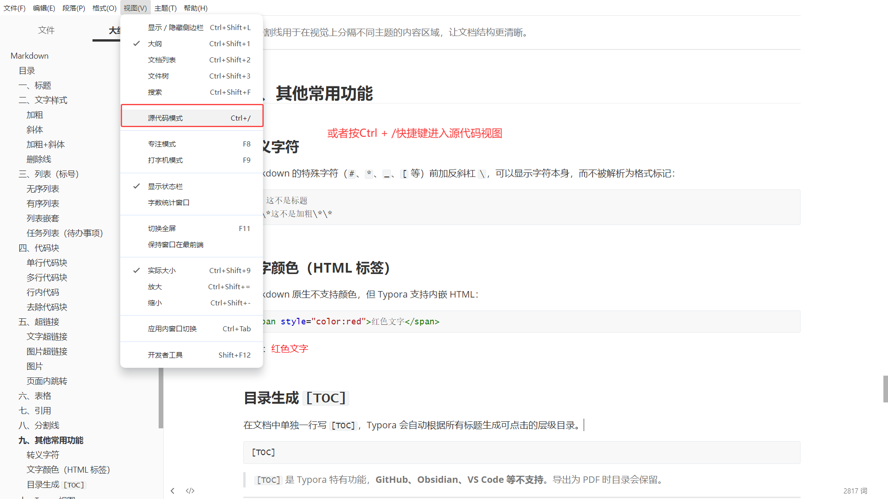
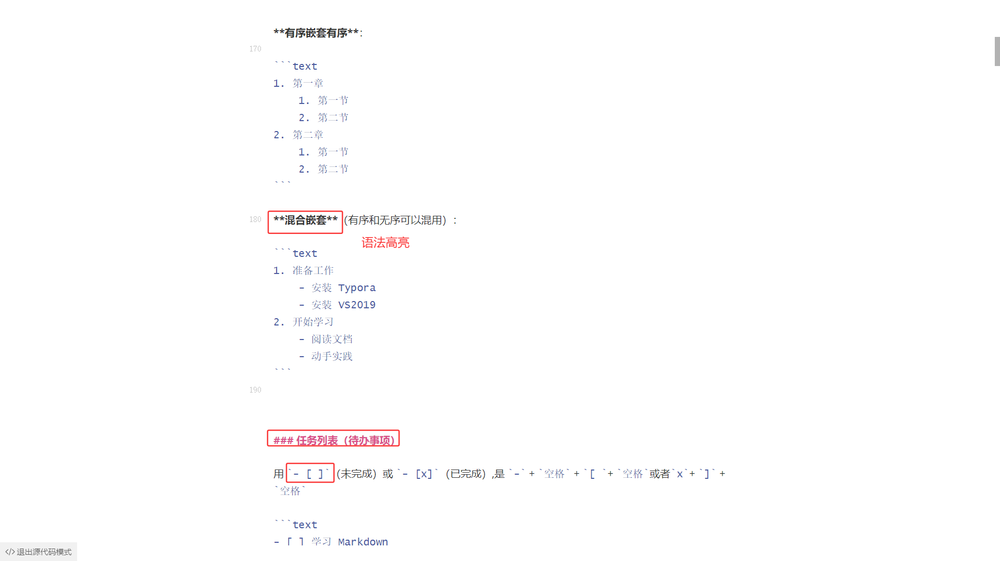
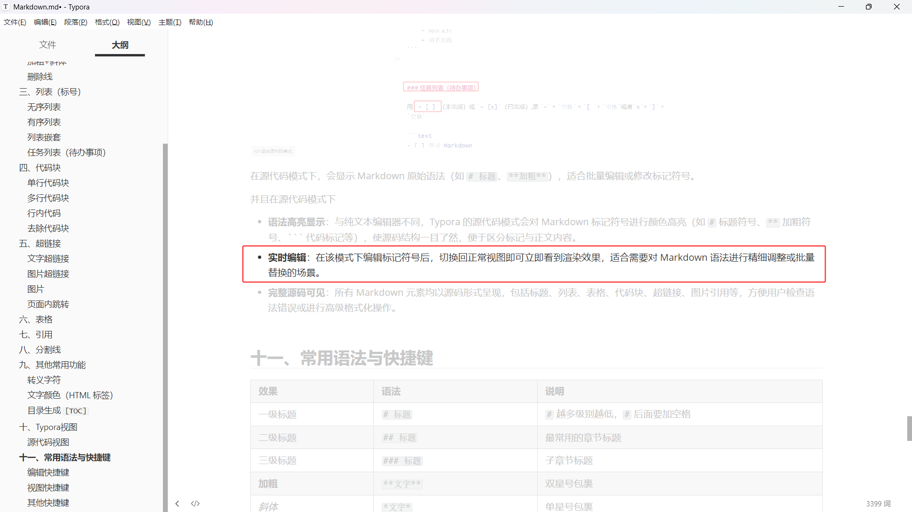

# Markdown

Markdown 是一种轻量级标记语言，用纯文本符号表达文章结构（标题、列表、链接、代码、表格等），文件后缀为 `.md`。它比 Word 简单、比纯文本美观，写完后可导出为 HTML、PDF 等格式。Typora 是目前最流行的 Markdown 编辑器之一，支持实时预览、`[TOC]` 自动生成目录等功能。

> 核心思想：**用符号写结构**，让作者专注于内容而非排版。类似于 LaTeX 的轻量替代方案。

## 目录

[TOC]

------

## 一、标题

标题用 `#` 表示，`#` 的个数对应标题级别。

```text
# 一级标题
## 二级标题
### 三级标题
#### 四级标题
##### 五级标题
###### 六级标题
```

| 语法           | 效果                           |
| -------------- | ------------------------------ |
| `# 一级标题`   | 最大号标题，通常作为文档主标题 |
| `## 二级标题`  | 主要章节标题                   |
| `### 三级标题` | 子章节标题                     |

**注意事项**：

- `#` 和标题文字之间**必须有空格**（`# 标题` 正确，`#标题` 错误）
- 不要跳级使用（如从 `#` 直接跳到 `####`），保持层级连续
- 一个 `.md` 文件建议**只有一个** `#` 一级标，作为文档标题
- Typora 中 `[TOC]` 会根据标题自动生成目录

> 标题是 Markdown 最重要的结构元素，先写标题搭好框架，再填充内容。

------


<span id="HTML锚点二">HTML锚点二</span>


## 二、文字样式

### 加粗

用双星号 `**` 包裹：

```text
**这是加粗文字**
```

效果：**这是加粗文字**


### 斜体

用单星号 `*` 包裹：

```text
*这是斜体文字*
```

效果：*这是斜体文字*


### 加粗+斜体

用三星号 `***` 包裹：

```text
***这是加粗且斜体的文字***
```

效果：***这是加粗且斜体的文字\***


### 删除线

用双波浪线 `~~` 包裹：

```text
~~这是删除线~~
```

效果：~~这是删除线~~


## 三、列表（标号）


### 无序列表

用 `-`、`*` 或 `+` 加空格开头：

```text
- 苹果
- 香蕉
- 橘子
```

效果：

- 苹果
- 香蕉
- 橘子

> 推荐统一使用 `-`，保持风格一致。


### 有序列表

用 `数字 + .` 加空格开头：

```text
1. 第一步
2. 第二步
3. 第三步
```

效果：

1. 第一步
2. 第二步
3. 第三步

> 数字可以不连续（如 `1.`、`3.`、`5.`），渲染出来仍然是 1、2、3，但建议按规范从 1 开始。


### 列表嵌套

通过**缩进**（4 个空格或一个 Tab）实现多层级嵌套：

**无序嵌套无序**：

```text
- 水果
    - 苹果
    - 香蕉
- 蔬菜
    - 白菜
    - 萝卜
```

效果：

- 水果
  - 苹果
  - 香蕉
- 蔬菜
  - 白菜
  - 萝卜

**有序嵌套有序**：

```text
1. 第一章
    1. 第一节
    2. 第二节
2. 第二章
    1. 第一节
    2. 第二节
```

**混合嵌套**（有序和无序可以混用）：

```text
1. 准备工作
    - 安装 Typora
    - 安装 VS2019
2. 开始学习
    - 阅读文档
    - 动手实践
```


### 任务列表（待办事项）

用 `- [ ]`（未完成）或 `- [x]`（已完成）,是 `-` + `空格` + `[ `+ `空格`或者`x`+ `]` + `空格`

```text
- [ ] 学习 Markdown
- [x] 安装 Typora
- [ ] 整理笔记
```

效果：

- [ ] 学习 Markdown

- [x] 安装 Typora

- [ ] 整理笔记

------


## 四、代码块

代码块用三个反引号 ````` 包裹，在里面放代码。按内容行数分为单行和多行两种。

**常用语言标识**：

| 标识     | 语言             |
| -------- | ---------------- |
| `c`      | C                |
| `cpp`    | C++              |
| `python` | Python           |
| `java`   | Java             |
| `js`     | JavaScript       |
| `bash`   | Bash / Shell     |
| `xml`    | XML              |
| `text`   | 纯文本（无高亮） |

> 如果不指定语言，代码块仍然生效，但没有语法高亮。写笔记时指定语言可读性更好。

### 单行代码块

只有一行代码时，可以直接输入三个连续的单反引号后回车，或者用```包裹单行代码

大部分编辑器也支持使用三个连续的波浪号来创建代码块~~~：

~~~text
```c
int a = 10;
```
~~~

效果：

```c
int a = 10;
```

> 单行代码块常用于展示**一条命令、一个语句、一行配置**。虽然只有一行，但用代码块比行内代码更醒目，且支持语法高亮。


### 多行代码块

多行代码在两个 ``` 之间换行书写，进行换行即可：

~~~c
```c
#include <stdio.h>
int main() {
    printf("Hello, World!\n");
    return 0;
}
```
~~~

效果：

```c
#include <stdio.h>
int main() {
    printf("Hello, World!\n");
    return 0;
}
```


### 行内代码

用单反引号 ` 包裹：

```text
请使用 `malloc` 函数分配内存
```

效果：请使用 `malloc` 函数分配内存

> 行内代码通常用于标记**变量名、函数名、关键字、命令、文件名**等短代码片段。

|          | 行内代码             | 代码块             |
| -------- | -------------------- | ------------------ |
| 语法     | ``代码``             | ````语言 代码 ```` |
| 用途     | 嵌在句子里的短代码   | 独立展示的一段代码 |
| 换行     | 不能换行             | 可以换行           |
| 语法高亮 | 不支持               | 支持（指定语言）   |
| 示例     | 用 `malloc` 分配内存 | 见上方代码块示例   |

------

### 去除代码块

如果是想保留代码块里的内容，切换为“源代码模式”之后去掉代码块的```即可，


## 五、超链接


### 文字超链接

```text
[链接文本](URL)
```

示例：

```text
[百度](https://www.baidu.com)
```

效果：[百度](https://www.baidu.com)

**链接本地文件**（相对路径）：

```text
[IAR 笔记](./IAR/IAR.md)
```

- `./` 表示当前目录
- `../` 表示上级目录
- Ctrl + 点击即可跳转


### 图片超链接

点击图片跳转到指定 URL——在图片语法外面再包一层链接：

```text
[](目标链接)
```


### 图片

```text

```

**本地图片（相对路径）**：

```text

```

> 笔记中使用**相对路径**引用图片，打包上传到其他电脑后图片仍能正常显示。推荐建一个 `pictures` 文件夹统一存放图片。


### 页面内跳转

页面内跳转是指在同一个 `.md` 文件内从一处跳到另一处，常用于"回到目录"或快速定位到某个章节。

[跳转到表格](#六、表格)

**方式一**：跳转到标题

```text
[跳转到目录](#目录)
[跳转到标题](#一标题)
```

- 小括号内写 `#标题名称`
- 标题名称中的**空格用 `-` 代替**，**英文全部小写**
- Typora 会自动为每个标题生成锚点

示例：

```text
[跳转到文字样式](#二、文字样式)
```

[跳转到文字样式](#二、文字样式)

[跳转到目录生成](#目录生成 `[TOC]`)

**方式二**：跳转到任意指定位置（HTML 锚点）

[跳转到HTML锚点二](#HTML锚点二)

先设置锚点（在目标位置放一个隐藏标记）：

```html
<span id="自定义名称">锚点显示名称</span>
```

再用链接跳转过去：

```text
[点击跳转](#自定义名称)
```

> 方式二更灵活，可以跳到文档中的**任意位置**，不限于标题，可以跳到某个表格、某张图片旁边。


**方式三**：`[TOC]` 目录跳转

在文档中写 `[TOC]`，Typora 自动生成目录，点击目录项即可跳转到对应标题。这种方法最方便，不用手写链接。

**三种跳转方式对比**：

| 方式      | 语法                           | 适用场景               |
| --------- | ------------------------------ | ---------------------- |
| 标题锚点  | `[文字](#标题)`                | 跳转到任意标题         |
| HTML 锚点 | `<span id="x">` + `[文字](#x)` | 跳转到非标题的任意位置 |
| TOC 目录  | `[TOC]`                        | 文档整体导航           |

------

## 六、表格

用 `|` 分隔列，`-` 分隔表头和内容行：

```text
| 姓名 | 年龄 | 城市 |
|------|------|------|
| 张三 | 25   | 北京 |
| 李四 | 30   | 上海 |
```

效果：

| 姓名 | 年龄 | 城市 |
| ---- | ---- | ---- |
| 张三 | 25   | 北京 |
| 李四 | 30   | 上海 |

**对齐方式**（在分隔行用冒号控制）：

```text
| 左对齐 | 居中对齐 | 右对齐 |
|:-------|:-------:|-------:|
| 内容   | 内容    | 内容   |
```

| 语法    | 含义           |
| ------- | -------------- |
| `:---`  | 左对齐（默认） |
| `:---:` | 居中对齐       |
| `---:`  | 右对齐         |

> 表格适合做**参数对比、配置说明、快捷键速查**。在 Typora 中可以直接用快捷键 `Ctrl+T` 快速插入表格。


## 七、引用

用 `>` 加空格开头：

```text
> 这是一段引用的内容。
> 可以写多行。
```

效果：

> 这是一段引用的内容。
>  可以写多行。

**嵌套引用**：

```text
> 外层引用
>> 内层引用
```

效果：

> 外层引用
>
> > 内层引用

> 引用块在技术笔记中非常实用，通常用来标注**注意事项、警告、提示、总结**等关键信息。

------


## 八、分割线

用三个或以上的 `-`、`*` 或 `_` 单独占一行：

```text
---
```

效果：

------

> 分割线用于在视觉上分隔不同主题的内容区域，让文档结构更清晰。

------


## 九、其他常用功能


### 转义字符

Markdown 的特殊字符（`#`、`*`、`_`、`[` 等）前加反斜杠 `\`，可以显示字符本身，而不被解析为格式标记：

```text
\# 这不是标题
\*\*这不是加粗\*\*
```


### 文字颜色（HTML 标签）

Markdown 原生不支持颜色，但 Typora 支持内嵌 HTML：

```html
<span style="color:red">红色文字</span>
```

效果：<span style="color:red">红色文字</span>


### 目录生成 `[TOC]`

在文档中单独一行写 `[TOC]`，Typora 会自动根据所有标题生成可点击的层级目录。

```text
[TOC]
```

> `[TOC]` 是 Typora 特有功能，**GitHub、Obsidian、VS Code 等不支持**。导出为 PDF 时目录会保留。

---


## 十、Typora视图



在视图下拉栏可以进行视图切换或者部分窗口的显示。

Typora 提供三种核心视图模式：

- **源代码模式**：显示 Markdown 原始语法，适合批量修改标记符号或排查格式问题，快捷键 `Ctrl + /`。
- **打字机模式**：将当前编辑行始终固定在屏幕中央，提升长篇写作的专注度。
- **专注模式**：仅高亮当前正在编辑的段落，其他内容自动淡化，减少视觉干扰。

其他部分

- **侧边栏**：可切换显示大纲（文档结构树）与文件树（文件夹管理），便于快速导航和项目组织。
- **显示选项**：支持隐藏/显示状态栏、标尺，以及切换全屏模式，最大化写作空间。
- **跳转与查找**：提供跳转到指定标题、页面内查找等功能，提升编辑效率。

- **渲染模式**：可在标准渲染与源代码高亮之间切换，控制文档的呈现方式。
- **开发者工具**：内置 Chromium DevTools，支持高级用户调试主题样式或自定义 CSS 效果。
- **视图重置**：若界面布局错乱，可一键重置所有视图设置为默认状态。


### 源代码视图



在源代码模式下，会显示 Markdown 原始语法（如 `# 标题`、`**加粗**`），适合批量编辑或修改标记符号。

并且在源代码模式下

- **语法高亮显示**：与纯文本编辑器不同，Typora 的源代码模式会对 Markdown 标记符号进行颜色高亮（如 `#` 标题符号、`**` 加粗符号、``` 代码标记等），使源码结构一目了然，便于区分标记与正文内容。
- **实时编辑**：在该模式下编辑标记符号后，切换回正常视图即可立即看到渲染效果，适合需要对 Markdown 语法进行精细调整或批量替换的场景。
- **完整源码可见**：所有 Markdown 元素均以源码形式呈现，包括标题、列表、表格、代码块、超链接、图片引用等，方便用户检查语法错误或进行高级格式化操作。


### 专注视图

用于写作辅助的视图，帮助用户集中注意力于当前正在编辑的内容段落。开启后，文档中除当前光标所在段落外的所有内容会自动淡化（降低透明度或变灰），从而减少视觉干扰，提升写作流畅度。

快捷键F8或者是视图下拉栏里进入




### 打字机视图

也是用于写作辅助的视图，将当前正在编辑的行始终固定在屏幕中央位置。该模式模拟了传统打字机“纸面不动、字车移动”的书写体验，帮助写作者避免视线在屏幕上下方频繁移动，从而保持稳定的写作节奏。


在该视图下：

- **编辑行自动居中**：无论光标移动到文档的哪个位置，当前编辑行始终显示在屏幕的垂直中央区域。输入新行或移动光标时，文档内容会自动滚动以保持该行居中。
- **减少视线跳跃**：传统编辑方式下，随着写作推进，视线需跟随光标从屏幕底部移动到顶部再返回。打字机模式消除了这种频繁的视线位移，有助于维持注意力和写作连贯性。
- **可与其他模式叠加**：打字机模式可与“专注模式”同时开启，此时当前编辑行既居中显示又保持高亮，两种辅助功能互补，营造深度沉浸的写作环境。


## 十一、常用语法与快捷键

| 效果             | 语法              | 说明                               |
| ---------------- | ----------------- | ---------------------------------- |
| 一级标题         | `# 标题`          | `#` 越多级别越低，`#` 后面要加空格 |
| 二级标题         | `## 标题`         | 最常用的章节标题                   |
| 三级标题         | `### 标题`        | 子章节标题                         |
| **加粗**         | `**文字**`        | 双星号包裹                         |
| *斜体*           | `*文字*`          | 单星号包裹                         |
| ***加粗+斜体\*** | `***文字***`      | 三星号包裹                         |
| ~~删除线~~       | `~~文字~~`        | 双波浪号包裹                       |
| `行内代码`       | ``代码``          | 反引号包裹                         |
| 代码块           | ````语言`         | 三个反引号包裹，可指定语言         |
| 引用             | `> 内容`          | 也支持 `>>` 嵌套                   |
| 无序列表         | `- 内容`          | `-` 或 `*` 或 `+`，加空格          |
| 有序列表         | `1. 内容`         | 数字 + 点 + 空格                   |
| 列表嵌套         | 缩进 4 空格或 Tab | 有序无序可混合嵌套                 |
| 任务列表         | `- [ ]` / `- [x]` | 未完成 / 已完成                    |
| 分割线           | `---`             | 三个或以上，单独一行               |
| 文字链接         | `[文本](URL)`     | 相对路径可链接本地文件             |
| 图片             | ``     | 推荐相对路径                       |
| 表格             | `\|` + `---`      | `Ctrl+T` 快速插入                  |
| 转义             | `\特殊字符`       | 让符号不被解析                     |
| 页面内跳转       | `[文字](#标题)`   | Typora 自动生成标题锚点            |
| 生成目录         | `[TOC]`           | Typora 专用                        |

------

```
常用：Ctrl+B` 加粗、`Ctrl+Shift+K` 代码块、`Ctrl+K` 链接、`Ctrl+T` 表格、`Ctrl+/`
```


### 编辑快捷键

| 操作                     | 快捷键              |
| ------------------------ | ------------------- |
| 加粗                     | `Ctrl+B`            |
| 斜体                     | `Ctrl+I`            |
| 删除线                   | `Alt+Shift+5`       |
| 行内代码                 | `Ctrl+Shift+` `     |
| 插入代码块               | `Ctrl+Shift+K`      |
| 插入链接                 | `Ctrl+K`            |
| 插入图片                 | `Ctrl+Shift+I`      |
| 插入表格                 | `Ctrl+T`            |
| 插入分割线               | `---` 后回车        |
| 插入任务列表             | `- [ ]` 后空格      |
| 标题 1~6                 | `Ctrl+1` ~ `Ctrl+6` |
| 清除格式（变回普通文本） | `Ctrl+0`            |
| 有序列表                 | `Ctrl+Shift+[`      |
| 无序列表                 | `Ctrl+Shift+]`      |
| 缩进增加                 | `Ctrl+]`            |
| 缩进减少                 | `Ctrl+[`            |
| 下划线                   | ctrl+u              |


### 视图快捷键

| 操作           | 快捷键         |
| -------------- | -------------- |
| 切换源代码模式 | `Ctrl+/`       |
| 切换打字机模式 | `F8`           |
| 切换聚焦模式   | `F9`           |
| 切换侧边栏     | `Ctrl+Shift+L` |
| 搜索           | `Ctrl+F`       |
| 替换           | `Ctrl+H`       |


### 其他快捷键

| 操作            | 快捷键         |
| --------------- | -------------- |
| 保存            | `Ctrl+S`       |
| 另存为          | `Ctrl+Shift+S` |
| 复制为 Markdown | `Ctrl+Shift+C` |
| 粘贴为纯文本    | `Ctrl+Shift+V` |
| 撤销            | `Ctrl+Z`       |
| 重做            | `Ctrl+Y`       |

