# 单元测试

单元测试（Unit Test）是指对软件中的最小可测试单元（通常是一个函数或方法）进行正确性验证的测试方法。其核心思想是：将代码拆分为独立的单元，为每个单元编写测试用例，通过给定输入、验证输出来判断代码是否符合预期。

在 VS2019 中，C++ 单元测试主要通过 **Microsoft 本机单元测试框架**实现，也可以集成 Google Test 等第三方框架。

> 手工验证每次改动时都需要重新运行程序、手动输入数据、肉眼判断结果。而单元测试把验证自动化，每次代码改动后一键运行所有测试，几秒内就知道有没有破坏原有功能。


## 目录

[TOC]

---

## 一、单元测试创建

### 创建单元测试项目

在 VS2019 中有三种方式创建单元测试项目：


**方式一**：创建独立的测试项目

1. 右键解决方案 → `添加` → `新建项目...`
2. 在模板列表中搜索 `本机单元测试项目`（Native Unit Test Project）
3. 输入项目名称（建议用 `xxxTest` 或 `Test_xxx` 命名），选择位置
4. 点击 `创建`

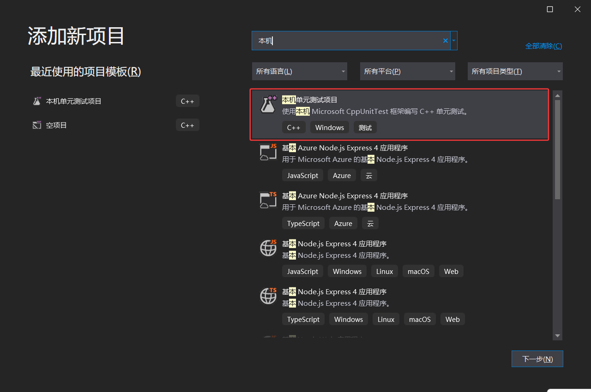

创建后，项目会自动包含：

| 文件 | 作用 |
| :--- | :--- |
| `pch.h` / `pch.cpp` | 预编译头文件，提高编译速度 |
| `unittest1.cpp` | 默认的测试文件，包含示例测试用例 |
| `CppUnitTest.h` | 自动引入的测试框架头文件 |

**pch.h**是存放**不常变化**的标准库和第三方库头文件。编译器预先编译成 `.pch` 二进制文件，后续每次编译时直接加载，大幅缩短编译时间。通常把把稳定的、不常改的 `#include` 放这里；频繁改动的业务头文件放具体测试文件里。

**pch.cpp**就是完成预处理的一部分， `#include "pch.h"`，触发编译器生成 `.pch` 二进制文件。一般不需要再写其他代码。


**方式二**：从被测试代码生成测试(VS2022或更高版本，VS2019没有)

1. 在代码编辑器中打开要测试的源文件
2. 右键点击函数名 → `创建单元测试...`
3. 在弹出的对话框中选择要测试的函数、配置测试项目名称和位置
4. 点击 `确定`，VS 自动生成测试项目骨架代码

> 自动生成的测试代码是一个起点，测试断言需要手动补充。


### 关联被测试工程

单元测试项目需要引用被测试的代码才能调用被测函数：

1. 右键单元测试项目 → `添加` → `引用...`
2. 在弹出的对话框中勾选被测试的项目
3. 点击 `确定`

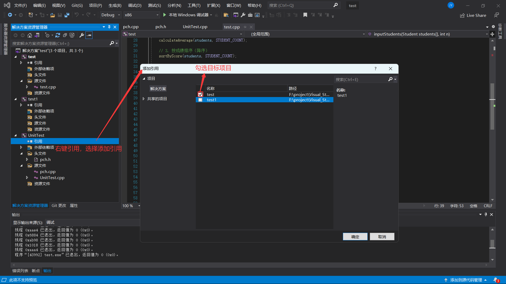

同时在单元测试项目的 `C/C++` → `常规` → `附加包含目录` 中添加被测项目的头文件路径，确保测试代码能 `#include` 被测头文件。

> 如果被测工程是静态库（`.lib`）项目，测试工程链接时会自动包含。如果是可执行文件（`.exe`）项目，建议把被测代码拆分为一个独立的静态库项目，供主程序和测试项目共同引用。


测试工程结构建议

```
解决方案
├── MyLib                   ← 被测代码（静态库项目）
│   ├── MyLib.h
│   └── MyLib.c
├── MyApp                   ← 主程序（引用 MyLib）
│   └── main.c
└── Test_MyLib              ← 单元测试（引用 MyLib，C++ 测试框架）
    ├── Test_MyLib.cpp
    └── Test_MyLib.h
```

> 将业务逻辑放在静态库中，主程序和测试项目都引用同一个库，这样测试覆盖的就是实际使用的代码。

---


## 二、测试样例书写

### 基本结构

VS2019 自带的 CppUnitTestFramework 中，一个测试文件的基本结构如下：

```cpp
初始单元测试的.cpp:
#include "pch.h"
#include "CppUnitTest.h"

using namespace Microsoft::VisualStudio::CppUnitTestFramework;

namespace UnitTest
{
	TEST_CLASS(UnitTest)
	{
	public:
		
		TEST_METHOD(TestMethod1)
		{
		}
	};
}


#include "pch.h"   			// 预编译头
#include "CppUnitTest.h"	// 测试框架

// 引入被测 C 代码的头文件（用 extern "C" 包裹，告知 C++ 编译器按 C 链接方式处理）
extern "C" {
	#include "../MyLib/MyLib.h"
}

using namespace Microsoft::VisualStudio::CppUnitTestFramework;

namespace Test_MyLib           // 测试命名空间
{
    TEST_CLASS(MyLibTest)       // 测试类：一个类对应一组测试
    {
    public:

        TEST_METHOD(Add_TwoPositiveNumbers_ReturnsSum)  // 测试方法：一个方法对应一个测试用例
        {
            // Arrange（准备）：构造输入数据
            int a = 3;
            int b = 5;
            int expected = 8;

            // Act（执行）：调用被测 C 函数
            int actual = Add(a, b);

            // Assert（断言）：验证结果是否符合预期
            Assert::AreEqual(expected, actual);
        }
    };
}

实际例子：


```

### 核心宏与注解

| 宏/关键字 | 作用 |
| :--- | :--- |
| `TEST_CLASS(类名)` | 声明一个测试类，包含一组测试方法 |
| `TEST_METHOD(方法名)` | 声明一个测试用例 |
| `TEST_CLASS_INITIALIZE(方法名)` | 在**本测试类所有方法执行前**运行一次（初始化共享资源） |
| `TEST_CLASS_CLEANUP(方法名)` | 在**本测试类所有方法执行后**运行一次（释放共享资源） |
| `TEST_METHOD_INITIALIZE(方法名)` | 在**每个测试方法执行前**运行（每个用例独立准备） |
| `TEST_METHOD_CLEANUP(方法名)` | 在**每个测试方法执行后**运行（每个用例独立清理） |

```cpp
TEST_CLASS(MyLibTest)
{
public:
    // 整个测试类开始前执行一次（必须是 static）
    TEST_CLASS_INITIALIZE(ClassInit)
    {
        // 打开日志文件、分配共用缓冲区等
    }

    // 整个测试类结束后执行一次（必须是 static）
    TEST_CLASS_CLEANUP(ClassCleanup)
    {
        // 关闭日志文件、释放共用缓冲区等
    }

    // 每个测试方法执行前执行
    TEST_METHOD_INITIALIZE(MethodInit)
    {
        // 重置被测模块的全局状态、清零缓冲区等
    }

    // 每个测试方法执行后执行
    TEST_METHOD_CLEANUP(MethodCleanup)
    {
        // 释放本测试申请的动态内存、恢复默认值等
    }

    TEST_METHOD(TestA) { /* ... */ }
    TEST_METHOD(TestB) { /* ... */ }
};
```

> **注意**：`TEST_CLASS_INITIALIZE` 和 `TEST_CLASS_CLEANUP` 的方法必须是 `static`。每个 `TEST_METHOD` 之间是独立的，一个失败不影响其他运行。

### 常用断言

断言是单元测试的核心：判断实际结果是否等于预期结果。如果断言失败，该测试用例标记为"未通过"。

| 断言方法 | 用途 | 示例 |
| :--- | :--- | :--- |
| `Assert::AreEqual(expected, actual)` | 判断两个值**相等** | `Assert::AreEqual(8, Add(3, 5));` |
| `Assert::AreNotEqual(a, b)` | 判断两个值**不相等** | `Assert::AreNotEqual(-1, result);` |
| `Assert::IsTrue(condition)` | 判断条件为**真** | `Assert::IsTrue(IsBufferEmpty(buf) == 0);` |
| `Assert::IsFalse(condition)` | 判断条件为**假** | `Assert::IsFalse(IsBufferEmpty(buf));` |
| `Assert::IsNull(ptr)` | 判断指针为**空** | `Assert::IsNull(pBuffer);` |
| `Assert::IsNotNull(ptr)` | 判断指针**不为空** | `Assert::IsNotNull(pBuffer);` |
| `Assert::Fail()` | **无条件失败** | 标记"不应该执行到这里"的分支 |
| `Assert::ExpectException<E>()` | 期望抛出**指定类型异常** | 仅 C++ 被测代码适用，见下方说明 |


#### 浮点数比较

浮点数直接用 `AreEqual` 可能因精度问题误判，使用带容差的比较：

```cpp
// 判断 a 和 b 差值不超过 0.001
Assert::AreEqual(3.1416, actual, 0.001);
```


#### 字符串比较

```cpp
// 宽字符串比较（默认 AreEqual 支持）
Assert::AreEqual(L"Hello", result);

// 普通字符串需要用 IsTrue + strcmp
Assert::IsTrue(strcmp("Hello", result) == 0);
```


#### 期望异常（C++）

CppUnitTestFramework 支持验证 C++ 异常，适用于被测代码使用 C++ 异常机制的场景：

```cpp
// 期望 DoSomething(NULL) 抛出 std::invalid_argument 异常
Assert::ExpectException<std::invalid_argument>([]
{
    DoSomething(nullptr);
});
```


#### C 语言的错误验证方式

C 代码通常通过**返回值**（错误码）或 **out 参数**来报告错误，不会抛异常。测试时直接断言返回值即可：

```cpp
// 被测 C 函数：int InitDevice(Device* pDev);  // 成功返回 0，失败返回 -1
TEST_METHOD(InitDevice_NullPointer_ReturnsMinusOne)
{
    int result = InitDevice(NULL);
    Assert::AreEqual(-1, result);     // 验证返回错误码
}

// 被测 C 函数：void* AllocBuffer(uint32_t size);  // 失败返回 NULL
TEST_METHOD(AllocBuffer_ZeroSize_ReturnsNull)
{
    void* ptr = AllocBuffer(0);
    Assert::IsNull(ptr);             // 验证返回空指针
}
```

> 对于纯 C 被测代码，用 `Assert::AreEqual` 验证错误码返回值是最常见的方式，比 `ExpectException` 更符合 C 的编程习惯。


### 测试命名规范

良好的测试命名让失败时一眼就知道哪个功能出了问题。推荐格式：

```
函数名_输入场景_期望结果
```

| 命名示例 | 含义 |
| :--- | :--- |
| `Add_TwoPositiveNumbers_ReturnsSum` | `Add `函数，两个正数，返回和 |
| `Divide_ByZero_ReturnsErrorCode` | `Divide` 函数，除数为零，返回错误码 |
| `ParseIp_ValidString_ReturnsSuccess` | `ParseIp` 函数，有效字符串，返回成功 |
| `AllocBuffer_ZeroSize_ReturnsNull` | `AllocBuffer` 函数，分配零大小，返回 NULL |
| `InitDevice_NullPointer_ReturnsMinusOne` | `InitDevice` 函数，空指针，返回 -1 |
| `MemCopy_SrcNull_ReturnsNull` | `MemCopy` 函数，源指针为空，安全返回 NULL |


### 测试覆盖场景

每个函数至少覆盖以下场景：

| 场景类型 | 说明 | 示例 |
| :--- | :--- | :--- |
| **正常路径** | 最常见的输入，验证基本功能 | `Add(3, 5)` → `8` |
| **边界值** | 输入为边界（最大、最小、0、空） | `Divide(x, 0)`、`NULL` 指针、空字符串 `""` |
| **异常路径** | 非法输入时的防御行为 | 传入 `NULL`、缓冲区大小为 0、数组索引越界 |
| **翻转/溢出** | 涉及计算时的极限值 | `Add(INT_MAX, 1)` 的溢出行为、`uint8_t` 翻转 |

---


## 三、运行测试与性能

### 运行单元测试

- **运行所有测试**：菜单栏 `测试` → `运行所有测试`（快捷键 `Ctrl+R, A`）
- **运行当前选中的测试**：`测试` → `运行所选测试`（`Ctrl+R, T`）
- **重复上次运行**：`Ctrl+R, L`

运行后，`测试资源管理器` 窗口自动打开，显示测试结果：

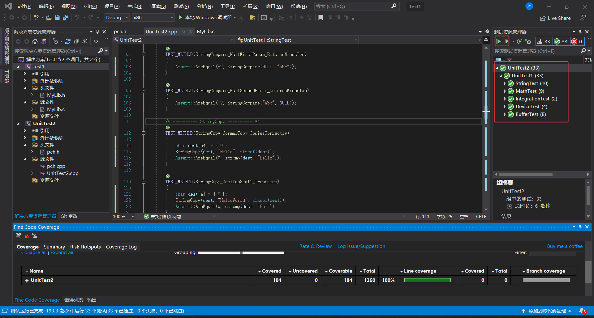

| 状态 | 图标 | 含义 |
| :--- | :--- | :--- |
| 通过 | ✅ | 所有断言通过 |
| 失败 | ❌ | 至少一个断言失败 |
| 跳过 | ⏭️ | 被显式跳过或条件不满足 |
| 未运行 | — | 尚未执行或不在当前配置范围内 |

> 点击失败的测试，下方会显示详细的失败信息，哪个断言失败、期望值是什么、实际值是什么。


### 运行性能

**`Alt+F2`** 是启动性能探查器的默认快捷键（前提是焦点在解决方案或代码编辑器中）

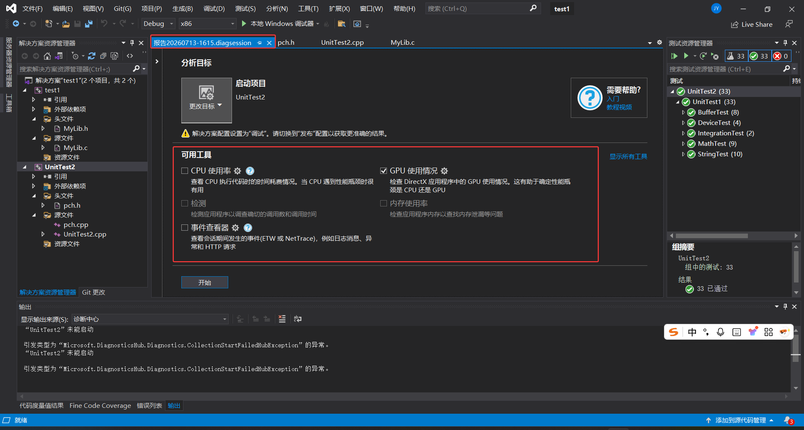

使用性能分析工具分析CPU使用率的具体官方文档链接：[度量应用中的 CPU 使用率 - Visual Studio (Windows) | Microsoft Learn](https://learn.microsoft.com/zh-cn/visualstudio/profiling/beginners-guide-to-performance-profiling?view=visualstudio)

也可以在`调试下拉栏`里选择`性能探查器`

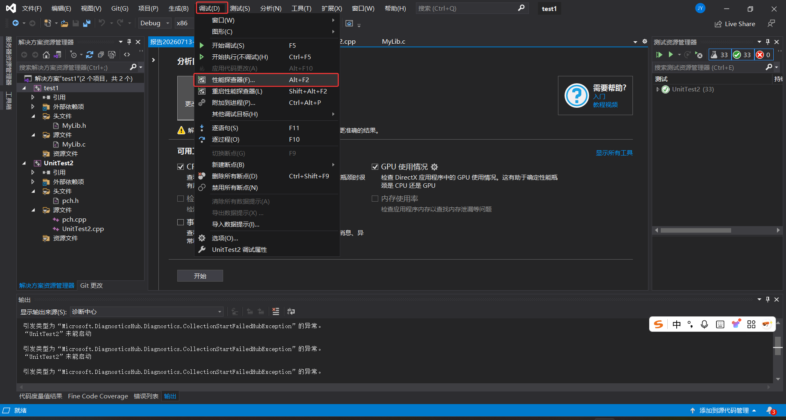

性能分析的可用工具

| 工具名称       | 说明                                        | 适用场景                   |
| :------------- | :------------------------------------------ | :------------------------- |
| **CPU 使用率** | 采样分析，开销小，显示各函数占用CPU时间占比 | 找出热点函数，**推荐首选** |
| **检测**       | 插桩分析，精确到每次函数调用的耗时          | 定位深层调用链问题         |
| **内存使用率** | 分析托管/本机内存分配                       | 排查内存泄漏或分配频繁     |
| **GPU 使用率** | 分析图形渲染性能                            | 仅图形应用需要             |

或者在调试的时候查看调试窗口来进行性能分析，需注意，**测试项目在 Visual Studio 中默认是编译成 `.dll` 动态链接库的。**这是微软单元测试框架的设计标准，它会由 `vstest.console.exe` 这个宿主进程来动态加载运行

如果测试项目是的配置类型是dll文件，需要注意**告诉性能探查器，用哪个 EXE 来加载这个 DLL**。

1. **打开性能探查器**：点击顶部菜单 `调试` -> `性能探查器`（或按 `Alt+F2`）。
2. **选择“CPU 使用率”**，但**先别急着点“开始”**！
3. **关键步骤——修改启动目标**：在性能探查器对话框的**左上角**，有一个下拉菜单或选项，写着 **“启动项目”** 或者 **“可执行文件”**。
   - 点击它，选择 **“可执行文件”**。
   - 在弹出的文件选择框中，浏览并选择 **`vstest.console.exe`**。
   - 它的路径通常是：`C:\Program Files (x86)\Microsoft Visual Studio\2019\Enterprise\Common7\IDE\CommonExtensions\Microsoft\TestWindow\vstest.console.exe`
     - 如果VS没有安装在c盘，那么前面部分的安装路径就是实际VS的安装路径，再从对应路径里找到exe
4. **填写命令行参数**：选中 EXE 后，下面会出现“命令行参数”输入框。需要在这里填入测试 DLL 的**完整路径和名称**，例如：
   `"D:\MyProject\UnitTest1\Debug\UnitTest1.dll"`
5. **点击“开始”**。此时，VS 会启动 `vstest.console.exe`，这个 EXE 会加载DLL并自动运行所有测试，性能探查器就会开始记录 DLL 里的性能数据了。

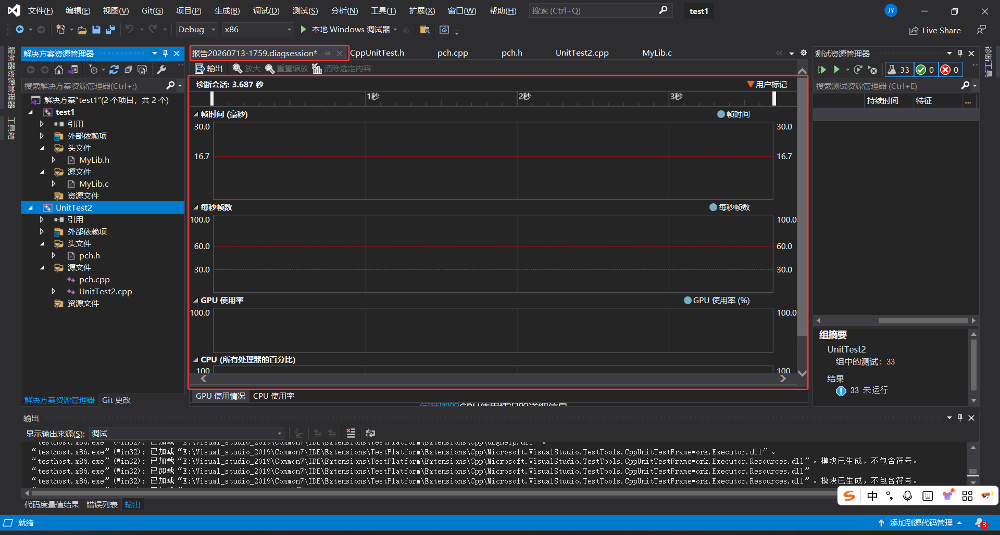


#### 测试执行时间

在 `测试资源管理器` 中，每个测试用例的右侧会显示执行时间（如 `<1 ms`、`15 ms`）。关注异常慢的测试用例，可能是被测代码存在性能问题，或测试数据量过大。


#### 并行运行测试

默认情况下，VS2019 不会并行运行测试。在 `.runsettings` 文件中可以启用并行：

```xml
<RunSettings>
  <RunConfiguration>
    <MaxCpuCount>0</MaxCpuCount>  <!-- 0 表示使用所有可用的 CPU 核心 -->
  </RunConfiguration>
</RunSettings>
```

> 并行运行要求测试用例之间**完全独立**，不共享可变状态。如果有测试依赖共享数据，并行运行会产生随机失败。


## 四、代码覆盖度

代码覆盖度（Code Coverage）衡量测试用例执行了**多少比例的源代码**，包括哪些函数被调用、哪些分支被执行、哪些行被覆盖。


 VS2019 **默认不启用代码覆盖率这个功能**，如果使用的是 Community 或 Professional 版本，需要安装 **`Microsoft.CodeCoverage`** 扩展或使用第三方工具。

在扩展中搜索Code Coverage后下载了Fine Code Coverage

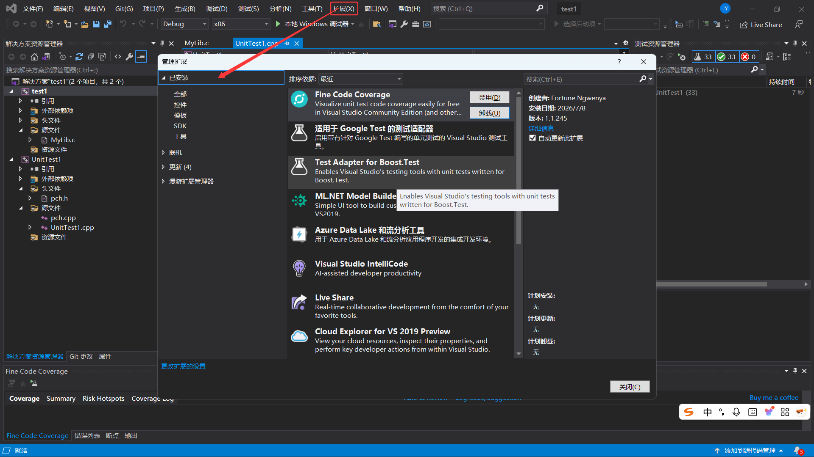

### 查看代码覆盖度

1. 在测试资源管理器中 点击`运行测试` 

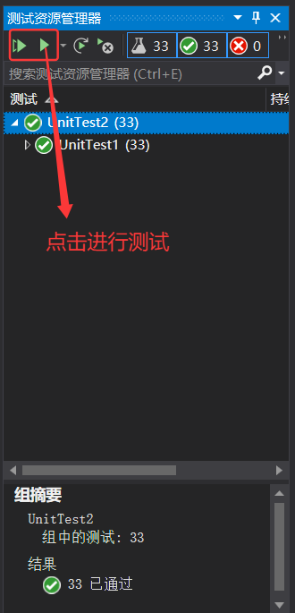


2. VS 会运行所有测试并统计覆盖数据

3. 运行完成后自动弹出 `代码覆盖率结果` 窗口

如果没有Fine Code Coverage显示窗口，则在`视图`下拉栏里选择`其他`，点击Fine Code Coverage即可

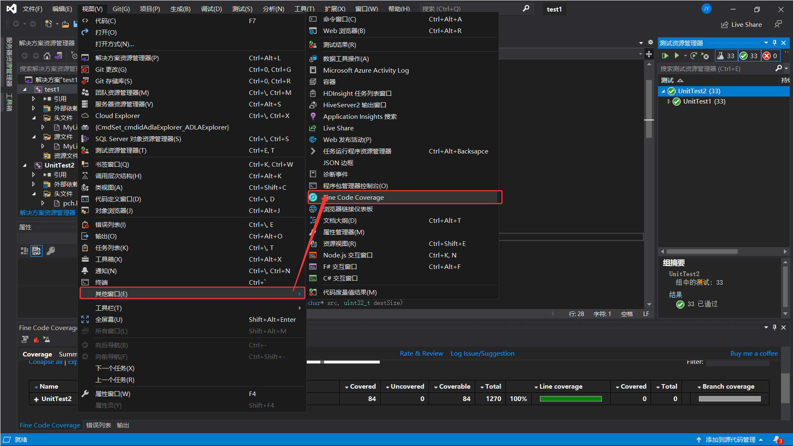


覆盖度窗口显示：

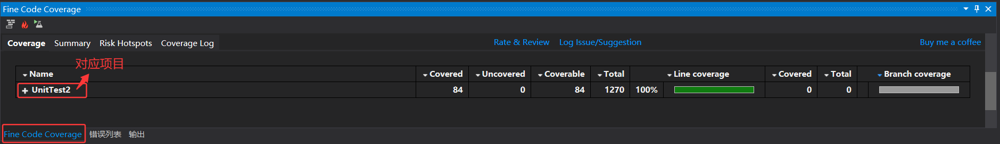


| 指标 | 含义 |
| :--- | :--- |
| 行覆盖率 | 被至少执行一次的源代码行数 / 总行数 |
| 块覆盖率 | 被执行的代码块占比 |
| 分支覆盖率 | 每个 `if`/`switch` 的两个（或多个）分支被覆盖的情况 |

覆盖度结果

- **80%+ 覆盖率**：通常被认为是良好水平，但取决于项目要求
- **覆盖度高 ≠ 测试质量高**：覆盖度只能告诉你代码"被执行过"，不能判断断言是否充分
- **红色行**：未被任何测试覆盖的代码，需要补充测试
- **黄色行**：部分覆盖（如 `if-else` 只测试了 `if` 分支）

> 代码覆盖度是**必要但不充分**的质量指标。100% 覆盖不代表没有 bug——如果你没断言正确的结果，即使代码被跑了一遍，错误也不会被发现。


**排除不需要覆盖的代码**：

某些代码（如自动生成的代码、第三方库）不需要覆盖，可以在项目文件中配置排除：

在 `.vcxproj` 中或通过 `代码覆盖率` → `排除的模块` 设置，排除指定模块。

---


## 五、单元测试的调试

当测试用例运行失败，或者你希望观察代码执行流程时，可以直接启动调试会话：

**操作步骤**：

1. 在测试代码中设置断点（单击行号左侧边缘或按 `F9`）
2. 在 `测试资源管理器` 中右键该测试 → **`调试`**，或在测试下拉栏中选择 **`调试上次运行的测试`** / **`调试所有测试`**
3. VS 启动测试执行进程，并在断点处暂停，进入调试模式
4. 此时可以：
   - 鼠标悬停变量查看当前值
   - 打开 `局部变量` 窗口（`调试` → `窗口` → `局部变量`）查看所有局部变量
   - 打开 `调用堆栈` 窗口（`Ctrl+Alt+C`）查看函数调用链
   - 使用 `F10` 逐过程执行、`F11` 逐语句执行、`Shift+F11` 跳出当前函数

**调试测试与调试主程序的区别**：

| 对比项   | 调试主程序                        | 调试测试用例                  |
| :------- | :-------------------------------- | :---------------------------- |
| 启动方式 | 按 `F5` 或点击“本地Windows调试器” | 测试资源管理器中右键 → `调试` |
| 入口函数 | `main()` 或 `WinMain()`           | 测试框架的 `TEST_METHOD`      |
| 输入数据 | 需要手动构造或从外部加载          | 测试代码中已构造好，直接命中  |
| 复现成本 | 可能需要操作界面或模拟外部信号    | 点击即可复现，**零成本**      |

> 调试测试用例时，所有输入数据已在测试代码中定义完毕，无需像调试主程序那样经历启动、导航、操作等重复步骤，**从失败到定位只需一次点击**。

### 在被测代码中打断点

1. 打开被测函数的源文件（如 `Calculator.cpp`）
2. 在可疑代码行设置断点（如加法运算那一行）
3. 在测试资源管理器中右键测试用例 → **`调试`**
4. 程序执行到断点处自动暂停，此时：
   - 查看函数参数的实际传入值（`a` 和 `b` 是多少？）
   - 按 `F11` 逐语句执行，跟踪每条语句的执行路径
   - 观察中间变量的变化，确认哪个步骤引入错误

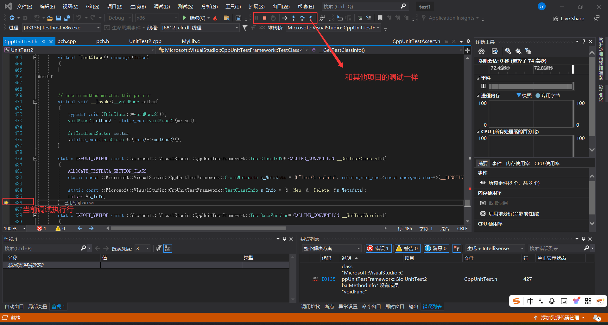

测试代码和被测试代码在同一个调试会话中运行，所以：

- 可以在被测函数（如 `Add(a, b)`）内部打断点
- 测试运行时触发断点，`F11` 进入 → 可以在被测函数内部逐行跟踪
- `调用堆栈` 窗口会显示完整的调用链：`TestAdd` → `Add` → 内部代码

> 这种"从测试入口进入被测代码逐行排查"的方式，比在主程序里复现场景再调试**高效得多**。


| 技巧           | 操作                                                 | 适用场景                                           |
| :------------- | :--------------------------------------------------- | :------------------------------------------------- |
| **条件断点**   | 右键断点红点 → `条件` → 输入条件表达式（如 `a < 0`） | 只关心特定输入时的行为，避免频繁中断               |
| **跟踪点**     | 右键断点 → `操作` → 打印消息（不暂停执行）           | 观察大量测试数据下的执行轨迹，输出到输出窗口       |
| **即时窗口**   | `调试` → `窗口` → `即时`（`Ctrl+Alt+I`）             | 在断点暂停时输入表达式即时求值或修改变量，观察变化 |
| **编辑并继续** | 在断点暂停时直接修改代码，按 `F5` 继续               | 发现小错误后无需停止调试即可修复，缩短调试周期     |

### 常见调试场景

| 场景 | 调试方法 |
| :--- | :--- |
| 断言失败 | 在断言前设断点，运行调试，查看 actual 值 |
| 被测函数崩溃 | 在被测函数入口打断点，`F11` 逐行跟踪 |
| 循环逻辑异常 | 在循环内设条件断点（如 `i == 5`），定位具体哪一轮出错 |
| 内存越界 | 在被测函数前后设断点，配合内存窗口检查 |
| 多线程问题 | 在线程窗口观察线程状态，在各线程入口设断点 |

---


## 六、常用操作速查

### 测试运行快捷键

| 操作 | 快捷键 |
| :--- | :--- |
| 运行所有测试 | `Ctrl+R, A` |
| 运行所选测试 | `Ctrl+R, T` |
| 重复上次运行 | `Ctrl+R, L` |
| 调试所有测试 | `Ctrl+R, Ctrl+A` |
| 调试所选测试 | `Ctrl+R, Ctrl+T` |


### 测试资源管理器

| 功能 | 操作 |
| :--- | :--- |
| 打开测试资源管理器 | `测试` → `测试资源管理器` |
| 分组显示 | 右键 → `分组依据` → 按类/命名空间/项目/结果等 |
| 筛选 | 搜索框输入文字，或按结果状态筛选 |
| 查看测试详情 | 点击失败测试，下方查看错误信息 |
| 跳转到测试代码 | 双击测试名称 |


### 常用断言速查

| 断言 | 含义 |
| :--- | :--- |
| `Assert::AreEqual(a, b)` | a == b |
| `Assert::AreNotEqual(a, b)` | a != b |
| `Assert::IsTrue(cond)` | cond 为 true |
| `Assert::IsFalse(cond)` | cond 为 false |
| `Assert::IsNull(ptr)` | ptr 为空 |
| `Assert::IsNotNull(ptr)` | ptr 非空 |
| `Assert::Fail()` | 无条件失败 |
| `Assert::ExpectException<E>(lambda)` | 期望抛出异常 E |

---


## 七、常见问题与注意事项

1. **找不到被测试函数（LNK2019）**：检查是否添加了对被测项目的引用，以及被测项目是否输出了正确的静态库。

2. **找不到头文件（C1083）**：检查测试项目的 `附加包含目录` 是否包含被测项目的头文件路径。

3. **测试在资源管理器中不显示**：检查测试项目是否编译成功；检查输出窗口是否有编译错误；确保使用的是 `TEST_METHOD` 宏（不是 `TEST_METHOD_`）。

4. **运行测试提示 `vstest.console.exe` 错误**：检查测试项目配置平台（x86/x64）是否与解决方案平台一致。

5. **代码覆盖度始终为 0%**：确认是通过 `测试` → `分析所有测试的代码覆盖率` 运行（不是普通运行），且被测代码是 `.lib` 项目而非直接引用 `.cpp` 文件。

6. **`TEST_CLASS_INITIALIZE` 不执行**：检查方法签名是否正确——必须是 `static void`，且参数为 `TestContext^`。

7. **被测函数中有静态变量导致测试间干扰**：使用 `TEST_METHOD_INITIALIZE` / `CLEANUP` 重置状态。理想情况下，避免使用全局变量和静态变量。

8. **当一个解决方案中有多个项目，且启动项目是测试项目（`.dll`）**时，点击“本地 Windows 调试器”会报错——因为测试项目本身不是可独立运行的程序。

