# Visual Studio 2019

Visual Studio 2019（简称 VS2019）是微软推出的集成开发环境（IDE），支持 C/C++、C#、Python 等多种语言开发。在嵌入式和工作站开发中，VS2019 常用于编写和调试 PC 端工具软件、生成与调用库文件（静态库 `.lib` / 动态库 `.dll`）、以及运行单元测试。其核心结构为**解决方案（Solution）项目（Project） 文件（File）** 三层模型。

> **解决方案**是一个顶层容器，一个解决方案可以包含多个项目；**项目**是编译的基本单位，每个项目编译后生成一个可执行文件（`.exe`）或库文件（`.lib` / `.dll`）。


**解决方案（Solution）** 本质上是一个**容器或者说管理单元**，用来存放一个或多个项目，并记录它们之间的依赖关系、编译顺序和全局配置。

解决方案本身**不包含任何代码**，它只是一个 `.sln` 文本文件，里面记录了哪些项目被包含（`.vcxproj` 文件路径），项目之间的依赖关系，解决方案级别的配置（Debug/Release、平台等），启动项目设置。

在新建项目时，VS 默认会**自动生成一个同名的解决方案**，把这个项目放进去。这是因为 VS 的设计理念是“一切从解决方案开始”——即使只有一个项目，也需要一个解决方案来承载它，才能管理配置、调试和构建。

虽然可以直接打开 `.vcxproj` 文件而不通过 `.sln`，VS也会自动生成一个临时的解决方案。但这样会失去解决方案级别的配置管理（比如多个项目的依赖关系、全局属性页等），每次都要重新设置，造成不必要的麻烦。因此对于只有单个项目的工程，`.sln` 的存在意义就是**提供一个稳定的配置容器**，让 Debug/Release 等设置能保存下来。

**一个解决方案可以包含一个项目，也可以包含多个项目。**解决方案和项目是 **1对多**的关系，每个项目都属于且仅属于一个解决方案。


## 目录

[TOC]

------

## 一、工程创建

### 1.工程相关

#### 创建项目

1. 启动 VS2019，点击起始页的 `创建新项目`，或菜单栏 `文件` → `新建` → `项目...`（快捷键 `Ctrl+Shift+N`）

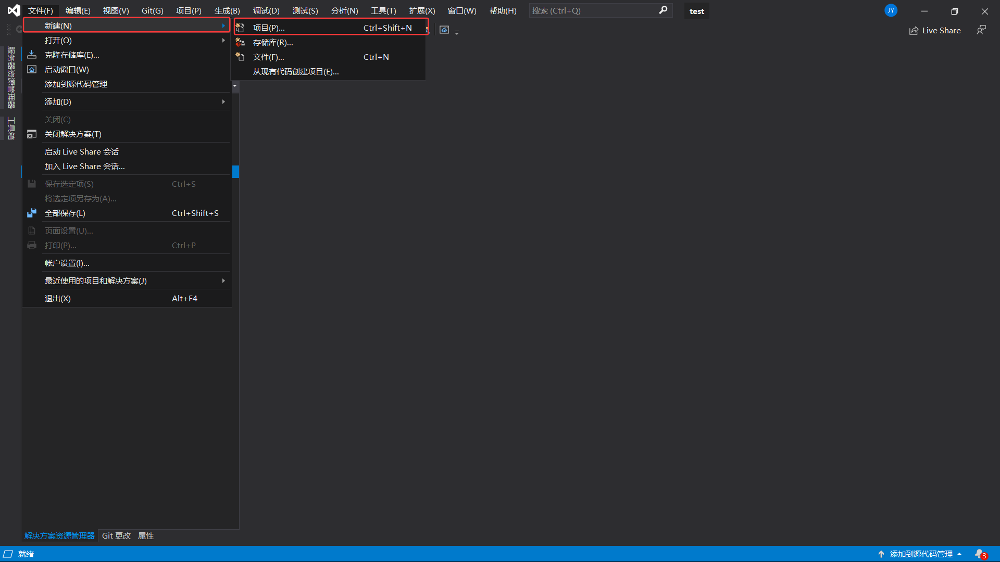

1. 在弹出的对话框中，左侧筛选语言（如 `C++`）、平台（如 `Windows`），中间选择项目模板：

| 模板              | 用途                 | 输出             |
| ----------------- | -------------------- | ---------------- |
| 控制台应用        | 命令行程序开发       | `.exe`           |
| 静态库            | 生成静态库           | `.lib`           |
| 动态链接库（DLL） | 生成动态库           | `.dll` + `.lib`  |
| 单元测试项目      | 运行单元测试         | `.exe`（测试用） |
| 空项目            | 完全自定义的开发起点 | 取决于配置       |

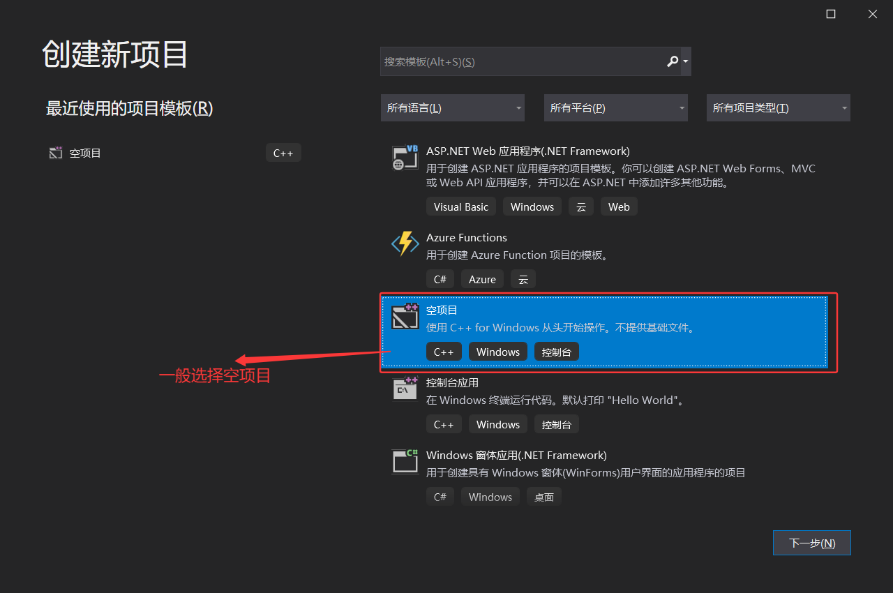

点击 `下一步`，配置项目：

- **项目名称**：输入项目名（建议英文，与功能对应）
- **位置**：选择项目存放的本地路径
- **解决方案名称**：通常默认与项目名相同，可修改
- 可勾选 `将解决方案和项目放在同一目录中`
- 点击 `创建`，项目即被创建并打开

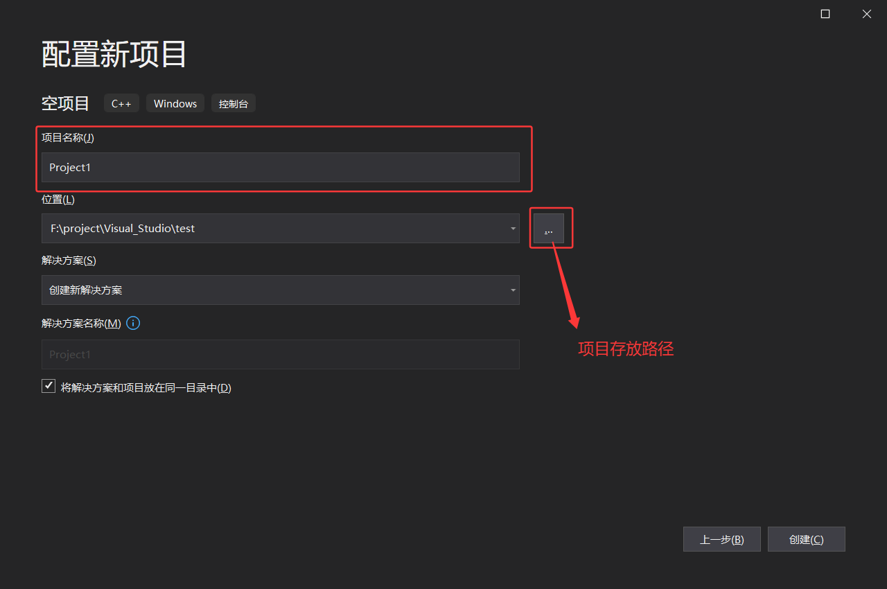

#### 打开项目

- **方法一**：菜单栏 `文件` → `打开` → `项目/解决方案...`，选择 `.sln` 文件
- **方法二**：直接在文件管理器中双击 `.sln` 文件
- **方法三**：VS2019 起始页 → `打开项目或解决方案`

> `.sln` 是解决方案文件，打开它即可加载整个解决方案及其包含的所有项目。


#### 加载/卸载项目

在大型解决方案中，有些项目可能不需要每次都编译，可以临时卸载它们以加速编译。

**卸载项目**：

1. 在 `解决方案资源管理器` 中右键点击目标项目
2. 选择 `卸载项目`
3. 卸载后项目名变为灰色字体，不再参与编译

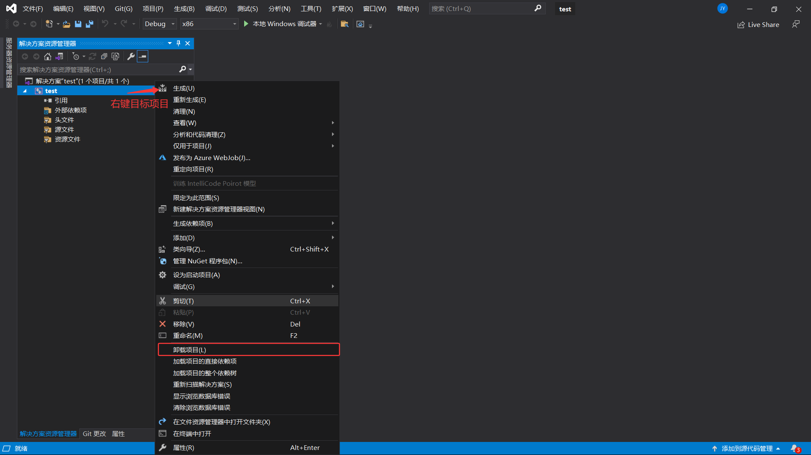

**加载/重新加载项目**：

1. 右键点击已卸载的项目
2. 选择 `重新加载项目`
3. 项目恢复正常状态，重新参与编译

> 卸载不等于删除，项目文件仍在磁盘上。卸载只是让 VS 暂时忽略它。

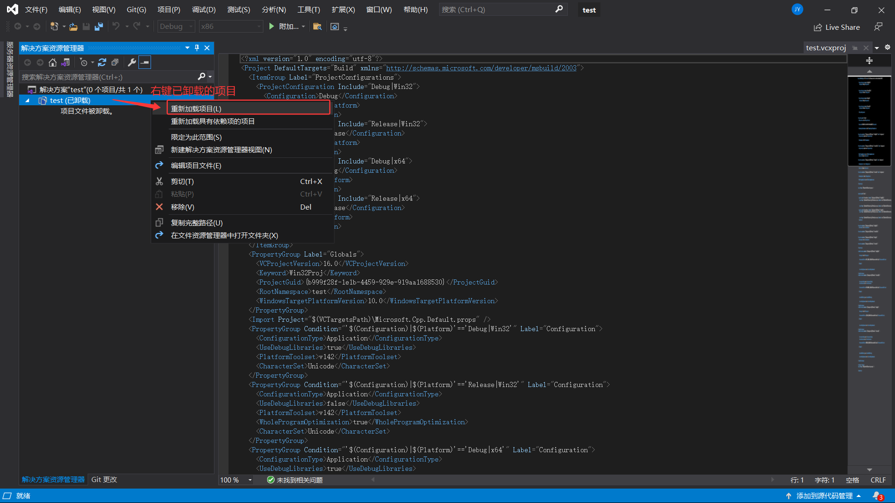


#### 设置启动项

当一个解决方案中有多个可执行项目时，需要指定哪个项目作为启动项（按 `F5` 运行时启动的项目）。

- **方法一**：在 `解决方案资源管理器` 中右键点击目标项目 → `设为启动项目`，该项目名称变为**粗体**

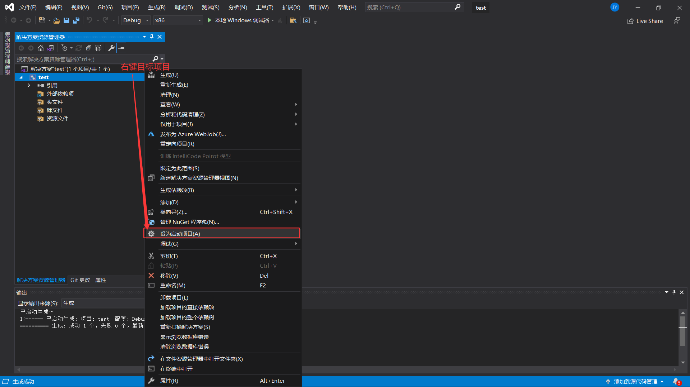

- **方法二**：右键解决方案 → `属性` → `启动项目` → 选择 `当前选定内容` / `单启动项目` / `多启动项目`

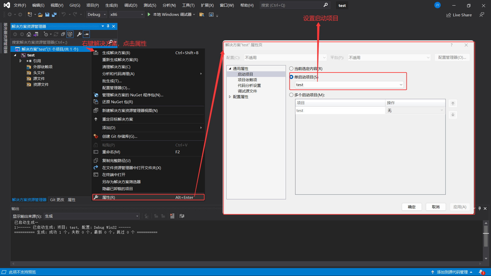


------


### 2.解决方案相关

#### 添加项目

- **新建项目并添加**：右键解决方案 → `添加` → `新建项目...`
- **添加已有项目**：右键解决方案 → `添加` → `现有项目...`，选择 `.vcxproj` 文件

> 一个解决方案下可以混合管理 `.exe` 项目、`.lib` 项目、`.dll` 项目和单元测试项目。

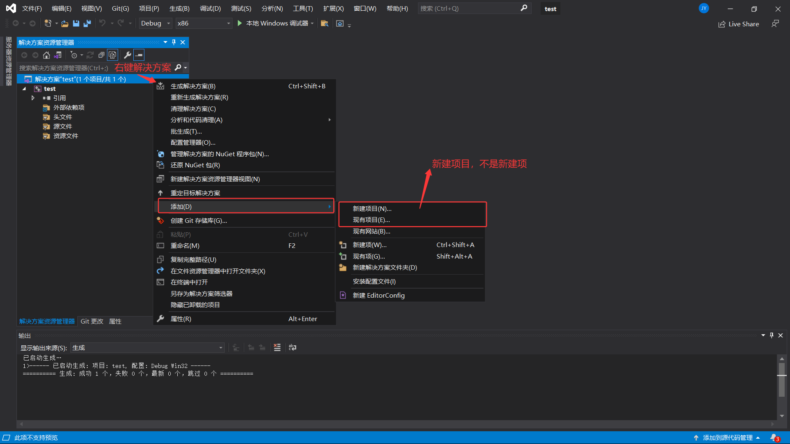


------


### 3.文件相关

#### 创建文件

1. 在 `解决方案资源管理器` 中右键点击目标项目
2. 选择 `添加` → `新建项...`（快捷键 `Ctrl+Shift+A`）

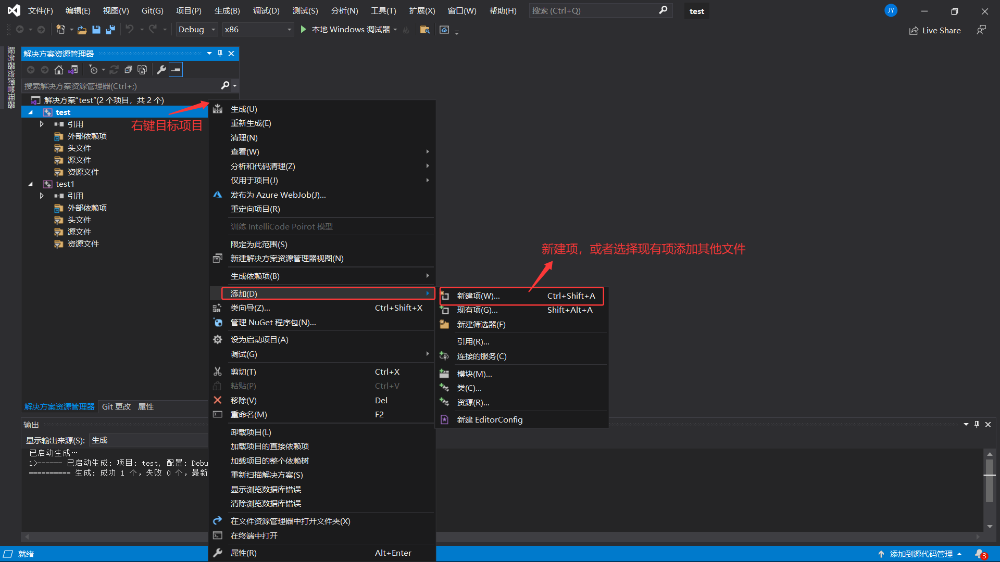

3. 在弹出的对话框中选择文件类型：

- `C++ 文件(.cpp)` — 源文件
- `头文件(.h)` — 头文件
- `C++ 类` — 同时生成 `.h` 和 `.cpp`

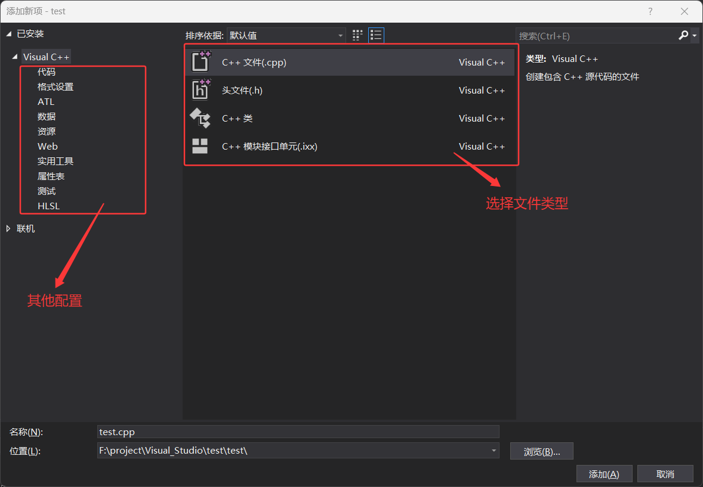

4. 输入文件名，点击 `添加`

**快捷操作**：`新建项` 的快捷键是 `Ctrl+Shift+A`，`现有项` 是 `Shift+Alt+A`


#### 打开文件

- 在 `解决方案资源管理器` 中双击文件名即可打开
- 或 `文件` → `打开` → `文件...`（`Ctrl+O`）


#### 包括/排除文件

- **从项目中排除**：右键文件 → `从项目中排除`，文件不再参与编译，但保留在磁盘上

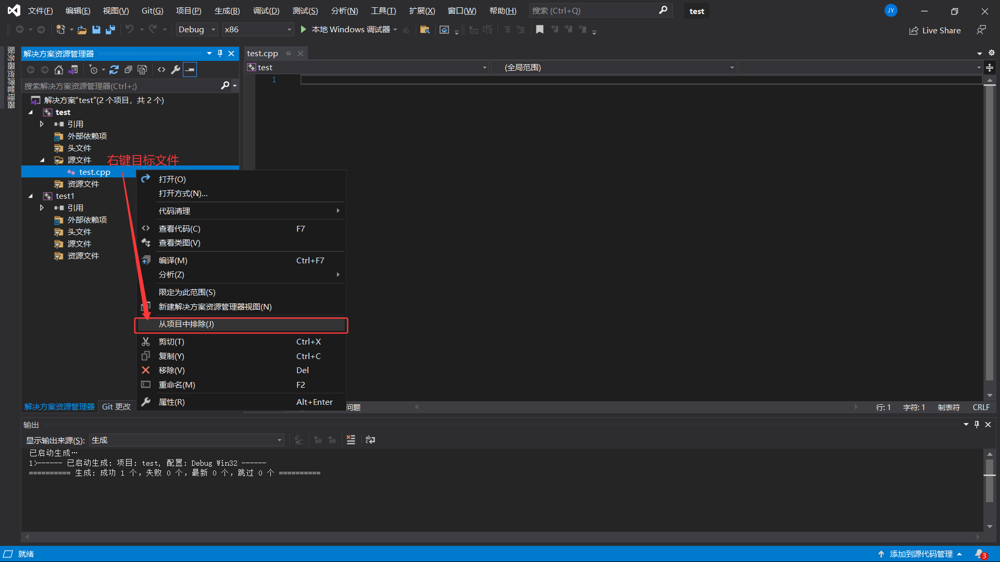

- **包括到项目中**：右键项目 → `添加` → `现有项...`（`Shift+Alt+A`），将磁盘上的文件加入项目，如果是被排除的项目，需要在资源管理器里选择显示所有文件后选择包括在项目里

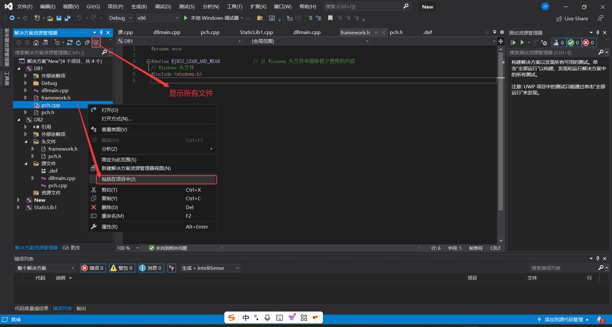

> 排除文件只是解除文件与项目的逻辑关联，文件本身**不会**被删除。与卸载项目类似。

| 操作目标               | 现象                                                         | 具体操作步骤                                                 | 本质与后果                                                   |
| :--------------------- | :----------------------------------------------------------- | :----------------------------------------------------------- | :----------------------------------------------------------- |
| **排除文件 (Exclude)** | 文件在解决方案资源管理器中变成**灰色斜体**，或者直接**消失**。 | 1. 在解决方案资源管理器中，**右键点击**该文件。 2. 在菜单中选择 **`Exclude from Project`**（从项目中排除）。 | **作用**：让该文件不参与项目的编译和构建（IDE 会假装它不存在）。 **注意**：文件**依然完好地存在**于你的电脑硬盘里，没有删除。 |
| **包括文件 (Include)** | 将“排除”或“丢失”的文件重新恢复为**正常显示的黑色**状态。     | 1. 在解决方案资源管理器顶部的工具栏，点击 **`Show All Files`**（显示所有文件）按钮。 2. 此时文件夹内未被包含的（或者被排除的）文件会以**虚线/浅色**图标显示出来。 3. **右键点击**该虚线/浅色图标，选择 **`Include in Project`**（包含到项目中）。 | **作用**：让该文件重新参与编译，并出现在项目树中。 **注意**：如果是全新的文件，务必点 `Show All Files` 才能找到它。 |

------

## 二、工程配置

右键点击项目 → `属性`（或选中项目后按 `Alt+Enter`），打开项目属性页。

> **注意区分**：右键**项目** 后点击 `属性` 打开的是**项目属性**（只影响当前项目）；右键**解决方案** 后点击 `属性` 打开的是**解决方案属性**（影响全局启动项等）。

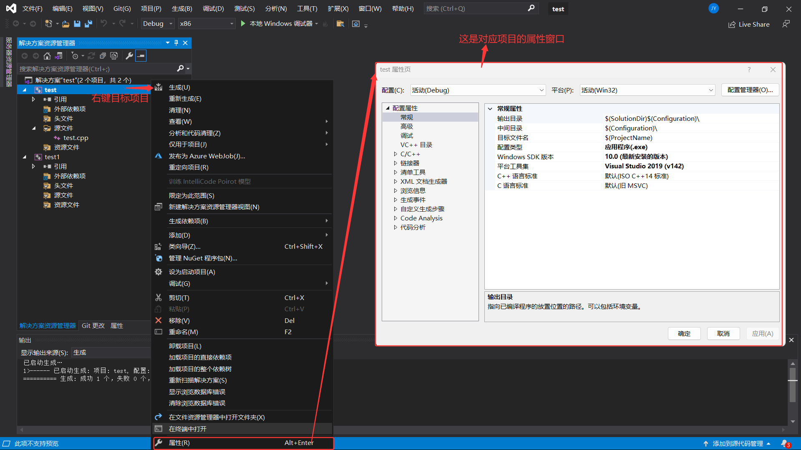

### 1.解决方案配置

在 VS2019 工具栏中，有两个关键下拉框：

| 下拉框           | 选项                         | 说明                     |
| ---------------- | ---------------------------- | ------------------------ |
| **解决方案配置** | `Debug` / `Release`          | 控制编译优化、调试信息等 |
| **解决方案平台** | `x86`(Win32) / `x64` / `ARM` | 控制目标架构             |

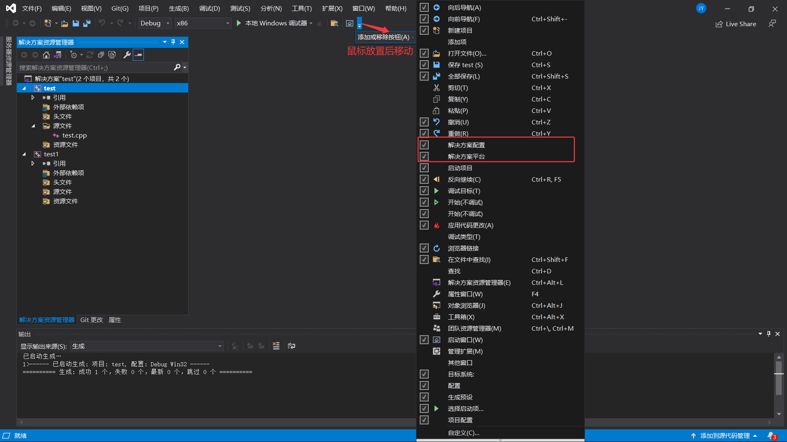

在**解决方案配置**栏一般可以选择Debug和Release配置，也可以打开配置管理器进行其他配置

- `Debug`：包含调试信息，无优化，便于断点调试

- `Release`：开启优化，去掉调试信息，用于最终发布

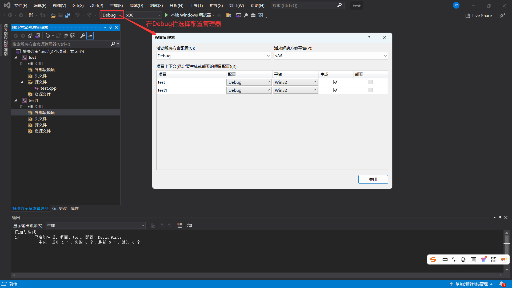

**新建配置**：点击下拉框 → `配置管理器...` → `活动解决方案配置` → `新建`，可自定义配置名称（如 `Debug_Test`），并从已有配置复制设置。


### 2.平台配置

解决方案平台决定编译出的程序在哪种架构上运行：

| 平台            | 说明                        |
| --------------- | --------------------------- |
| `Win32`（x86）  | 32 位程序，兼容性最广       |
| `x64`           | 64 位程序，可访问更大内存   |
| `ARM` / `ARM64` | ARM 架构（嵌入式/移动设备） |

**添加新平台**：`配置管理器` → `活动解决方案平台` → `新建...` → 选择目标平台

> 平台配置需要在**所有项目**中统一，如果一个解决方案中混用 x86 和 x64 项目，链接时会报错。

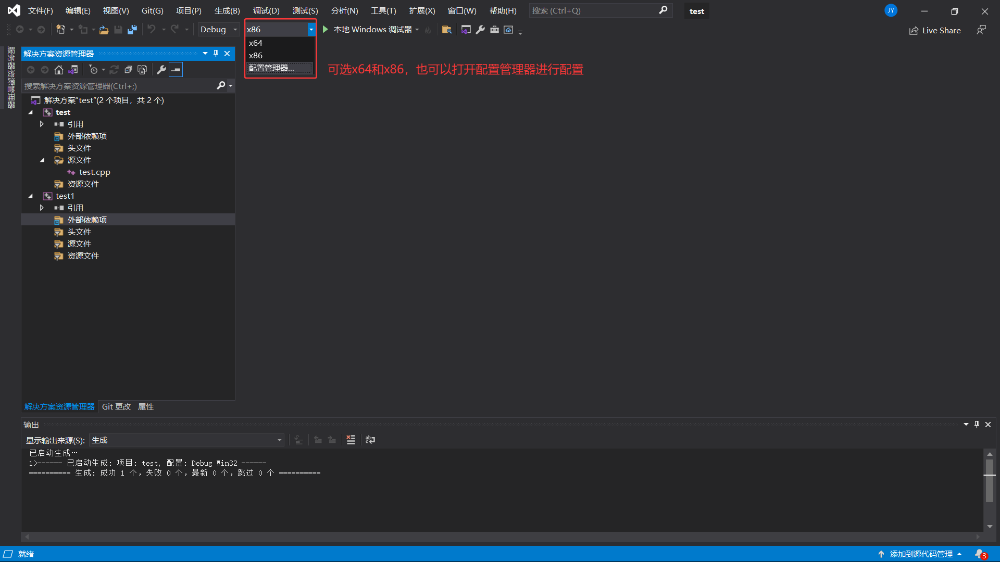


### 3.项目类型配置

在项目属性 → `配置属性` → `常规`：

| 配置项   | 选项             | 说明           |
| -------- | ---------------- | -------------- |
| 配置类型 | `应用程序(.exe)` | 生成可执行文件 |
|          | `静态库(.lib)`   | 生成静态库     |
|          | `动态库(.dll)`   | 生成动态链接库 |

> 创建项目时选错了类型也不用重建，在这里直接修改配置类型即可。

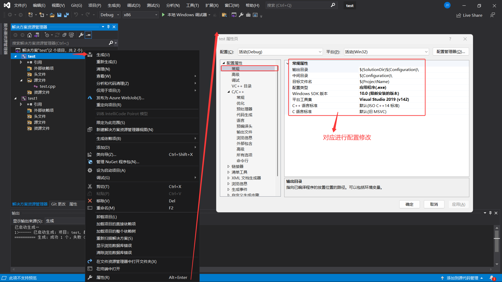


### 4.路径配置

路径配置是项目配置中最容易出现问题的部分，所有路径都可以使用 VS 内置宏变量。

#### 输出路径配置

在项目属性 → `配置属性` → `常规`：

| 配置项   | 默认值                            | 说明                              |
| -------- | --------------------------------- | --------------------------------- |
| 输出目录 | `$(SolutionDir)$(Configuration)\` | `.exe` / `.lib` / `.dll` 生成位置 |
| 中间目录 | `$(Configuration)\`               | `.obj` 等中间文件位置             |

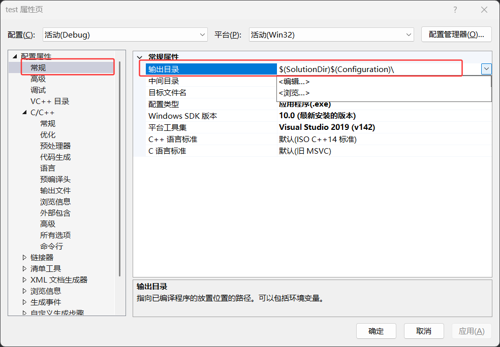

**常用路径宏变量**：

| 宏变量             | 含义                                       |
| ------------------ | ------------------------------------------ |
| `$(SolutionDir)`   | 解决方案文件（`.sln`）所在目录，末尾带 `\` |
| `$(ProjectDir)`    | 项目文件（`.vcxproj`）所在目录，末尾带 `\` |
| `$(Configuration)` | 当前配置名（如 `Debug` 或 `Release`）      |
| `$(Platform)`      | 当前平台名（如 `Win32` 或 `x64`）          |
| `$(OutDir)`        | 输出目录的完整路径                         |
| `$(IntDir)`        | 中间目录的完整路径                         |


#### 头文件路径配置

在项目属性 → `C/C++` → `常规` → `附加包含目录`：

```
$(ProjectDir)include
$(SolutionDir)Common\include
```

- 告诉编译器去哪里找 `#include` 引用的头文件
- 多个路径用分号 `;` 分隔
- 可以使用绝对路径或相对路径（推荐宏变量）

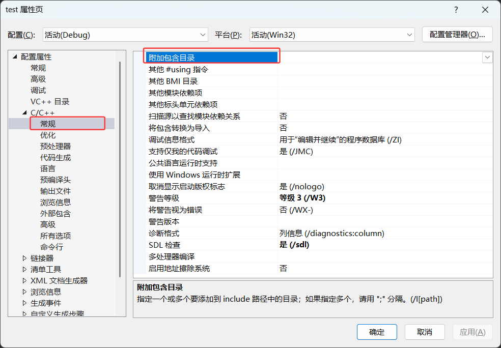


#### 源文件路径配置

源文件路径配置的入口在项目属性 → `配置属性` → `VC++ 目录` → `源目录`。这里设置的是调试器和 IntelliSense 搜索源文件的额外目录。当编译时使用的源文件路径与当前机器上的实际路径不一致时，如拷贝了别人的工程、编译机与开发机不同，调试器根据此处配置的路径来定位源文件，否则断点调试时会提示"无法找到源文件"。

与此不同的是，将 `.c`/`.cpp` 文件通过 `添加` → `现有项` 加入项目是让文件参与编译。源目录配置不决定哪些文件被编译，只影响调试和智能提示时的源文件搜索范围。两者是独立的概念。

> VS2019 不会自动扫描磁盘上的源文件，编译时只编译已添加到项目中的文件。可以用 `添加` → `现有项` 将任意路径下的源文件加入项目。

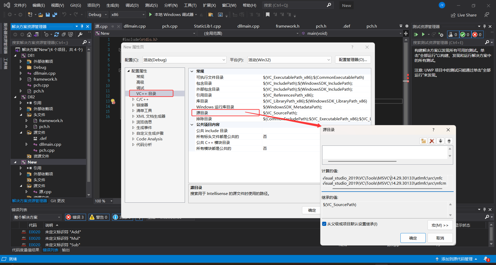


#### 库文件路径配置

调用外部库时，需要配置两处：库目录和附加依赖项。

**库目录**（告诉链接器去哪里找 `.lib` 文件）：
 在项目属性 → `链接器` → `常规` → `附加库目录`：

注意，如果项目的配置类型是**静态库(.lib)**是没有链接器选项的，因为静态库只编译不链接，不需要链接配置。

如果配置类型是**实用工具**，同样没有链接器选项，因为实用工具项目不生成代码，**不存在链接的过程**。

```
$(ProjectDir)lib
$(SolutionDir)ThirdParty\lib
```

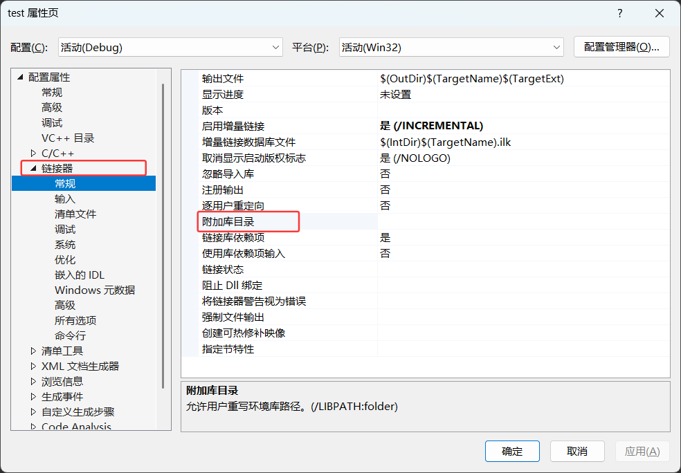


确保整个解决方案中所有项目使用**相同的运行库选项**。如果库是第三方提供的，需要确认它的编译选项，并让工程与之保持一致。


### 5.宏定义

在项目属性 → `C/C++` → `预处理器` → `预处理器定义`：

```
_DEBUG
WIN32
MY_CUSTOM_MACRO=1
```

- 等效于代码中的 `#define MY_CUSTOM_MACRO 1`
- 带值的宏用 `NAME=VALUE` 格式
- 多个宏定义用分号 `;` 分隔（VS 自动添加）
- `Debug` 配置默认包含 `_DEBUG`，`Release` 配置默认包含 `NDEBUG`

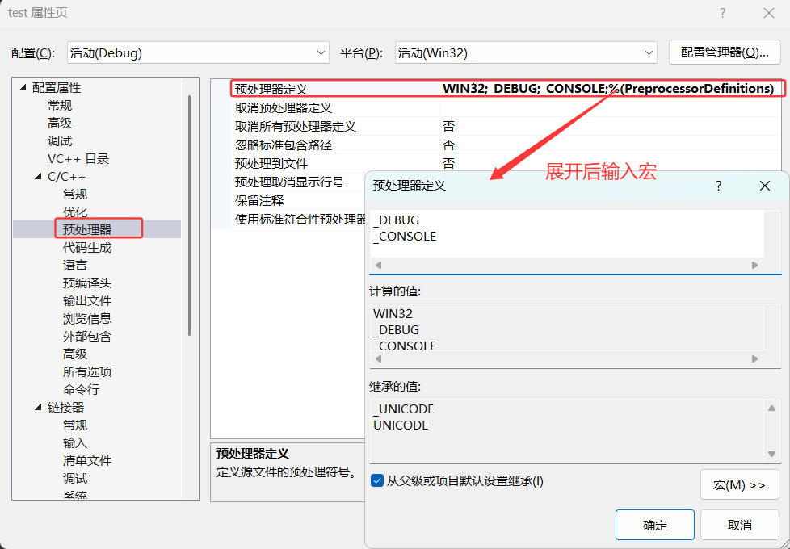

> 预处理器定义的值是字符串类型，如`MY_MACRO=1` 中的 `1` 是字符串 `"1"`，不是数字。


### 6.运行库配置

在项目属性 → `C/C++` → `代码生成` → `运行库`：

| 选项                   | 说明                 | 使用场景                 |
| ---------------------- | -------------------- | ------------------------ |
| `多线程调试(/MTd)`     | 静态链接 Debug CRT   | 调试时无需 VC 运行时 DLL |
| `多线程(/MT)`          | 静态链接 Release CRT | 发布时无需 VC 运行时 DLL |
| `多线程调试 DLL(/MDd)` | 动态链接 Debug CRT   | 调试时依赖 VC 运行时 DLL |
| `多线程 DLL(/MD)`      | 动态链接 Release CRT | 发布时依赖 VC 运行时 DLL |

> **关键规则**：一个解决方案中**所有项目的运行库配置必须一致**。混用 `/MT` 和 `/MD` 会导致链接错误或运行时崩溃。静态库、动态库和主程序必须统一。

`T` = 静态（Static），`D` = 动态（DLL），`d` 后缀 = Debug 版本。

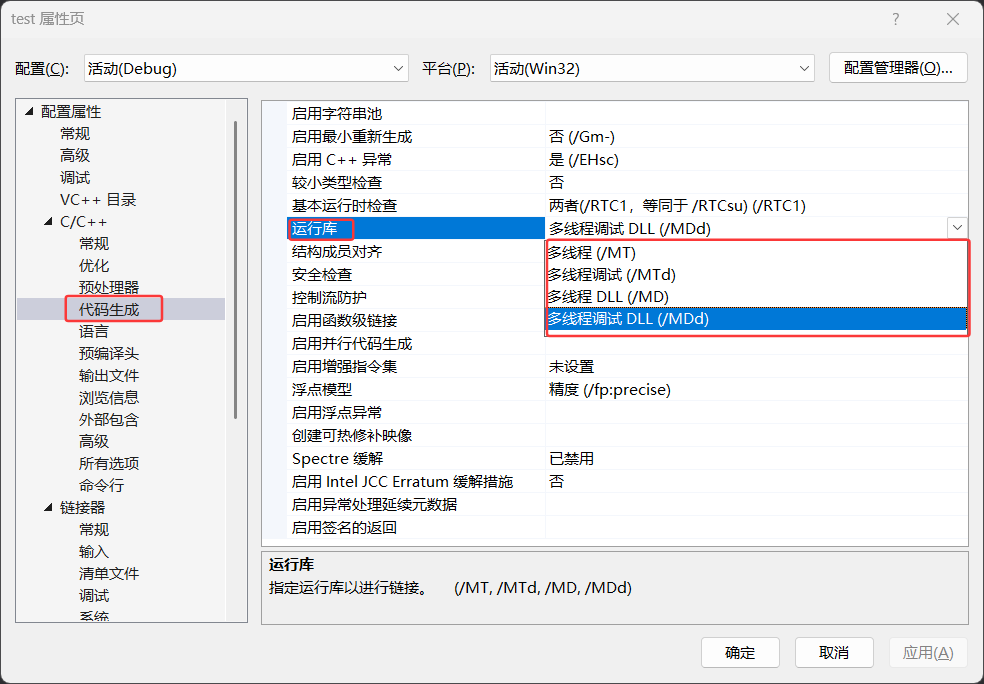


### 7.调用库配置

调用库配置负责告诉链接器具体要链接哪些 `.lib` 文件，它和库文件路径配置配套使用。

附加依赖项（告诉链接器具体链接哪些库）：

在项目属性 → `链接器` → `输入` → `附加依赖项`：

```
mylib.lib
ws2_32.lib
```


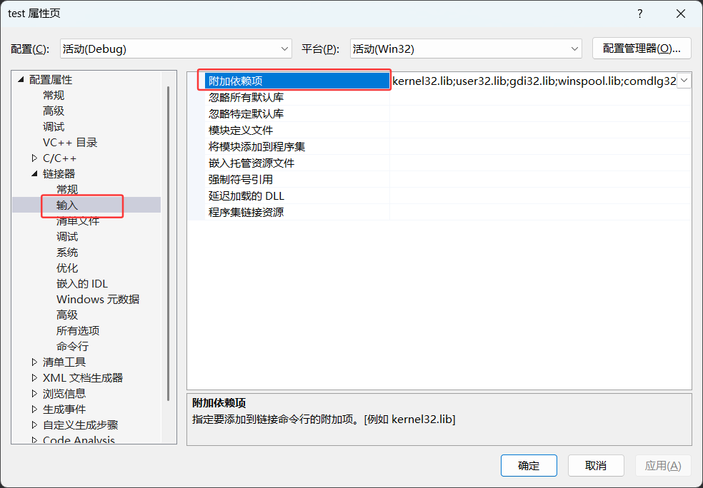

在 VS2019 中调用外部库，完整配置包括以下步骤：

1. **头文件路径**：`C/C++` → `常规` → `附加包含目录`
2. **库文件搜索路径**：`链接器` → `常规` → `附加库目录`
3. **库文件名**：`链接器` → `输入` → `附加依赖项`
4. **DLL 文件位置**（动态库）：将 `.dll` 放到 `.exe` 同一目录，或添加到系统 PATH

> 静态库在编译时嵌入到 `.exe` 中，运行时不需要 `.lib` 文件；动态库在运行时需要 `.dll` 文件存在。


### 8.安全检查

在项目属性 → `C/C++` → `代码生成` → `安全检查`：

| 选项                 | 说明                                                    |
| -------------------- | ------------------------------------------------------- |
| `启用安全检查(/GS)`  | 编译器插入缓冲区溢出检测代码，Debug 和 Release 默认开启 |
| `禁用安全检查(/GS-)` | 关闭检测，仅用于特殊场景（如驱动开发或极限性能优化）    |

> 一般情况下保持默认的 `/GS` 启用即可，能有效防止栈缓冲区溢出攻击。

------


## 三、工程调试

### 1.断点

#### 断点创建

- **方法一**：在代码编辑区左侧灰色边距点击，出现红色圆点
- **方法二**：光标停在目标行，按 `F9`
- **方法三**：菜单栏 `调试` → `切换断点`

> 断点只能设置在**有效可执行代码行**上，空行、注释行、纯变量声明行无法设置。

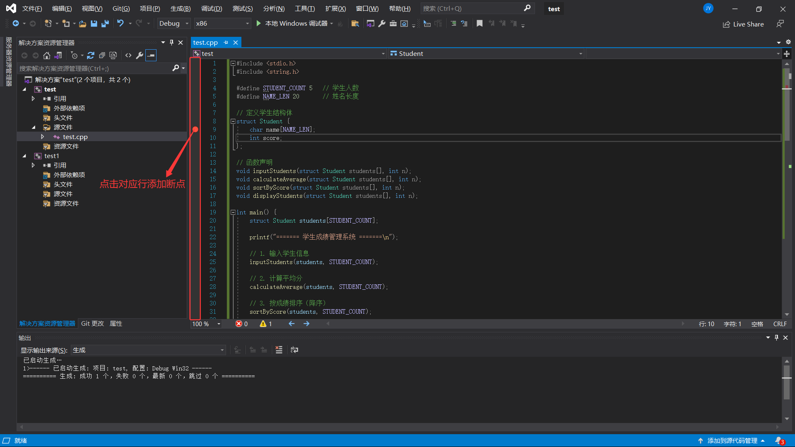


#### 断点删除

- **方法一**：直接点击红色断点圆点
- **方法二**：光标停在目标行，按 `F9`（与创建相同，切换式操作）
- **方法三**：菜单栏 `调试` → `窗口` → `断点`（`Ctrl+Alt+B`），在断点窗口中右键 → `删除`

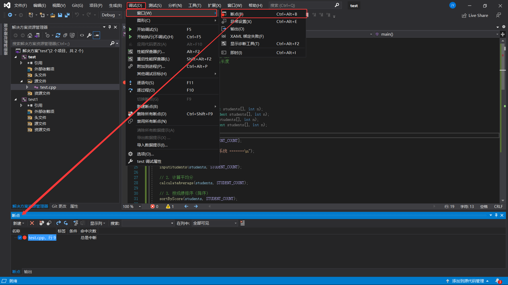

和添加断点的方法基本一致


#### 断点禁用

- 右键点击断点红色圆点 → `禁用断点`，圆点变为**空心红色圆圈**
- 或在断点窗口（`Ctrl+Alt+B`）中取消勾选对应断点

> 禁用断点不会删除，位置和条件均保留，方便临时跳过。

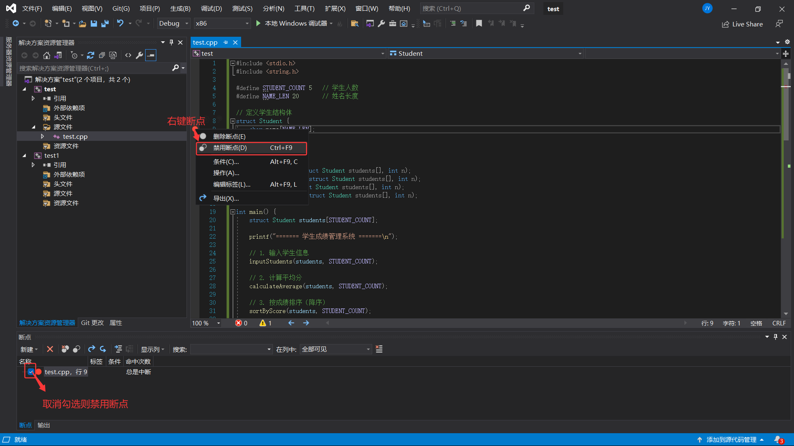


#### 断点启用

- 右键点击禁用的断点（空心圆圈）→ `启用断点`
- 或在断点窗口中重新勾选

和断点禁用基本一致


#### 条件断点

条件断点在满足特定条件时才触发暂停，避免手动反复跳过。

**设置方法**：

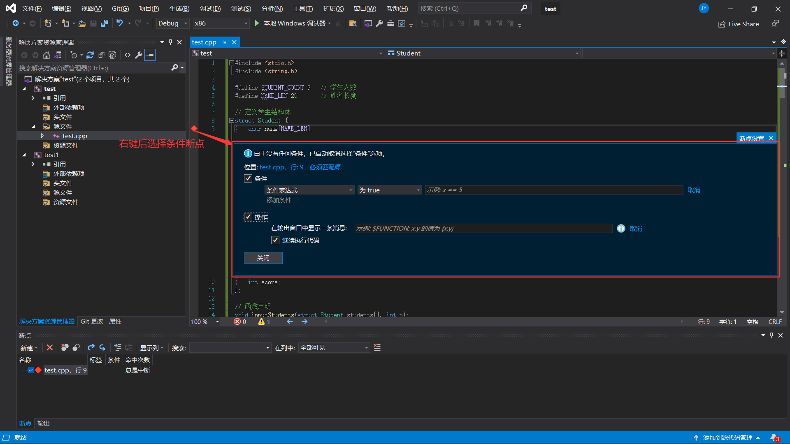

1. 先创建普通断点
2. 右键点击断点 → `条件...`
3. 设置条件：

| 条件类型   | 说明                   | 示例                |
| ---------- | ---------------------- | ------------------- |
| 条件表达式 | 表达式为 `true` 时暂停 | `i == 100`          |
| 命中次数   | 断点被命中 N 次后暂停  | 第 100 次命中时暂停 |
| 筛选器     | 指定线程/进程          | 多线程调试时使用    |

> 条件断点非常实用，例如在循环 1000 次中只在 `i == 500` 时暂停。

------


### 2.调试窗口


#### 监视窗口

实时查看变量和表达式的当前值。注意要在调试状态下进行

**打开方式**：

- 菜单栏 `调试` → `窗口` → `监视` → `监视1` / `监视2` / `监视3` / `监视4`
- 或在调试时右键变量 → `添加监视`

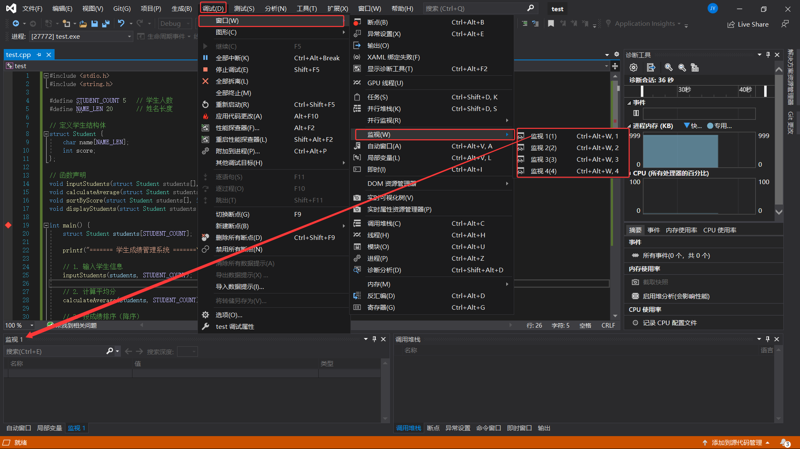

**使用技巧**：

- 可输入任意表达式（如 `a+b`、`*ptr`、`array[0]`）
- 变量值变化时以**红色**高亮
- 双击值栏可**直接修改**变量的值
- 支持拖拽变量到监视窗口


#### 内存窗口

查看指定内存地址的原始字节数据。注意**内存窗口只能在程序暂停（中断）时查看**

**打开方式**：

- 菜单栏 `调试` → `窗口` → `内存` → `内存1` ~ `内存4`

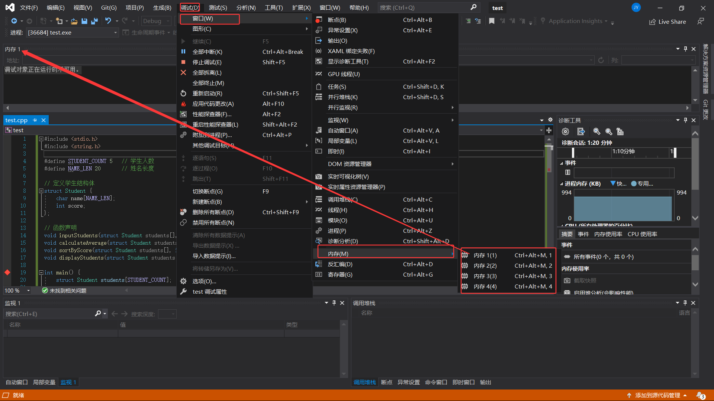

**使用操作**：

- 在地址栏输入地址（如 `&myVar`、`0x00A1B2C3`）
- 可拖拽调整每行显示的字节数
- 右键可切换数据格式（1 字节、2 字节、4 字节、8 字节显示）
- 可以直接编辑内存中的值


#### 线程窗口

查看当前进程中的所有线程及其状态。

**打开方式**：

- 菜单栏 `调试` → `窗口` → `线程`（快捷键 `Ctrl+Alt+H`）

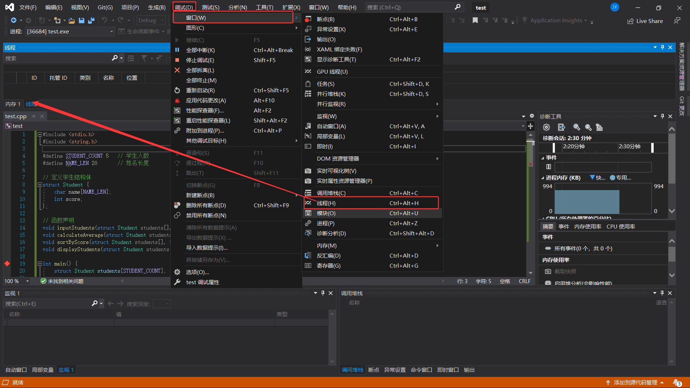

**窗口内容**：

- 线程 ID、名称、位置（当前执行的函数）、优先级
- 双击线程可切换到该线程的调用堆栈和执行点
- 在多线程调试时用于定位死锁和竞态问题


#### 调用堆栈窗口

查看当前函数调用链。

**打开方式**：

- 菜单栏 `调试` → `窗口` → `调用堆栈`（快捷键 `Ctrl+Alt+C`）

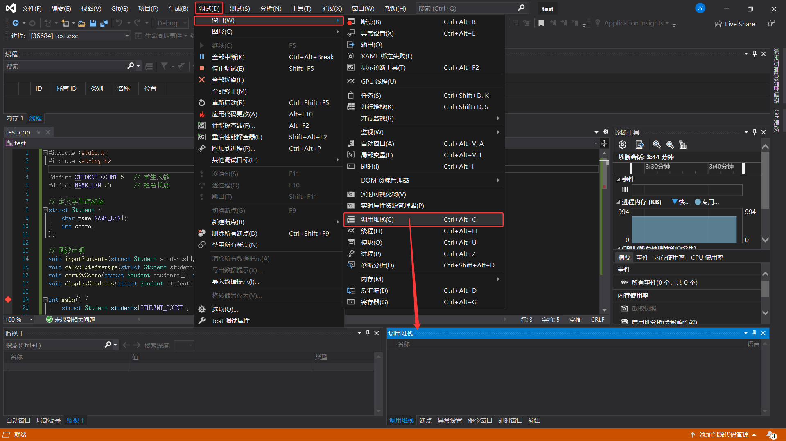

**用途**：

- 显示从入口点到当前位置的完整调用路径
- 双击堆栈中任意层可跳转到对应源码位置
- 程序崩溃时，调用堆栈是定位问题**最关键的线索**

> 调用堆栈是最常用的调试窗口之一，崩溃时从这里开始分析，向下追溯出错函数。

------


### 3.单步调试

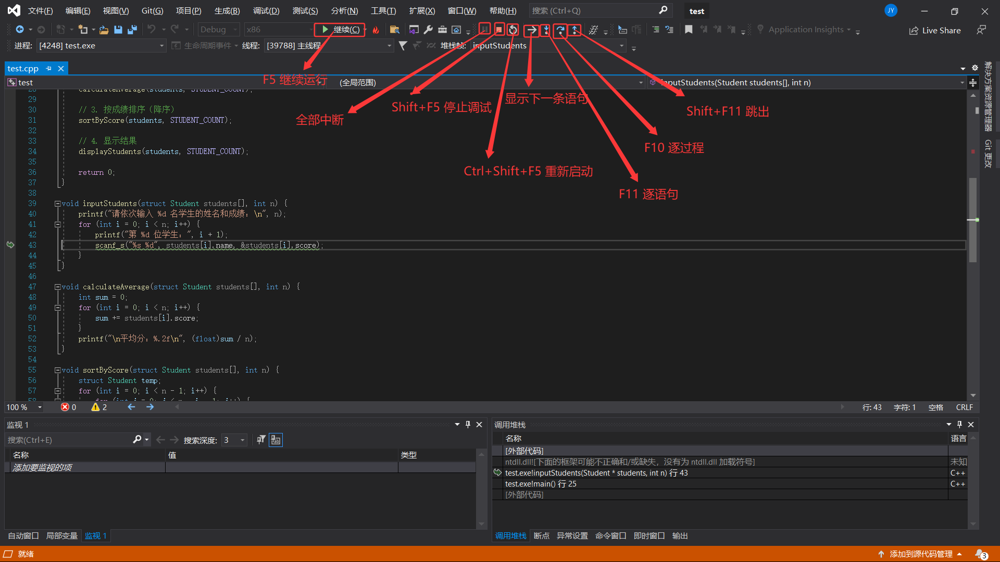


#### 全速运行

| 操作     | 快捷键 | 说明                               |
| -------- | ------ | ---------------------------------- |
| 开始调试 | `F5`   | 启动程序并附加调试器，遇到断点暂停 |
| 继续运行 | `F5`   | 从暂停位置继续运行到下一个断点     |


#### 重新运行

| 操作     | 快捷键          | 说明                       |
| -------- | --------------- | -------------------------- |
| 重新启动 | `Ctrl+Shift+F5` | 停止当前调试并重新启动程序 |
| 停止调试 | `Shift+F5`      | 终止当前调试会话           |


#### 逐过程

| 操作   | 快捷键 | 说明                           |
| ------ | ------ | ------------------------------ |
| 逐过程 | `F10`  | 执行当前行，**不进入**函数内部 |

> 逐过程将函数调用当作一步完成。确定函数内部无问题时使用。


#### 逐语句

| 操作   | 快捷键 | 说明                                 |
| ------ | ------ | ------------------------------------ |
| 逐语句 | `F11`  | 执行当前行，**进入**函数内部逐行跟踪 |

> 逐语句会跟踪进函数内部，用于深入排查。与逐过程配合使用。


#### 跳出

| 操作 | 快捷键      | 说明                                 |
| ---- | ----------- | ------------------------------------ |
| 跳出 | `Shift+F11` | 执行完当前函数剩余代码，返回到调用处 |

> 当 `F11` 进入一个不需要细看的函数后，用 `Shift+F11` 快速跳出来。


#### 运行到光标处

| 操作         | 快捷键     | 说明                             |
| ------------ | ---------- | -------------------------------- |
| 运行到光标处 | `Ctrl+F10` | 从当前位置运行到光标所在行后暂停 |

> 相当于在光标位置设置了一个临时断点，到达后自动删除。

------


## 四、常用


### 1.文件后缀

以下是 VS 中常见的文件扩展名全称、含义及说明：

| 文件类型/后缀      | 全称                               | 含义                                      | 说明                                                         |
| :----------------- | :--------------------------------- | :---------------------------------------- | :----------------------------------------------------------- |
| `.sln`             | **Sol**utio**n**                   | 解决方案文件                              | 解决方案的入口文件，记录包含哪些项目、项目间依赖关系、解决方案级配置（Debug/Release、平台等）和启动项目设置。是一个文本文件，双击打开整个解决方案。 |
| `.vcxproj`         | **V**isual **C**++ **Pro**ject     | VC++ 项目文件                             | 单个 C++ 项目的配置文件，包含源文件列表、头文件路径、编译选项、链接设置等。相当于 IAR 的 `.ewp`。 |
| `.vcxproj.filters` | **Filters**                        | 项目筛选器文件                            | 记录解决方案资源管理器中的虚拟文件夹结构（即项目中的“文件夹”布局），便于组织文件。不改变实际磁盘目录结构。 |
| `.vcxproj.user`    | **User**                           | 用户选项文件                              | 存储个人开发环境配置，如调试命令参数、启动项目设置等。与具体用户绑定，通常不提交到版本控制。 |
| `.suo`             | **S**olution **U**ser **O**ptions  | 解决方案用户选项                          | 存储解决方案级别的用户个性化设置（如窗口布局、断点位置、启动项目等）。二进制文件，不应提交到版本控制。 |
| `.filters`         | **Filters**                        | 筛选器文件                                | 同 `.vcxproj.filters`，用于解决方案资源管理器中的文件夹组织。 |
| `.props`           | **Prop**ertie**s**                 | 属性表文件                                | 共享的项目属性配置，可被多个项目继承使用。常用于统一团队的编译选项、包含目录、库目录等设置。 |
| `.targets`         | **Targets**                        | 目标文件                                  | MSBuild 构建过程中的自定义构建步骤，用于扩展编译流程（如编译前后执行特定脚本）。 |
| `.cpp`             | **C** Plus **P**lus                | C++ 源文件                                | C++ 语言编写的源代码文件。                                   |
| `.c`               | **C**                              | C 源文件                                  | C 语言编写的源代码文件。                                     |
| `.h`               | **H**eader                         | 头文件                                    | 存放函数声明、类定义、宏定义、类型定义等，被 `.c`/`.cpp` 通过 `#include` 引用。 |
| `.hpp`             | **H**eader **P**lus **P**lus       | C++ 头文件                                | C++ 专用的头文件，通常包含类定义、模板声明等。与 `.h` 本质相同，但习惯上 `.hpp` 用于 C++。 |
| `.rc`              | **R**esource **C**ompiler          | 资源脚本文件                              | 定义 Windows 应用程序的资源（如菜单、对话框、图标、版本信息等）。 |
| `.res`             | **Res**ource                       | 资源编译后的文件                          | `.rc` 文件经资源编译器编译后生成的二进制资源文件，链接时被合并到最终可执行文件中。 |
| `.obj`             | **Obj**ect                         | 目标文件                                  | 编译器将每个 `.cpp`/`.c` 编译后生成的中间文件，包含机器码和符号信息。 |
| `.lib`             | **Lib**rary                        | 静态库文件                                | 预编译好的代码库，在链接时被完整复制到最终可执行文件中。包含函数的二进制实现。 |
| `.dll`             | **D**ynamic-**l**ink **L**ibrary   | 动态链接库                                | 运行时动态加载的库文件，多个程序可以共享同一个 `.dll`，减少磁盘占用和内存开销。 |
| `.exe`             | **Exe**cutable                     | 可执行文件                                | Windows 下可直接运行的程序文件，包含机器码和入口点。         |
| `.pdb`             | **P**rogram **D**ata**b**ase       | 程序数据库文件                            | 存储调试信息（如函数名、变量名、源代码行号映射等），用于调试时关联源码。仅 Debug 模式下生成，不随程序发布。 |
| `.exp`             | **Exp**ort                         | 导出文件                                  | 链接器生成的中间文件，记录 `.dll` 中导出函数的信息，供链接器创建 `.lib` 和 `.dll` 时使用。 |
| `.manifest`        | **Manifest**                       | 清单文件                                  | 描述程序依赖的运行时库版本（如 VC++ Redistributable），用于确保程序在目标系统上有正确的依赖环境。 |
| `.ico`             | **Ico**n                           | 图标文件                                  | 存储应用程序的图标资源，可包含多种尺寸和颜色深度。           |
| `.ncb`             | **N**o **C**ompile **B**rowser     | 无编译浏览信息文件（IntelliSense 数据库） | 存储 IntelliSense（代码补全、跳转）的解析缓存。重新生成解决方案时会自动重建。 |
| `.sdf`             | **S**olution **D**atabase **F**ile | 解决方案数据库文件                        | 存储 IntelliSense 的完整数据库，用于大型项目的代码分析。`.ncb` 的升级版，文件较大。 |

- VS 中 `.lib` 和 `.a` 本质相同，都是静态库，只是平台命名差异（Windows 常用 `.lib`，Linux/GCC 常用 `.a`）
- `.obj` 和 IAR 的 `.o` 本质相同，都是编译后的中间目标文件
- `.pdb` 文件对于调试至关重要，但发布 Release 版本时不应随程序分发


### 2.文件与工程快捷键

| 操作         | 快捷键           |
| ------------ | ---------------- |
| 新建项目     | `Ctrl+Shift+N`   |
| 新建文件/项  | `Ctrl+Shift+A`   |
| 添加现有项   | `Shift+Alt+A`    |
| 打开文件     | `Ctrl+O`         |
| 保存文件     | `Ctrl+S`         |
| 全部保存     | `Ctrl+Shift+S`   |
| 编译项目     | `Ctrl+B` 或 `F6` |
| 编译解决方案 | `Ctrl+Shift+B`   |
| 项目属性     | `Alt+Enter`      |


### 3.调试快捷键

| 操作            | 快捷键          |
| --------------- | --------------- |
| 开始调试 / 继续 | `F5`            |
| 逐过程          | `F10`           |
| 逐语句          | `F11`           |
| 跳出            | `Shift+F11`     |
| 运行到光标处    | `Ctrl+F10`      |
| 切换断点        | `F9`            |
| 重新启动        | `Ctrl+Shift+F5` |
| 停止调试        | `Shift+F5`      |


### 4.调试窗口快捷键

| 窗口     | 快捷键              |
| -------- | ------------------- |
| 断点窗口 | `Ctrl+Alt+B`        |
| 调用堆栈 | `Ctrl+Alt+C`        |
| 线程窗口 | `Ctrl+Alt+H`        |
| 监视窗口 | `Ctrl+Alt+W` + 数字 |
| 内存窗口 | `Ctrl+Alt+M` + 数字 |
| 即时窗口 | `Ctrl+Alt+I`        |
| 输出窗口 | `Ctrl+Alt+O`        |

------


## 五、常见问题与注意事项

1. **找不到头文件（C1083）**：检查 `C/C++` → `常规` → `附加包含目录` 中路径是否正确，特别是相对路径的基准目录。
2. **无法解析的外部符号（LNK2019）**：最常见的是缺少 `.lib` 依赖，检查 `链接器` → `输入` → `附加依赖项` 是否包含对应的库名。
3. **找不到 DLL（运行时报错）**：动态库的 `.dll` 文件需要放在 `.exe` 同目录下，或添加到系统 PATH 中。
4. **Debug 正常 Release 崩溃**：通常是运行库配置不一致或优化暴露了隐藏 bug（如未初始化变量），检查所有项目的运行库是否统一。
5. **x86/x64 混用报错**：所有项目的目标平台必须一致，在 `配置管理器` 中统一检查。
6. **修改属性后不生效**：注意属性页是从**当前配置和平台**打开的，修改 Debug 的属性不会影响 Release，修改 x86 的属性不会影响 x64。
7. **解决方案加载缓慢**：可卸载当前不需要编译的项目（右键 → `卸载项目`），加快编译和加载速度。

8. 如果没有菜单或者其他窗口，在视图栏里，和视图栏下的工具栏，可选择标准就能恢复标准布局

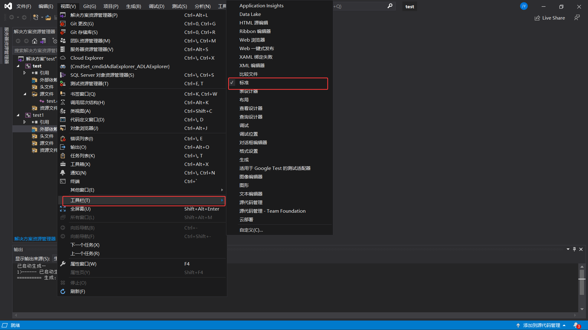